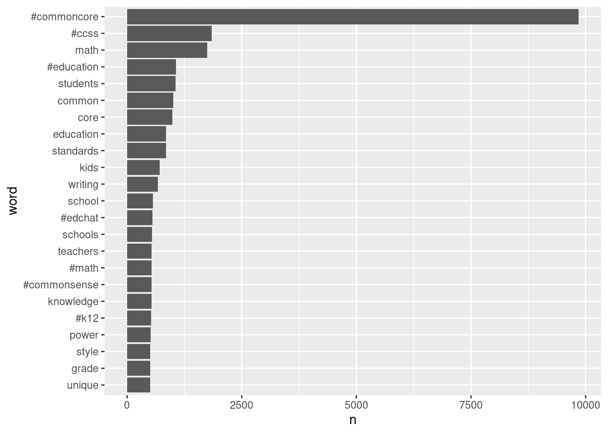
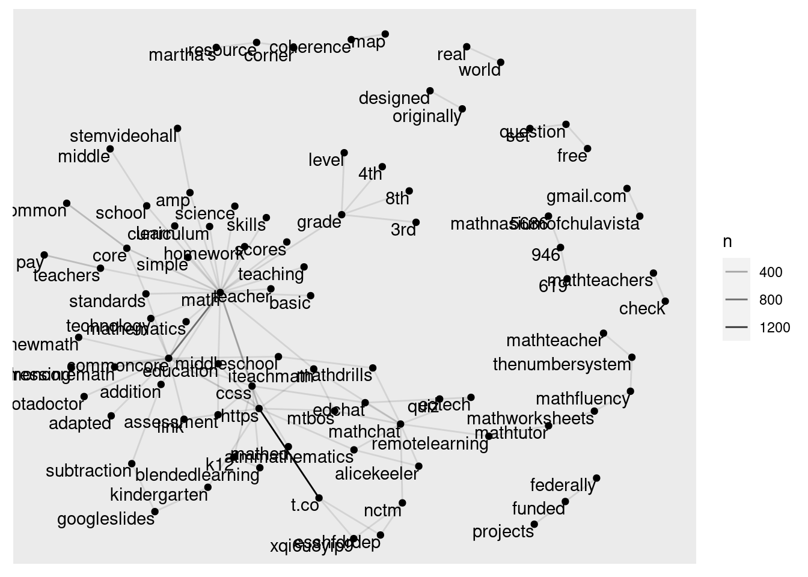
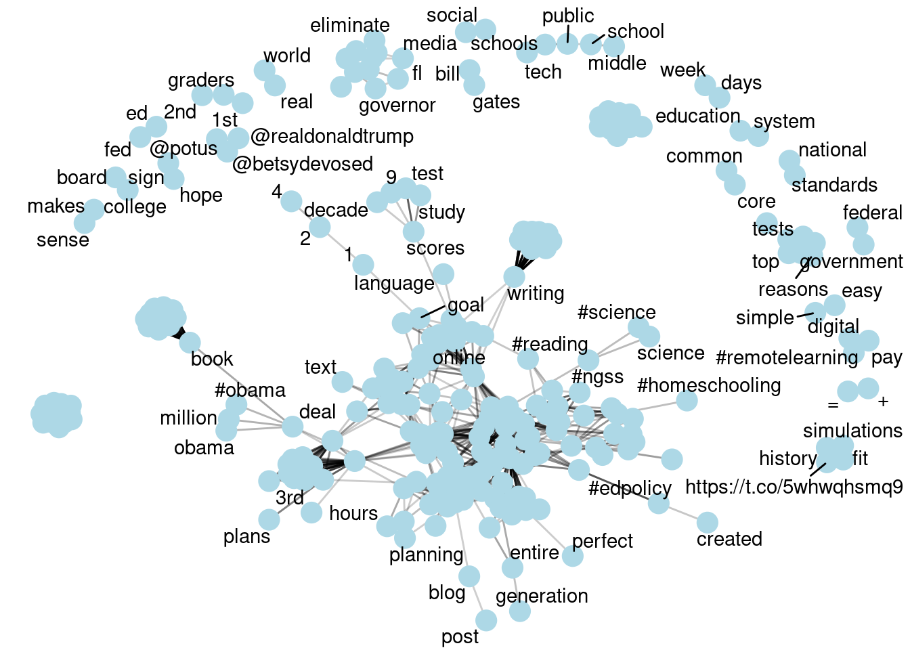

[INSERT PRESENTATION VIDEO HERE]

## 1. PREPARE

#### Research Questions

Recall from our presentation that one central question to text mining and natural language processing is:

> How do we to **quantify** what a document or collection of documents is about?

For our first lab on text mining in STEM education, we'll explore this question by examining a corpus, or collection, of public posts on Twitter about the Common Core State Standards (CCSS) to better understand public discourse surrounding these standards, particularly as they relate to math education. Specifically, in this lab we'll be applying some basic text mining techniques to address the following questions:

1.  What are the most frequent words or phrases used in reference to tweets about the CCSS?

2.  What words and hashtags commonly co-occur together, particularly with the word "math"?

#### Section Objectives

To help us better understand the packages, Twitter API tools, and data we'll use during this lab to address these questions, in this section we'll learn to:

a.  **Load Packages** for tidy text mining and using Twitter APIs

b.  **Create a Twitter App** to obtain [authentication](https://developer.twitter.com/en/docs/authentication) credentials, also known as keys and tokens

c.  **Authorize RStudio** to use your app for retrieving data from Twitter

#### Exercise RMarkdown File

Instructions for accessing practice file and completing lab...

### 1a. Load Packages

#### Prior Packages

Let's begin by loading some familiar packages from previous Learning Labs that we'll be using for data wrangling and exploration :


```r
library(dplyr)
library(readr)
library(tidyr)
library(ggplot2)
library(readxl)
library(writexl)
library (DT)
```

#### 📦 The rtweet Package

{width="100"}

The `rtweet` package provides users a range of functions designed to extract data from Twitter's REST and streaming APIs and has three main goals:

1.  Formulate and send requests to Twitter's REST and stream APIs.

2.  Retrieve and iterate over returned data.

3.  Wrangling data into tidy structures.

Let's load the `rtweet` package which we'll be using later in this lab to accomplish all three of the goals listed above:


```r
library(rtweet)
```

### 1b. Create a Twitter App

Before you can begin pulling tweets into R, you'll first need to create a Twitter App in your developer account. This section and the section that follows, are borrowed largely from the `rtweet` package by Michael Kearney, and requires that you have set up a Twitter developer account.

You are not required to set up developer account for this institute, but if you are still interested in creating one, [these instructions](https://dev.to/sumedhpatkar/beginners-guide-how-to-apply-for-a-twitter-developer-account-1kh7) succinctly outline the process and you can set one up in about 10 minutes. We have provided the data we'll be using for the Wrangling and Explore parts of the lab on our [GitHub repository](https://github.com/sbkellogg/eci-588/tree/main/unit-2/data) and you can skip to section [2b. Tidy Text] if you are not interested in or unable to set up a Twitter developer account.

#### Steps for Creating your Twitter App

1.  Navigate to [developer.twitter.com/en/apps](https://developer.twitter.com/en/apps/), click the blue button that says, `Create a New App`, and then complete the form with the following fields:

    -   `App Name`: What your app will be called

    -   `Application Description`: How your app will be described to its users

        <p align="center">

        

        </p>

    -   `Website URLs`: Website associated with app--I recommend using the URL to your Twitter profile

    -   `Callback URLs`: ***IMPORTANT*** enter exactly the following: `http://127.0.0.1:1410`

        <p align="center">

        

        </p>

    -   `Tell us how this app will be used`: Be clear and honest

        <p align="center">

        

        </p>

2.  When you've completed the required form fields, click the blue `Create` button at the bottom

3.  Read through and indicate whether you accept the developer terms

    <p align="center">

    

    </p>

4.  And you're done!

    <p align="center">

    

    </p>

### 1c. Authorize RStudio

In order to authorize R to use your Twitter App to retrieve data, you'll need to create a personal Twitter token by completing the following steps:

-   Navigate to [developer.twitter.com/en/apps](https://developer.twitter.com/en/apps) and select your Twitter app
-   Click the tab labeled `Keys and tokens` to retrieve your keys.
-   Locate the `Consumer API keys` (aka "API Secret").

<p align="center">


</p>

-   Scroll down to `Access token & access token secret` and click `Create`

<p align="center">


</p>

-   Copy and paste the four keys (along with the name of your app) into an R Markdown file file and pass them along to `create_token()`. Note, these keys are named secret for a reason. I recommend setting up your token in a separate R Markdown file than the one that you will eventually share.


```r
## store api keys (these are fake example values; replace with your own keys)
app_name <- "Text Mining in Education"
api_key <- "afYS4vbIlPAj096E60c4W1fiK"
api_secret_key <- "bI91kqnqFoNCrZFbsjAWHD4gJ91LQAhdCJXCj3yscfuULtNkuu"
access_token <- "9551451262-wK2EmA942kxZYIwa5LMKZoQA4Xc2uyIiEwu2YXL"
access_token_secret <- "9vpiSGKg1fIPQtxc5d5ESiFlZQpfbknEN1f1m2xe5byw7"

## authenticate via web browser
token <- create_token(
  app = app_name,
  consumer_key = api_key,
  consumer_secret = api_secret_key,
  access_token = access_token,
  access_secret = access_token_secret)
```

If you are interested in viewing an alternate authentication method, you can view `rtweet` Twitter authorization vignette by running the following code:


```r
vignette("auth")
```

#### Authorization in future R sessions

-   The `create_token()` function should automatically save your token as an environment variable for you. So next time you start an R session [on the same machine], rtweet should automatically find your token.
-   To make sure it works, restart your R session, run the following code, and again check to make sure the app name and `api_key` match.


```r
## check to see if the token is loaded
get_token()
```

```
## <Token>
## <oauth_endpoint>
##  request:   https://api.twitter.com/oauth/request_token
##  authorize: https://api.twitter.com/oauth/authenticate
##  access:    https://api.twitter.com/oauth/access_token
## <oauth_app> LASER Labs
##   key:    I0M2APeuHjDPqSaussmcHYQDC
##   secret: <hidden>
## <credentials> oauth_token, oauth_token_secret
## ---
```

That's it!

------------------------------------------------------------------------

## 2. WRANGLE

In general, data wrangling involves some combination of cleaning, reshaping, transforming, and merging data (Wickham & Grolemund, 2017). The importance of data wrangling is difficult to overstate, as it involves the initial steps of going from raw data to a dataset that can be explored and modeled (Krumm et al, 2018).

a.  **Search & Subset**. In this section, we introduce new functions from the `rtweet` package to search for and filter tweets and users of interest.
b.  **Tidy Text**. We also introduce the `tidytext` package to both "tidy" and tokenize our tweets in order to create our data frame for analysis.
c.  **Stop Words.** We conclude our data wrangling by using the now familiar `dplyr` package to remove words that don't add much value to our analysis.

### 2a. Search & Subset

This section introduces the following functions from the `rtweet` package for reading Twitter data into R:

-   [`search_tweets()`](https://www.rdocumentation.org/packages/rtweet/versions/0.7.0/topics/search_tweets) Pulls up to 18,000 tweets from the last 6-9 days matching provided search terms. 
-   [`search_tweets2()`](https://www.rdocumentation.org/packages/rtweet/versions/0.7.0/topics/search_tweets) Returns data from **multiple** search queries.
-   [`get_timelines()`](https://www.rdocumentation.org/packages/rtweet/versions/0.7.0/topics/search_tweets) Returns up to 3,200 tweets of one or more specified Twitter users.

#### Search Tweets

Since one of our goals for this Learning Lab and the next is a very simplistic replication of the studies by Wang and Fikis (2019), let's begin by introducing the `search_tweets()` function to try reading into R 5,000 tweets containing the CommonCore hashtag and store as a new data frame called `ccss_tweets`.

Type or copy the following code into your R Markdown file or console and run:


```r
ccss_tweets <- search_tweets(q = "#CommonCore", n=5000)
```

Note that the first argument `q =` that the `search_tweets()` function expects is the search term included in quotation marks and that `n =` specifies the maximum number of tweets to return.

##### ✅ Comprehension Check

View your new `ccss_tweets` data frame using the `glimpse()` function introduced previously to help answer the following questions:

1.  How many tweets did our query using the Twitter API actually return? How many variables?
2.  Why do you think our query pulled in far less than 5,000 tweets requested?
3.  Does our query also include retweets? How do you know?
4.  Does capitalization in your query matter?

#### Using the OR Operator

Wang and Fikis (2019) collected the tweets containing the hashtags \#CommonCore and \#CCSS for 12 months from 2014 to 2015. Unfortunately, a basic Twitter developer account only lets us go back about a week but retrieving tweets the two hashtags identified by the authors is not an issue.

Let's modify our query using the `OR` operator to also include "CCSS" so it will return tweets containing either \#NGSSchat or "ngss" and assign to `ngss_or_tweets`:


```r
ccss_or_tweets <- search_tweets(q = "#commoncore OR #ccss", n=5000)
```

##### ✅ Comprehension Check

Try including both search terms but excluding the `OR` operator to answer the following question:

1.  Does excluding the `OR` operator return more tweets, the same number of tweets, or fewer tweets? Why?
2.  What happens if you remove the hashtag? Does it still return tweets with CommonCore?
3.  What other useful arguments does the `search_tweet()` function contain? Try adding one and see what happens.

Hint: Use the `?search_tweets` help function to learn more about the `q` argument and other arguments for composing search queries.

#### Use Multiple Queries

Although Wang and Fikis (2019) limited their query to the two hashtags used above, at some point you may be interested in a more complex query that includes additional search terms. Unfortunately, the `OR` operator only gets us so far. In order to pass multiple queries , we will need to use the `c()` function to combine our search terms into a single list.

Copy and past the following code to store the results of our query in `ngss_tweets`:


```r
ccss_tweets <- search_tweets2(c("#commoncore OR #ccss",
                                '"common core standards"',
                                '"common core state standards"'), 
                             n=5000,
                             include_rts = FALSE)
```

Notice the unique syntax required for the query argument. For example, when "OR" is entered between search terms, `query = "#CommonCore OR #CCSS"`, Twitter's REST API should return any tweet that contains either "\#CommonCore" or "\#CCSS." It is also possible to search for exact phrases using double quotes. To do this, either wrap single quotes around a search query using double quotes, e.g., `q = '"common core standards"'` as we did above, or escape each internal double quote with a single backslash, e.g., `q = "\"common core standards\""`.

To learn more about constructing search terms using the query argument, enter `?search_tweets` in your console and review the documentation for the `q=` argument.

##### ✅ Comprehension Check

1.  Use the `search_tweets` function to create you own custom query for a twitter hashtag or topic(s) of interest.

#### Subset Tweets

As you may have noticed, we have way more data than we need for our analysis and should probably pare it down to just what we'll use.

First, it's likely the authors removed retweets from their analysis since a retweet is simply a user reposting someone else's tweet and would duplicate the exact same content of the original. It's also likely that they limited their analysis to just English language Tweets so let's go ahead and

Let's use the `filter()` function introduced in previous labs to subset rows containing only original tweets in the English language:


```r
ccss_tweets <- ccss_tweets %>% filter(is_retweet == "False", 
                                      lang == "en")
```

Now let's use the `select()` function select the following columns from our new `ccss_text` data frame:

1.  `screen_name` of the user who created the tweet
2.  `created_at` timestamp for examining changes in sentiment over time
3.  `text` containing the tweet which is our primary data source of interest


```r
ccss_tweets <- select(ccss_tweets,
                 screen_name, 
                 created_at, 
                 text)
```

##### ✅ Comprehension Check

For the remainder of the lab, you'll be asked to using your own Twitter data. Complete the following steps before proceeding to the [2b. Tidy Text] section:

1.  Creates new code chunk and write a query based on a STEM area of interest.

2.  Subset your data to remove any unnecessary tweets from analysis.

3.  Assign your search to a new object called `my_tweets`.

4.  Output your new dataset using the `datatable()` function from the `DT` package and take a quick look.

Extra credit for using the `%>%` pipe operator and efficient use of arguments to keep your code succinct and using the `<-` assignment operator only once.

You're output should look something like this:


#### Write to Excel File

Finally, let's save our tweet files to use in later exercises since tweets have a tendency to change every minute. We'll save as a Microsoft Excel file since one of our columns can not be stored in a flat file like .csv.

Let's use the `write_xlxs()` function from the `writexl` package just like we would the `write_csv()` function from `dplyr` in Unit 1:


```r
write_xlsx(ccss_tweets, "data/csss_tweets.xlsx")
```

##### **✅ Comprehension Check**

1.  What happens if you try to write to a flat file like .csv?

#### Other Useful Functions (Optional)

For your own research, you may be interest in exploring posts by specific users rather than topics, key words, or hashtags. Yes, there is a function for that too!

For example, let's create another list containing the usernames of the LASER Institute leads using the `c()` function again and use the `get_timelines()` function to get the most recent tweets from each of those users:


```r
fi <- c("sbkellogg", "jrosenberg6432", "yanecnu", "robmoore3", "hollylynnester")

fi_tweets <- fi %>%
  get_timelines(include_rts=FALSE)
```

Notice that you can use the pipe operator with the `rtweet` functions just like you would other functions from the tidyverse.

And let's use the `sample_n()` function from the `dplyr` package to pick 10 random tweets and use `select()` to select and view just the `screenname` and `text` columns that contains the user and the content of their post:


```r
sample_n(fi_tweets, 10) %>%
  select(screen_name, text)
```

```
## # A tibble: 10 x 2
##    screen_name    text                                                          
##    <chr>          <chr>                                                         
##  1 hollylynnester @dsabulldogs go Dawg!!!                                       
##  2 jrosenberg6432 Honestly, I can't do my work without steam.                   
##  3 jrosenberg6432 @m_0erv @MarKubsch @GDCP_eV @telekomstiftung ty Marvin!       
##  4 hollylynnester If you are dpsnc staff or student, you can vote!  my daughter…
##  5 sbkellogg      “...in about a month, we built a new course on teaching remot…
##  6 jrosenberg6432 @CatharynShelton @leannaarch excited to learn about this work 
##  7 yanecnu        Learned so much from mentors and peers at ECW! https://t.co/U…
##  8 robmoore3      Very cool! https://t.co/s24nhQmbfZ                            
##  9 robmoore3      Come work with me and the other awesome faculty at @UF_COE! A…
## 10 robmoore3      @plowenthal Putting it in a tweet is about that accountability
```

The `rtweet` package also has handy `ts_plot` function built into `rtweet` to take a very quick look at how far back our data set goes:


```r
ts_plot(ccss_tweets, by = "days")
```

Notice that this effectively creates a `ggplot` time series plot for us. I've included the `by =` argument which by default is set to "days". It looks like tweets go back 9 days which is the rate limit set by Twitter.

Try changing it to "hours" and see what happens.

##### ✅ Comprehension Check

To conclude Section 2a, try one of the following search functions from the `rtweet` vignette:

1.  `get_timelines()` Get the most recent 3,200 tweets from users.
2.  `stream_tweets()` Randomly sample (approximately 1%) from the live stream of all tweets.
3.  `get_friends()` Retrieve a list of all the accounts a user follows.
4.  `get_followers()` Retrieve a list of the accounts following a user.
5.  `get_favorites()` Get the most recently favorited statuses by a user.
6.  `get_trends()` Discover what's currently trending in a city.
7.  `search_users()` Search for 1,000 users with the specific hashtag in their profile bios.

We've only scratched the surface of the number of functions available in the `rtweets` package for searching Twitter. To learn more about the `rtweet` package, you can find full documentation on CRAN at: [\<https://cran.r-project.org/web/packages/rtweet/rtweet.pdf\>](https://cran.r-project.org/web/packages/rtweet/rtweet.pdf){.uri}

Or use the following function to access the package vignette:


```r
vignette("intro", package="rtweet")
```

### 2b. Tidy Text

#### 📦 The tidytext Package

{width="100"}

Text data, by it's very nature is ESPECIALLY untidy and sometimes referred to as "unstructured." The `tidytext` package provide functions and supporting data sets to allow conversion of text to and from tidy formats, and to switch seamlessly between tidy tools and existing text mining packages.

As we'll Learn first hand later in this lab, using tidy data principles can make many text mining tasks easier, more effective, and consistent with tools already in wide use. Much of the infrastructure needed for text mining with tidy data frames already exists in `tidyverse` packages with which we've already been introduced.

For a more comprehensive introduction to the `tidytext` package, we cannot recommend enough the free online book, [Text Mining with R: A Tidy Approach](https://www.tidytextmining.com) by Silge and Robinson (2018).

Let's go ahead and load `tidytext`:


```r
library(tidytext)
```

**Attention:** From this point forward, we'll also use a shared dataset constructed with the [Twitter Academic Research product track](https://developer.twitter.com/en/solutions/academic-research/products-for-researchers) that allows for a much greater number of tweets to be accessed over a far greater period of time. This will also ensure that we're producing similar results so we can check to see if our code is behaving as expected.

Let's use the `readxl` package highlighted in Section 1 and the `read_xlsx()` function to read in the data stored in the data folder of our R project:


```r
ccss_tweets <- read_csv("data/ccss-tweets.csv",
                        col_types = cols(id = col_character(), 
                                         author_id = col_character()
                                         )
                        )
```

#### Tokenize Text {data-link="2b. Tidy Text"}

In [Chapter 1 of Text Mining with R](https://www.tidytextmining.com/tidytext.html), Silge and Robinson (2018) define the tidy text format as a table with one-token-per-row. A **token** is a meaningful unit of text, such as a word, two-word phrase (bigram), or sentence that we are interested in using for analysis. And **tokenization** is the process of splitting text into tokens.

This one-token-per-row structure is in contrast to the ways text is often stored for text analysis, perhaps as strings in a corpus object or in a document-term matrix. For tidy text mining, the token that is stored in each row is most often a single word, but can also be an n-gram, sentence, or paragraph.

For this part of our workflow, our goal is to transform our `ccss_tweets` data from this:


```
## # A tibble: 11,592 x 4
##    text                              id         author_id    created_at         
##    <chr>                             <chr>      <chr>        <dttm>             
##  1 "Textual Evidence in #GatheringB… 108537318… 93237206838… 2019-01-16 03:08:27
##  2 "11 PM ET Thursday live 805-285-… 108533640… 38784416     2019-01-16 00:42:18
##  3 "11 PM ET Thursday live 805-285-… 108533633… 85409136     2019-01-16 00:42:00
##  4 "Petrilli /Forham were the ones … 108532985… 253343991    2019-01-16 00:16:16
##  5 "This is rich.\nLet's look at th… 108532928… 253343991    2019-01-16 00:14:00
##  6 "This new math will always leave… 108532139… 25189615     2019-01-15 23:42:39
##  7 "Our free #lesson gives a sample… 108528177… 91497123610… 2019-01-15 21:05:13
##  8 "With a focus on the complete wr… 108528172… 281718510    2019-01-15 21:05:00
##  9 "Super excited to learn from @ju… 108526899… 395853723    2019-01-15 20:14:25
## 10 "Find ideas for how to teach &am… 108526204… 99865113846… 2019-01-15 19:46:48
## # … with 11,582 more rows
```

Into a "tidy text" format that looks more like this familiar tibble data structure:


```
## Using `to_lower = TRUE` with `token = 'tweets'` may not preserve URLs.
```


```
## # A tibble: 169,711 x 4
##    id                  author_id         created_at          word               
##    <chr>               <chr>             <dttm>              <chr>              
##  1 1085373185263128576 9323720683808808… 2019-01-16 03:08:27 textual            
##  2 1085373185263128576 9323720683808808… 2019-01-16 03:08:27 evidence           
##  3 1085373185263128576 9323720683808808… 2019-01-16 03:08:27 #gatheringblue     
##  4 1085373185263128576 9323720683808808… 2019-01-16 03:08:27 #ccss              
##  5 1085373185263128576 9323720683808808… 2019-01-16 03:08:27 #rl71              
##  6 1085373185263128576 9323720683808808… 2019-01-16 03:08:27 #rl72              
##  7 1085373185263128576 9323720683808808… 2019-01-16 03:08:27 #w72               
##  8 1085373185263128576 9323720683808808… 2019-01-16 03:08:27 #middleschool      
##  9 1085373185263128576 9323720683808808… 2019-01-16 03:08:27 #interactivenotebo…
## 10 1085373185263128576 9323720683808808… 2019-01-16 03:08:27 🍎📚📝✅💯❤️🚀     
## # … with 169,701 more rows
```

Later we'll learn about other data structures for text analysis like the document-term matrix and corpus objects. For now, however, working with the familiar tidy data frame allows us to take advantage of popular packages that use the shared tidyverse syntax and principles for wrangling, exploring, and modeling data.

##### Unigrams

The `tidytext` package provides the incredibly powerful `unnest_tokens()` function to tokenize text (including tweets!) and convert them to a one-token-per-row format.

Let's tokenize our tweets by using this function to split each tweet into a single row to make it easier to analyze:


```r
ccss_unigrams <- unnest_tokens(ccss_tweets, 
                               output = word, 
                               input = text)
```

There is A LOT to unpack with this function. First notice that `unnest_tokens()` expects a data frame as the first argument, followed by two column names. The second argument is an output column name that doesn't currently exist but will be created as the text is "unnested" into it (`word`, in this case). This is followed by the input column that the text comes from, which we uncreatively named `text`. Also notice:

-   By default, a token is an individual word or unigram.

-   Other columns, such as `screen_name` and `created_at`, are retained.

-   All punctuation has been removed.

-   Tokens have been changed to lowercase, which makes them easier to compare or combine with other datasets (use the `to_lower = FALSE` argument to turn off if desired).

The `unnest_tokens()` function also has specialized `“tweets”` tokenizer in the `tokens =` argument that is very useful for dealing with Twitter text in that it retains hashtags and mentions of usernames with the \@ symbol.

##### ✅ Comprehension Check

Rewrite the code below to include the token argument set to:


```r
ccss_unigrams <- unnest_tokens(ccss_tweets, 
                              output = word, 
                              input = text, 
                              _____ = _____)
```

Your output should look something like this:


```
## Using `to_lower = TRUE` with `token = 'tweets'` may not preserve URLs.
```

```
## # A tibble: 289,390 x 4
##    id                  author_id         created_at          word               
##    <chr>               <chr>             <dttm>              <chr>              
##  1 1085373185263128576 9323720683808808… 2019-01-16 03:08:27 textual            
##  2 1085373185263128576 9323720683808808… 2019-01-16 03:08:27 evidence           
##  3 1085373185263128576 9323720683808808… 2019-01-16 03:08:27 in                 
##  4 1085373185263128576 9323720683808808… 2019-01-16 03:08:27 #gatheringblue     
##  5 1085373185263128576 9323720683808808… 2019-01-16 03:08:27 #ccss              
##  6 1085373185263128576 9323720683808808… 2019-01-16 03:08:27 #rl71              
##  7 1085373185263128576 9323720683808808… 2019-01-16 03:08:27 #rl72              
##  8 1085373185263128576 9323720683808808… 2019-01-16 03:08:27 #w72               
##  9 1085373185263128576 9323720683808808… 2019-01-16 03:08:27 #middleschool      
## 10 1085373185263128576 9323720683808808… 2019-01-16 03:08:27 #interactivenotebo…
## # … with 289,380 more rows
```

##### Bigrams

In the function above we specified tokens as individual words, but many interesting text analyses are based on the relationships between words, which words tend to follow others immediately, or words that tend to co-occur within the same documents.

We can also use the `unnest_tokens()` function to tokenize our tweets into consecutive sequences of words, called **n-grams**. By seeing how often word X is followed by word Y, we can then build a model of the relationships between them as well see in Section [4. MODEL].

We do this by adding the `token = "ngrams"` option to [`unnest_tokens()`](https://rdrr.io/pkg/tidytext/man/unnest_tokens.html), and setting `n` to the number of words in each n-gram. Let's set `n` to 2, so we can examine pairs of two consecutive words, often called "bigrams":


```r
ccss_bigrams <- ccss_tweets %>% 
  unnest_tokens(bigram, 
                text, 
                token = "ngrams", 
                n = 2)

ccss_bigrams
```

```
## # A tibble: 301,118 x 4
##    id              author_id        created_at          bigram                  
##    <chr>           <chr>            <dttm>              <chr>                   
##  1 10853731852631… 932372068380880… 2019-01-16 03:08:27 textual evidence        
##  2 10853731852631… 932372068380880… 2019-01-16 03:08:27 evidence in             
##  3 10853731852631… 932372068380880… 2019-01-16 03:08:27 in gatheringblue        
##  4 10853731852631… 932372068380880… 2019-01-16 03:08:27 gatheringblue ccss      
##  5 10853731852631… 932372068380880… 2019-01-16 03:08:27 ccss rl71               
##  6 10853731852631… 932372068380880… 2019-01-16 03:08:27 rl71 rl72               
##  7 10853731852631… 932372068380880… 2019-01-16 03:08:27 rl72 w72                
##  8 10853731852631… 932372068380880… 2019-01-16 03:08:27 w72 middleschool        
##  9 10853731852631… 932372068380880… 2019-01-16 03:08:27 middleschool interactiv…
## 10 10853731852631… 932372068380880… 2019-01-16 03:08:27 interactivenotebook 2ks…
## # … with 301,108 more rows
```

\
Before we move any further let's take a quick look at the most common unigrams and bigrams in our two datasets:


```r
ccss_unigrams %>%
  count(word, sort = TRUE)
```

```
## # A tibble: 39,703 x 2
##    word            n
##    <chr>       <int>
##  1 #commoncore  9852
##  2 the          8508
##  3 to           6858
##  4 of           4821
##  5 and          4129
##  6 a            3686
##  7 is           3567
##  8 in           3224
##  9 for          3015
## 10 this         2415
## # … with 39,693 more rows
```

```r
ccss_bigrams %>% 
  count(bigram, sort = TRUE)
```

```
## # A tibble: 138,876 x 2
##    bigram                     n
##    <chr>                  <int>
##  1 https t.co             10538
##  2 commoncore https         940
##  3 common core              935
##  4 commoncore math          749
##  5 of the                   735
##  6 in the                   504
##  7 the commoncore           498
##  8 commoncore commonsense   497
##  9 of writing               492
## 10 say https                491
## # … with 138,866 more rows
```

Well, many of these tweets are clearly about the common core, but beyond that it's a bit hard to tell because there are so many "stop words" like "the", "to", "and", "in" that don't carry much meaning by themselves.

### 2c. Stop Words

Often in text analysis, we will want to remove these stop words if they are not useful for an analysis. The `stop_words` dataset in the tidytext package contains stop words from three lexicons. We can use them all together, as we have here, or [`filter()`](https://dplyr.tidyverse.org/reference/filter.html) to only use one set of stop words if that is more appropriate for a certain analysis.

Let's take a closer the lexicons and stop words included in each:


```r
datatable(stop_words)
```

```{=html}
<div id="htmlwidget-48de3f3a2c964e95a051" style="width:100%;height:auto;" class="datatables html-widget"></div>
<script type="application/json" data-for="htmlwidget-48de3f3a2c964e95a051">{"x":{"filter":"none","data":[["1","2","3","4","5","6","7","8","9","10","11","12","13","14","15","16","17","18","19","20","21","22","23","24","25","26","27","28","29","30","31","32","33","34","35","36","37","38","39","40","41","42","43","44","45","46","47","48","49","50","51","52","53","54","55","56","57","58","59","60","61","62","63","64","65","66","67","68","69","70","71","72","73","74","75","76","77","78","79","80","81","82","83","84","85","86","87","88","89","90","91","92","93","94","95","96","97","98","99","100","101","102","103","104","105","106","107","108","109","110","111","112","113","114","115","116","117","118","119","120","121","122","123","124","125","126","127","128","129","130","131","132","133","134","135","136","137","138","139","140","141","142","143","144","145","146","147","148","149","150","151","152","153","154","155","156","157","158","159","160","161","162","163","164","165","166","167","168","169","170","171","172","173","174","175","176","177","178","179","180","181","182","183","184","185","186","187","188","189","190","191","192","193","194","195","196","197","198","199","200","201","202","203","204","205","206","207","208","209","210","211","212","213","214","215","216","217","218","219","220","221","222","223","224","225","226","227","228","229","230","231","232","233","234","235","236","237","238","239","240","241","242","243","244","245","246","247","248","249","250","251","252","253","254","255","256","257","258","259","260","261","262","263","264","265","266","267","268","269","270","271","272","273","274","275","276","277","278","279","280","281","282","283","284","285","286","287","288","289","290","291","292","293","294","295","296","297","298","299","300","301","302","303","304","305","306","307","308","309","310","311","312","313","314","315","316","317","318","319","320","321","322","323","324","325","326","327","328","329","330","331","332","333","334","335","336","337","338","339","340","341","342","343","344","345","346","347","348","349","350","351","352","353","354","355","356","357","358","359","360","361","362","363","364","365","366","367","368","369","370","371","372","373","374","375","376","377","378","379","380","381","382","383","384","385","386","387","388","389","390","391","392","393","394","395","396","397","398","399","400","401","402","403","404","405","406","407","408","409","410","411","412","413","414","415","416","417","418","419","420","421","422","423","424","425","426","427","428","429","430","431","432","433","434","435","436","437","438","439","440","441","442","443","444","445","446","447","448","449","450","451","452","453","454","455","456","457","458","459","460","461","462","463","464","465","466","467","468","469","470","471","472","473","474","475","476","477","478","479","480","481","482","483","484","485","486","487","488","489","490","491","492","493","494","495","496","497","498","499","500","501","502","503","504","505","506","507","508","509","510","511","512","513","514","515","516","517","518","519","520","521","522","523","524","525","526","527","528","529","530","531","532","533","534","535","536","537","538","539","540","541","542","543","544","545","546","547","548","549","550","551","552","553","554","555","556","557","558","559","560","561","562","563","564","565","566","567","568","569","570","571","572","573","574","575","576","577","578","579","580","581","582","583","584","585","586","587","588","589","590","591","592","593","594","595","596","597","598","599","600","601","602","603","604","605","606","607","608","609","610","611","612","613","614","615","616","617","618","619","620","621","622","623","624","625","626","627","628","629","630","631","632","633","634","635","636","637","638","639","640","641","642","643","644","645","646","647","648","649","650","651","652","653","654","655","656","657","658","659","660","661","662","663","664","665","666","667","668","669","670","671","672","673","674","675","676","677","678","679","680","681","682","683","684","685","686","687","688","689","690","691","692","693","694","695","696","697","698","699","700","701","702","703","704","705","706","707","708","709","710","711","712","713","714","715","716","717","718","719","720","721","722","723","724","725","726","727","728","729","730","731","732","733","734","735","736","737","738","739","740","741","742","743","744","745","746","747","748","749","750","751","752","753","754","755","756","757","758","759","760","761","762","763","764","765","766","767","768","769","770","771","772","773","774","775","776","777","778","779","780","781","782","783","784","785","786","787","788","789","790","791","792","793","794","795","796","797","798","799","800","801","802","803","804","805","806","807","808","809","810","811","812","813","814","815","816","817","818","819","820","821","822","823","824","825","826","827","828","829","830","831","832","833","834","835","836","837","838","839","840","841","842","843","844","845","846","847","848","849","850","851","852","853","854","855","856","857","858","859","860","861","862","863","864","865","866","867","868","869","870","871","872","873","874","875","876","877","878","879","880","881","882","883","884","885","886","887","888","889","890","891","892","893","894","895","896","897","898","899","900","901","902","903","904","905","906","907","908","909","910","911","912","913","914","915","916","917","918","919","920","921","922","923","924","925","926","927","928","929","930","931","932","933","934","935","936","937","938","939","940","941","942","943","944","945","946","947","948","949","950","951","952","953","954","955","956","957","958","959","960","961","962","963","964","965","966","967","968","969","970","971","972","973","974","975","976","977","978","979","980","981","982","983","984","985","986","987","988","989","990","991","992","993","994","995","996","997","998","999","1000","1001","1002","1003","1004","1005","1006","1007","1008","1009","1010","1011","1012","1013","1014","1015","1016","1017","1018","1019","1020","1021","1022","1023","1024","1025","1026","1027","1028","1029","1030","1031","1032","1033","1034","1035","1036","1037","1038","1039","1040","1041","1042","1043","1044","1045","1046","1047","1048","1049","1050","1051","1052","1053","1054","1055","1056","1057","1058","1059","1060","1061","1062","1063","1064","1065","1066","1067","1068","1069","1070","1071","1072","1073","1074","1075","1076","1077","1078","1079","1080","1081","1082","1083","1084","1085","1086","1087","1088","1089","1090","1091","1092","1093","1094","1095","1096","1097","1098","1099","1100","1101","1102","1103","1104","1105","1106","1107","1108","1109","1110","1111","1112","1113","1114","1115","1116","1117","1118","1119","1120","1121","1122","1123","1124","1125","1126","1127","1128","1129","1130","1131","1132","1133","1134","1135","1136","1137","1138","1139","1140","1141","1142","1143","1144","1145","1146","1147","1148","1149"],["a","a's","able","about","above","according","accordingly","across","actually","after","afterwards","again","against","ain't","all","allow","allows","almost","alone","along","already","also","although","always","am","among","amongst","an","and","another","any","anybody","anyhow","anyone","anything","anyway","anyways","anywhere","apart","appear","appreciate","appropriate","are","aren't","around","as","aside","ask","asking","associated","at","available","away","awfully","b","be","became","because","become","becomes","becoming","been","before","beforehand","behind","being","believe","below","beside","besides","best","better","between","beyond","both","brief","but","by","c","c'mon","c's","came","can","can't","cannot","cant","cause","causes","certain","certainly","changes","clearly","co","com","come","comes","concerning","consequently","consider","considering","contain","containing","contains","corresponding","could","couldn't","course","currently","d","definitely","described","despite","did","didn't","different","do","does","doesn't","doing","don't","done","down","downwards","during","e","each","edu","eg","eight","either","else","elsewhere","enough","entirely","especially","et","etc","even","ever","every","everybody","everyone","everything","everywhere","ex","exactly","example","except","f","far","few","fifth","first","five","followed","following","follows","for","former","formerly","forth","four","from","further","furthermore","g","get","gets","getting","given","gives","go","goes","going","gone","got","gotten","greetings","h","had","hadn't","happens","hardly","has","hasn't","have","haven't","having","he","he's","hello","help","hence","her","here","here's","hereafter","hereby","herein","hereupon","hers","herself","hi","him","himself","his","hither","hopefully","how","howbeit","however","i","i'd","i'll","i'm","i've","ie","if","ignored","immediate","in","inasmuch","inc","indeed","indicate","indicated","indicates","inner","insofar","instead","into","inward","is","isn't","it","it'd","it'll","it's","its","itself","j","just","k","keep","keeps","kept","know","knows","known","l","last","lately","later","latter","latterly","least","less","lest","let","let's","like","liked","likely","little","look","looking","looks","ltd","m","mainly","many","may","maybe","me","mean","meanwhile","merely","might","more","moreover","most","mostly","much","must","my","myself","n","name","namely","nd","near","nearly","necessary","need","needs","neither","never","nevertheless","new","next","nine","no","nobody","non","none","noone","nor","normally","not","nothing","novel","now","nowhere","o","obviously","of","off","often","oh","ok","okay","old","on","once","one","ones","only","onto","or","other","others","otherwise","ought","our","ours","ourselves","out","outside","over","overall","own","p","particular","particularly","per","perhaps","placed","please","plus","possible","presumably","probably","provides","q","que","quite","qv","r","rather","rd","re","really","reasonably","regarding","regardless","regards","relatively","respectively","right","s","said","same","saw","say","saying","says","second","secondly","see","seeing","seem","seemed","seeming","seems","seen","self","selves","sensible","sent","serious","seriously","seven","several","shall","she","should","shouldn't","since","six","so","some","somebody","somehow","someone","something","sometime","sometimes","somewhat","somewhere","soon","sorry","specified","specify","specifying","still","sub","such","sup","sure","t","t's","take","taken","tell","tends","th","than","thank","thanks","thanx","that","that's","thats","the","their","theirs","them","themselves","then","thence","there","there's","thereafter","thereby","therefore","therein","theres","thereupon","these","they","they'd","they'll","they're","they've","think","third","this","thorough","thoroughly","those","though","three","through","throughout","thru","thus","to","together","too","took","toward","towards","tried","tries","truly","try","trying","twice","two","u","un","under","unfortunately","unless","unlikely","until","unto","up","upon","us","use","used","useful","uses","using","usually","uucp","v","value","various","very","via","viz","vs","w","want","wants","was","wasn't","way","we","we'd","we'll","we're","we've","welcome","well","went","were","weren't","what","what's","whatever","when","whence","whenever","where","where's","whereafter","whereas","whereby","wherein","whereupon","wherever","whether","which","while","whither","who","who's","whoever","whole","whom","whose","why","will","willing","wish","with","within","without","won't","wonder","would","would","wouldn't","x","y","yes","yet","you","you'd","you'll","you're","you've","your","yours","yourself","yourselves","z","zero","i","me","my","myself","we","our","ours","ourselves","you","your","yours","yourself","yourselves","he","him","his","himself","she","her","hers","herself","it","its","itself","they","them","their","theirs","themselves","what","which","who","whom","this","that","these","those","am","is","are","was","were","be","been","being","have","has","had","having","do","does","did","doing","would","should","could","ought","i'm","you're","he's","she's","it's","we're","they're","i've","you've","we've","they've","i'd","you'd","he'd","she'd","we'd","they'd","i'll","you'll","he'll","she'll","we'll","they'll","isn't","aren't","wasn't","weren't","hasn't","haven't","hadn't","doesn't","don't","didn't","won't","wouldn't","shan't","shouldn't","can't","cannot","couldn't","mustn't","let's","that's","who's","what's","here's","there's","when's","where's","why's","how's","a","an","the","and","but","if","or","because","as","until","while","of","at","by","for","with","about","against","between","into","through","during","before","after","above","below","to","from","up","down","in","out","on","off","over","under","again","further","then","once","here","there","when","where","why","how","all","any","both","each","few","more","most","other","some","such","no","nor","not","only","own","same","so","than","too","very","a","about","above","across","after","again","against","all","almost","alone","along","already","also","although","always","among","an","and","another","any","anybody","anyone","anything","anywhere","are","area","areas","around","as","ask","asked","asking","asks","at","away","back","backed","backing","backs","be","became","because","become","becomes","been","before","began","behind","being","beings","best","better","between","big","both","but","by","came","can","cannot","case","cases","certain","certainly","clear","clearly","come","could","did","differ","different","differently","do","does","done","down","down","downed","downing","downs","during","each","early","either","end","ended","ending","ends","enough","even","evenly","ever","every","everybody","everyone","everything","everywhere","face","faces","fact","facts","far","felt","few","find","finds","first","for","four","from","full","fully","further","furthered","furthering","furthers","gave","general","generally","get","gets","give","given","gives","go","going","good","goods","got","great","greater","greatest","group","grouped","grouping","groups","had","has","have","having","he","her","here","herself","high","high","high","higher","highest","him","himself","his","how","however","i","if","important","in","interest","interested","interesting","interests","into","is","it","its","itself","just","keep","keeps","kind","knew","know","known","knows","large","largely","last","later","latest","least","less","let","lets","like","likely","long","longer","longest","made","make","making","man","many","may","me","member","members","men","might","more","most","mostly","mr","mrs","much","must","my","myself","necessary","need","needed","needing","needs","never","new","new","newer","newest","next","no","nobody","non","noone","not","nothing","now","nowhere","number","numbers","of","off","often","old","older","oldest","on","once","one","only","open","opened","opening","opens","or","order","ordered","ordering","orders","other","others","our","out","over","part","parted","parting","parts","per","perhaps","place","places","point","pointed","pointing","points","possible","present","presented","presenting","presents","problem","problems","put","puts","quite","rather","really","right","right","room","rooms","said","same","saw","say","says","second","seconds","see","seem","seemed","seeming","seems","sees","several","shall","she","should","show","showed","showing","shows","side","sides","since","small","smaller","smallest","some","somebody","someone","something","somewhere","state","states","still","still","such","sure","take","taken","than","that","the","their","them","then","there","therefore","these","they","thing","things","think","thinks","this","those","though","thought","thoughts","three","through","thus","to","today","together","too","took","toward","turn","turned","turning","turns","two","under","until","up","upon","us","use","used","uses","very","want","wanted","wanting","wants","was","way","ways","we","well","wells","went","were","what","when","where","whether","which","while","who","whole","whose","why","will","with","within","without","work","worked","working","works","would","year","years","yet","you","young","younger","youngest","your","yours"],["SMART","SMART","SMART","SMART","SMART","SMART","SMART","SMART","SMART","SMART","SMART","SMART","SMART","SMART","SMART","SMART","SMART","SMART","SMART","SMART","SMART","SMART","SMART","SMART","SMART","SMART","SMART","SMART","SMART","SMART","SMART","SMART","SMART","SMART","SMART","SMART","SMART","SMART","SMART","SMART","SMART","SMART","SMART","SMART","SMART","SMART","SMART","SMART","SMART","SMART","SMART","SMART","SMART","SMART","SMART","SMART","SMART","SMART","SMART","SMART","SMART","SMART","SMART","SMART","SMART","SMART","SMART","SMART","SMART","SMART","SMART","SMART","SMART","SMART","SMART","SMART","SMART","SMART","SMART","SMART","SMART","SMART","SMART","SMART","SMART","SMART","SMART","SMART","SMART","SMART","SMART","SMART","SMART","SMART","SMART","SMART","SMART","SMART","SMART","SMART","SMART","SMART","SMART","SMART","SMART","SMART","SMART","SMART","SMART","SMART","SMART","SMART","SMART","SMART","SMART","SMART","SMART","SMART","SMART","SMART","SMART","SMART","SMART","SMART","SMART","SMART","SMART","SMART","SMART","SMART","SMART","SMART","SMART","SMART","SMART","SMART","SMART","SMART","SMART","SMART","SMART","SMART","SMART","SMART","SMART","SMART","SMART","SMART","SMART","SMART","SMART","SMART","SMART","SMART","SMART","SMART","SMART","SMART","SMART","SMART","SMART","SMART","SMART","SMART","SMART","SMART","SMART","SMART","SMART","SMART","SMART","SMART","SMART","SMART","SMART","SMART","SMART","SMART","SMART","SMART","SMART","SMART","SMART","SMART","SMART","SMART","SMART","SMART","SMART","SMART","SMART","SMART","SMART","SMART","SMART","SMART","SMART","SMART","SMART","SMART","SMART","SMART","SMART","SMART","SMART","SMART","SMART","SMART","SMART","SMART","SMART","SMART","SMART","SMART","SMART","SMART","SMART","SMART","SMART","SMART","SMART","SMART","SMART","SMART","SMART","SMART","SMART","SMART","SMART","SMART","SMART","SMART","SMART","SMART","SMART","SMART","SMART","SMART","SMART","SMART","SMART","SMART","SMART","SMART","SMART","SMART","SMART","SMART","SMART","SMART","SMART","SMART","SMART","SMART","SMART","SMART","SMART","SMART","SMART","SMART","SMART","SMART","SMART","SMART","SMART","SMART","SMART","SMART","SMART","SMART","SMART","SMART","SMART","SMART","SMART","SMART","SMART","SMART","SMART","SMART","SMART","SMART","SMART","SMART","SMART","SMART","SMART","SMART","SMART","SMART","SMART","SMART","SMART","SMART","SMART","SMART","SMART","SMART","SMART","SMART","SMART","SMART","SMART","SMART","SMART","SMART","SMART","SMART","SMART","SMART","SMART","SMART","SMART","SMART","SMART","SMART","SMART","SMART","SMART","SMART","SMART","SMART","SMART","SMART","SMART","SMART","SMART","SMART","SMART","SMART","SMART","SMART","SMART","SMART","SMART","SMART","SMART","SMART","SMART","SMART","SMART","SMART","SMART","SMART","SMART","SMART","SMART","SMART","SMART","SMART","SMART","SMART","SMART","SMART","SMART","SMART","SMART","SMART","SMART","SMART","SMART","SMART","SMART","SMART","SMART","SMART","SMART","SMART","SMART","SMART","SMART","SMART","SMART","SMART","SMART","SMART","SMART","SMART","SMART","SMART","SMART","SMART","SMART","SMART","SMART","SMART","SMART","SMART","SMART","SMART","SMART","SMART","SMART","SMART","SMART","SMART","SMART","SMART","SMART","SMART","SMART","SMART","SMART","SMART","SMART","SMART","SMART","SMART","SMART","SMART","SMART","SMART","SMART","SMART","SMART","SMART","SMART","SMART","SMART","SMART","SMART","SMART","SMART","SMART","SMART","SMART","SMART","SMART","SMART","SMART","SMART","SMART","SMART","SMART","SMART","SMART","SMART","SMART","SMART","SMART","SMART","SMART","SMART","SMART","SMART","SMART","SMART","SMART","SMART","SMART","SMART","SMART","SMART","SMART","SMART","SMART","SMART","SMART","SMART","SMART","SMART","SMART","SMART","SMART","SMART","SMART","SMART","SMART","SMART","SMART","SMART","SMART","SMART","SMART","SMART","SMART","SMART","SMART","SMART","SMART","SMART","SMART","SMART","SMART","SMART","SMART","SMART","SMART","SMART","SMART","SMART","SMART","SMART","SMART","SMART","SMART","SMART","SMART","SMART","SMART","SMART","SMART","SMART","SMART","SMART","SMART","SMART","SMART","SMART","SMART","SMART","SMART","SMART","SMART","SMART","SMART","SMART","SMART","SMART","SMART","SMART","SMART","SMART","SMART","SMART","SMART","SMART","SMART","SMART","SMART","SMART","SMART","SMART","SMART","SMART","SMART","SMART","SMART","SMART","SMART","SMART","SMART","SMART","SMART","SMART","SMART","SMART","SMART","SMART","SMART","SMART","SMART","SMART","SMART","SMART","SMART","SMART","SMART","SMART","SMART","SMART","SMART","SMART","SMART","SMART","SMART","SMART","SMART","SMART","SMART","SMART","snowball","snowball","snowball","snowball","snowball","snowball","snowball","snowball","snowball","snowball","snowball","snowball","snowball","snowball","snowball","snowball","snowball","snowball","snowball","snowball","snowball","snowball","snowball","snowball","snowball","snowball","snowball","snowball","snowball","snowball","snowball","snowball","snowball","snowball","snowball","snowball","snowball","snowball","snowball","snowball","snowball","snowball","snowball","snowball","snowball","snowball","snowball","snowball","snowball","snowball","snowball","snowball","snowball","snowball","snowball","snowball","snowball","snowball","snowball","snowball","snowball","snowball","snowball","snowball","snowball","snowball","snowball","snowball","snowball","snowball","snowball","snowball","snowball","snowball","snowball","snowball","snowball","snowball","snowball","snowball","snowball","snowball","snowball","snowball","snowball","snowball","snowball","snowball","snowball","snowball","snowball","snowball","snowball","snowball","snowball","snowball","snowball","snowball","snowball","snowball","snowball","snowball","snowball","snowball","snowball","snowball","snowball","snowball","snowball","snowball","snowball","snowball","snowball","snowball","snowball","snowball","snowball","snowball","snowball","snowball","snowball","snowball","snowball","snowball","snowball","snowball","snowball","snowball","snowball","snowball","snowball","snowball","snowball","snowball","snowball","snowball","snowball","snowball","snowball","snowball","snowball","snowball","snowball","snowball","snowball","snowball","snowball","snowball","snowball","snowball","snowball","snowball","snowball","snowball","snowball","snowball","snowball","snowball","snowball","snowball","snowball","snowball","snowball","snowball","snowball","snowball","snowball","snowball","snowball","snowball","snowball","snowball","snowball","snowball","onix","onix","onix","onix","onix","onix","onix","onix","onix","onix","onix","onix","onix","onix","onix","onix","onix","onix","onix","onix","onix","onix","onix","onix","onix","onix","onix","onix","onix","onix","onix","onix","onix","onix","onix","onix","onix","onix","onix","onix","onix","onix","onix","onix","onix","onix","onix","onix","onix","onix","onix","onix","onix","onix","onix","onix","onix","onix","onix","onix","onix","onix","onix","onix","onix","onix","onix","onix","onix","onix","onix","onix","onix","onix","onix","onix","onix","onix","onix","onix","onix","onix","onix","onix","onix","onix","onix","onix","onix","onix","onix","onix","onix","onix","onix","onix","onix","onix","onix","onix","onix","onix","onix","onix","onix","onix","onix","onix","onix","onix","onix","onix","onix","onix","onix","onix","onix","onix","onix","onix","onix","onix","onix","onix","onix","onix","onix","onix","onix","onix","onix","onix","onix","onix","onix","onix","onix","onix","onix","onix","onix","onix","onix","onix","onix","onix","onix","onix","onix","onix","onix","onix","onix","onix","onix","onix","onix","onix","onix","onix","onix","onix","onix","onix","onix","onix","onix","onix","onix","onix","onix","onix","onix","onix","onix","onix","onix","onix","onix","onix","onix","onix","onix","onix","onix","onix","onix","onix","onix","onix","onix","onix","onix","onix","onix","onix","onix","onix","onix","onix","onix","onix","onix","onix","onix","onix","onix","onix","onix","onix","onix","onix","onix","onix","onix","onix","onix","onix","onix","onix","onix","onix","onix","onix","onix","onix","onix","onix","onix","onix","onix","onix","onix","onix","onix","onix","onix","onix","onix","onix","onix","onix","onix","onix","onix","onix","onix","onix","onix","onix","onix","onix","onix","onix","onix","onix","onix","onix","onix","onix","onix","onix","onix","onix","onix","onix","onix","onix","onix","onix","onix","onix","onix","onix","onix","onix","onix","onix","onix","onix","onix","onix","onix","onix","onix","onix","onix","onix","onix","onix","onix","onix","onix","onix","onix","onix","onix","onix","onix","onix","onix","onix","onix","onix","onix","onix","onix","onix","onix","onix","onix","onix","onix","onix","onix","onix","onix","onix","onix","onix","onix","onix","onix","onix","onix","onix","onix","onix","onix","onix","onix","onix","onix","onix","onix","onix","onix","onix","onix","onix","onix","onix","onix","onix","onix","onix","onix","onix","onix","onix","onix","onix","onix","onix","onix","onix","onix","onix","onix","onix","onix","onix","onix","onix","onix","onix","onix","onix","onix","onix","onix","onix","onix","onix","onix","onix","onix","onix","onix","onix","onix","onix","onix","onix","onix","onix","onix","onix","onix","onix","onix","onix","onix","onix","onix","onix","onix","onix","onix","onix","onix","onix","onix","onix"]],"container":"<table class=\"display\">\n  <thead>\n    <tr>\n      <th> <\/th>\n      <th>word<\/th>\n      <th>lexicon<\/th>\n    <\/tr>\n  <\/thead>\n<\/table>","options":{"order":[],"autoWidth":false,"orderClasses":false,"columnDefs":[{"orderable":false,"targets":0}]}},"evals":[],"jsHooks":[]}</script>
```

#### The `anti_join` Function

In order to remove these stop words, we will use a function called `anti_join()` that looks for matching values in a specific column from two datasets and returns rows from the original dataset that have no matches like so:


For a good overview of the different `dplyr` joins see here: <https://medium.com/the-codehub/beginners-guide-to-using-joins-in-r-682fc9b1f119>

Now let's remove stop words that don't help us learn much about what people are saying about the state standards.


```r
tidy_unigrams <- anti_join(ccss_unigrams,
                         stop_words,
                         by = "word")

tidy_unigrams
```

```
## # A tibble: 169,711 x 4
##    id                  author_id         created_at          word               
##    <chr>               <chr>             <dttm>              <chr>              
##  1 1085373185263128576 9323720683808808… 2019-01-16 03:08:27 textual            
##  2 1085373185263128576 9323720683808808… 2019-01-16 03:08:27 evidence           
##  3 1085373185263128576 9323720683808808… 2019-01-16 03:08:27 #gatheringblue     
##  4 1085373185263128576 9323720683808808… 2019-01-16 03:08:27 #ccss              
##  5 1085373185263128576 9323720683808808… 2019-01-16 03:08:27 #rl71              
##  6 1085373185263128576 9323720683808808… 2019-01-16 03:08:27 #rl72              
##  7 1085373185263128576 9323720683808808… 2019-01-16 03:08:27 #w72               
##  8 1085373185263128576 9323720683808808… 2019-01-16 03:08:27 #middleschool      
##  9 1085373185263128576 9323720683808808… 2019-01-16 03:08:27 #interactivenotebo…
## 10 1085373185263128576 9323720683808808… 2019-01-16 03:08:27 🍎📚📝✅💯❤️🚀     
## # … with 169,701 more rows
```

Notice that we've specified the `by =` argument to look for matching words in the `word` column for both data sets and remove any rows from the `tweet_tokens` dataset that match the `stop_words` dataset. Remember when we first tokenized our dataset I conveniently chose `output = word` as the column name because it matches the column name `word` in the `stop_words` dataset contained in the `tidytext` package. This makes our call to `anti_join()`simpler because `anti_join()` knows to look for the column named `word` in each dataset. However this wasn't really necessary since `word` is the only matching column name in both datasets and it would have matched those columns by default.

#### Filtering Bigrams

As we saw above, a lot of the most common bigrams are pairs of common (uninteresting) words as well. Dealing with these is a little less straightforward and we'll need to use the `separate()` function from the `tidyr` package, which splits a column into multiple based on a delimiter. This lets us separate it into two columns, "word1" and "word2", at which point we can remove cases where either is a stop-word.


```r
library(tidyr)

bigrams_separated <- ccss_bigrams %>%
  separate(bigram, c("word1", "word2"), sep = " ")

bigrams_filtered <- bigrams_separated %>%
  filter(!word1 %in% stop_words$word) %>%
  filter(!word2 %in% stop_words$word)

tidy_bigrams <- bigrams_filtered %>%
  unite(bigram, word1, word2, sep = " ")
```

\

#### Custom Stop Words

Before wrapping up, let's take a quick count of the most common unigrams and bigrams to see if the results are a little more meaningful:


```r
tidy_unigrams %>%
  count(word, sort = TRUE)
```

```
## # A tibble: 39,086 x 2
##    word            n
##    <chr>       <int>
##  1 #commoncore  9852
##  2 #ccss        1843
##  3 math         1750
##  4 amp          1520
##  5 #education   1064
##  6 students     1053
##  7 common       1011
##  8 core          987
##  9 education     850
## 10 standards     846
## # … with 39,076 more rows
```

```r
tidy_bigrams %>% 
  count(bigram, sort = TRUE)
```

```
## # A tibble: 63,513 x 2
##    bigram                     n
##    <chr>                  <int>
##  1 https t.co             10538
##  2 commoncore https         940
##  3 common core              935
##  4 commoncore math          749
##  5 commoncore commonsense   497
##  6 commonsense knowledge    488
##  7 compact style            488
##  8 power site:is            488
##  9 writing common           488
## 10 t.co sxw9rhgwzm          470
## # … with 63,503 more rows
```

Notice that the nonsense word "amp" is among our high frequency words. Let's add a filter to our previous code similar to what we did with our bigrams to remove rows with "amp" in them:


```r
tidy_unigrams <-
  ccss_unigrams %>%
  anti_join(stop_words, by = "word") %>%
  filter(!word == "amp")
```

Note that we could extend this filter to weed out any additional words that don't carry much meaning but skew our data by being so prominent.

##### ✅ Comprehension Check {#comprehension-check-7}

Tidy your `my_tweets` dataset from the [✅ Comprehension Check](#comprehension-check-7) in Section 2a by tokenizing your text into unigrams and removing stop words.

Also, since we created some unnecessarily lengthy code to demonstrate some of the steps in the tidying process, try to use a more compact series of functions and assign your data frame to `my_tidy_tweets`.

## 3. EXPLORE

As highlighted in DSEIUR and Learning Analytics Goes to School, calculating summary statistics, data visualization, and feature engineering (the process of creating new variables from a dataset) are a key part of exploratory data analysis. In Section 3, we will calculate some very basic summary statistics from our tidied text, explore key words of interest to gather additional context, and use data visualization to identify patterns and trends that may not be obvious from our tables and numerical summaries. Topics addressed in Section 3 include::

a.  **c**

b.  **Time Series**. We take a quick look at the date range of our tweets and compare number of postings by standards.

### 3a. Count Words

> People new to text mining are often disillusioned when they figure out how it's actually done --- which is still, in large part, by counting words. They're willing to believe that computers have developed some clever strategy for finding patterns in language --- but think "surely it's something better than *that?*"

The quote above from [Word Counts are Amazing](https://tedunderwood.com/2013/02/20/wordcounts-are-amazing/) by Ted Underwood...

Recall from the previous section that one overarching question guiding most of our efforts in these text mining labs is: "How do we **quantify** what a text is about?"

\


```r
 library(wordcloud2)

tidy_unigrams %>%
  count(word) %>%
  filter(n > 200) %>%
  wordcloud2()
```

```{=html}
<div id="htmlwidget-03dcce670c1b672f9173" style="width:672px;height:480px;" class="wordcloud2 html-widget"></div>
<script type="application/json" data-for="htmlwidget-03dcce670c1b672f9173">{"x":{"word":["@realdonaldtrump","#ccss","#classroom","#common","#commoncore","#commonsense","#compact","#curriculum","#edchat","#edtech","#education","#highschool","#k12","#kindergarten","#math","#stem","#teacher","#teachers","#teaching","#technology","2","3dprinting","book","check","children","common","core","curriculum","day","designed","dont","editors","education","florida","free","grade","history","https://t.co/sxw9rhgwzm","im","indoctrination","kids","knowledge","learn","learning","lesson","level","math","parents","people","power","public","read","reading","school","schools","siteis","standards","students","style","system","teach","teachers","teaching","time","unique","writing"],"freq":[258,1843,250,490,9852,534,488,273,550,359,1064,334,522,207,534,475,250,262,319,203,237,206,290,213,333,1011,987,305,237,242,382,490,850,204,316,507,220,470,239,203,714,530,379,350,362,260,1750,261,251,518,278,269,291,560,546,488,846,1053,507,228,281,536,394,357,506,671],"fontFamily":"Segoe UI","fontWeight":"bold","color":"random-dark","minSize":0,"weightFactor":0.0182704019488429,"backgroundColor":"white","gridSize":0,"minRotation":-0.785398163397448,"maxRotation":0.785398163397448,"shuffle":true,"rotateRatio":0.4,"shape":"circle","ellipticity":0.65,"figBase64":null,"hover":null},"evals":[],"jsHooks":{"render":[{"code":"function(el,x){\n                        console.log(123);\n                        if(!iii){\n                          window.location.reload();\n                          iii = False;\n\n                        }\n  }","data":null}]}}</script>
```


```r
tidy_unigrams %>%
  count(word) %>%
  filter(n > 500) %>%
  mutate(word = reorder(word, n)) %>%
  ggplot(aes(n, word)) +
  geom_col()
```



\


```r
ccss_tweets %>%
  select(text) %>% 
  filter(grepl('math', text)) %>%
  sample_n(20)
```

```
## # A tibble: 20 x 1
##    text                                                                         
##    <chr>                                                                        
##  1 "BOOK NOW for #Back2School promotion 20 % Off ALL MathMove Add-ons!\n\nHow t…
##  2 "(Bonus Fun Fact: Being relatively unfamiliar with the current common core i…
##  3 "@mmikeyphilly1 @therecount @Acosta 72 + 12 = 100 ??\n\nMust be that #common…
##  4 "If you're a #ParentingInAPandemic and suddenly turned #HomeSchool Teacher, …
##  5 "Since 2015, hundreds of thousands more students of color are now proficient…
##  6 "@PeteHegseth @RedRhino44 @pearson Proverbs 22:6 is the key\n\nOnce they've …
##  7 "1️⃣Which one doesn’t belong?\n2️⃣How do they all belong?\n3️⃣What do you notice a…
##  8 "Again....how did PA send out 1.8 million ballots but count 2.5 million with…
##  9 "So apparently the children are't allowed to use pencils in math anymore, um…
## 10 "Some liberals think that 3rd term abortions are more rare than school shoot…
## 11 "@epkman @MickMulvaneyOMB I bet you he doesn't do his math using #commoncore…
## 12 "#CommonCore math is why I have a hard time helping my daughter with her 3rd…
## 13 "@CNN That's an INCREDIBLY misleading headline, no one's vote was blocked. W…
## 14 "Interested in hearing answers from all your Ss at the same time? Anonymousl…
## 15 "#HappyFriday ~ Do you sometimes feel this way about math?\n#math #moms #par…
## 16 "SAT now has 2 math portions thanks to the #CommonCore: 20 questions in 25 m…
## 17 "The hypocrisy of #edreform is they only care about ‘data’ that supports pri…
## 18 "#Communirater 0/10\nNeeds a math tutor. Or is it just #CommonCore? https://…
## 19 "Now #CommonCore's backers are spending money to promote Common Core.\n#remo…
## 20 "Educators and parents: test your #CommonCore #math knowledge and your commo…
```

\


```r
unigram_counts <- tidy_unigrams %>%
  count(word) %>%
  filter(n > 200)

wordcloud2(unigram_counts,
           color = ifelse(unigram_counts[, 2] > 800, 'black', 'gray'))
```

```{=html}
<div id="htmlwidget-4de9bba5a6c563ab6568" style="width:672px;height:480px;" class="wordcloud2 html-widget"></div>
<script type="application/json" data-for="htmlwidget-4de9bba5a6c563ab6568">{"x":{"word":["@realdonaldtrump","#ccss","#classroom","#common","#commoncore","#commonsense","#compact","#curriculum","#edchat","#edtech","#education","#highschool","#k12","#kindergarten","#math","#stem","#teacher","#teachers","#teaching","#technology","2","3dprinting","book","check","children","common","core","curriculum","day","designed","dont","editors","education","florida","free","grade","history","https://t.co/sxw9rhgwzm","im","indoctrination","kids","knowledge","learn","learning","lesson","level","math","parents","people","power","public","read","reading","school","schools","siteis","standards","students","style","system","teach","teachers","teaching","time","unique","writing"],"freq":[258,1843,250,490,9852,534,488,273,550,359,1064,334,522,207,534,475,250,262,319,203,237,206,290,213,333,1011,987,305,237,242,382,490,850,204,316,507,220,470,239,203,714,530,379,350,362,260,1750,261,251,518,278,269,291,560,546,488,846,1053,507,228,281,536,394,357,506,671],"fontFamily":"Segoe UI","fontWeight":"bold","color":[["gray"],["black"],["gray"],["gray"],["black"],["gray"],["gray"],["gray"],["gray"],["gray"],["black"],["gray"],["gray"],["gray"],["gray"],["gray"],["gray"],["gray"],["gray"],["gray"],["gray"],["gray"],["gray"],["gray"],["gray"],["black"],["black"],["gray"],["gray"],["gray"],["gray"],["gray"],["black"],["gray"],["gray"],["gray"],["gray"],["gray"],["gray"],["gray"],["gray"],["gray"],["gray"],["gray"],["gray"],["gray"],["black"],["gray"],["gray"],["gray"],["gray"],["gray"],["gray"],["gray"],["gray"],["gray"],["black"],["black"],["gray"],["gray"],["gray"],["gray"],["gray"],["gray"],["gray"],["gray"]],"minSize":0,"weightFactor":0.0182704019488429,"backgroundColor":"white","gridSize":0,"minRotation":-0.785398163397448,"maxRotation":0.785398163397448,"shuffle":true,"rotateRatio":0.4,"shape":"circle","ellipticity":0.65,"figBase64":null,"hover":null},"evals":[],"jsHooks":{"render":[{"code":"function(el,x){\n                        console.log(123);\n                        if(!iii){\n                          window.location.reload();\n                          iii = False;\n\n                        }\n  }","data":null}]}}</script>
```

\

\

### 3b. Graph Pairs


```r
tidy_bigrams %>%
  count(bigram, sort = TRUE)
```

```
## # A tibble: 63,513 x 2
##    bigram                     n
##    <chr>                  <int>
##  1 https t.co             10538
##  2 commoncore https         940
##  3 common core              935
##  4 commoncore math          749
##  5 commoncore commonsense   497
##  6 commonsense knowledge    488
##  7 compact style            488
##  8 power site:is            488
##  9 writing common           488
## 10 t.co sxw9rhgwzm          470
## # … with 63,503 more rows
```

\


```r
library(igraph)
```

```
## 
## Attaching package: 'igraph'
```

```
## The following object is masked from 'package:tidyr':
## 
##     crossing
```

```
## The following objects are masked from 'package:dplyr':
## 
##     as_data_frame, groups, union
```

```
## The following objects are masked from 'package:stats':
## 
##     decompose, spectrum
```

```
## The following object is masked from 'package:base':
## 
##     union
```

```r
library(ggraph)
library(stringr)

math_bigrams <- ccss_tweets %>%
  filter(str_detect(text, 'math')) %>%
  unnest_tokens(bigram, 
                text, 
                token = "ngrams", 
                n = 2)

bigrams_separated <- math_bigrams %>%
  separate(bigram, c("word1", "word2"), sep = " ")

bigrams_filtered <- bigrams_separated %>%
  filter(!word1 %in% stop_words$word) %>%
  filter(!word2 %in% stop_words$word)

bigram_graph <- bigrams_filtered %>% 
  count(word1, word2, sort = TRUE) %>%
  filter(n > 10) %>%
  graph_from_data_frame()


set.seed(2017)

ggraph(bigram_graph, layout = "fr") +
  geom_edge_link(aes(edge_alpha = n)) +
  geom_node_point() +
  geom_node_text(aes(label = name), vjust = 1, hjust = 1)
```



\

\


## 4. MODEL


```r
library(widyr)

math_unigrams <- ccss_tweets %>%
  filter(str_detect(text, 'math')) %>%
  unnest_tokens(word, 
                text, 
                token = "tweets")
```

```
## Using `to_lower = TRUE` with `token = 'tweets'` may not preserve URLs.
```

```r
word_pairs <- math_unigrams %>%
  pairwise_count(word, id, sort = TRUE)
```

```
## Warning: `distinct_()` was deprecated in dplyr 0.7.0.
## Please use `distinct()` instead.
## See vignette('programming') for more help
```

```
## Warning: `tbl_df()` was deprecated in dplyr 1.0.0.
## Please use `tibble::as_tibble()` instead.
```

\


```r
word_cors <- math_unigrams %>%
  group_by(word) %>%
  filter(n() >= 20) %>%
  pairwise_cor(word, id, sort = TRUE)

word_cors %>%
  filter(item1 == "math")
```

```
## # A tibble: 331 x 3
##    item1 item2  correlation
##    <chr> <chr>        <dbl>
##  1 math  i           0.141 
##  2 math  they        0.116 
##  3 math  core        0.109 
##  4 math  is          0.104 
##  5 math  common      0.103 
##  6 math  must        0.0933
##  7 math  thats       0.0930
##  8 math  think       0.0918
##  9 math  do          0.0914
## 10 math  me          0.0897
## # … with 321 more rows
```

\


```r
word_cors <- tidy_unigrams %>%
  group_by(word) %>%
  filter(n() >= 50) %>%
  pairwise_cor(word, id, sort = TRUE)
```

\


```r
word_cors %>%
  filter(item1 %in% c("math", "#math")) %>%
  group_by(item1) %>%
  slice_max(correlation, n = 6) %>%
  ungroup() %>%
  mutate(item2 = reorder(item2, correlation)) %>%
  ggplot(aes(item2, correlation)) +
  geom_bar(stat = "identity") +
  facet_wrap(~ item1, scales = "free") +
  coord_flip()
```


\


```r
word_cors %>%
  filter(correlation > .15) %>%
  graph_from_data_frame() %>%
  ggraph(layout = "fr") +
  geom_edge_link(aes(edge_alpha = correlation), show.legend = FALSE) +
  geom_node_point(color = "lightblue", size = 5) +
  geom_node_text(aes(label = name), repel = TRUE) +
  theme_void()
```

```
## Warning: ggrepel: 185 unlabeled data points (too many overlaps). Consider
## increasing max.overlaps
```


