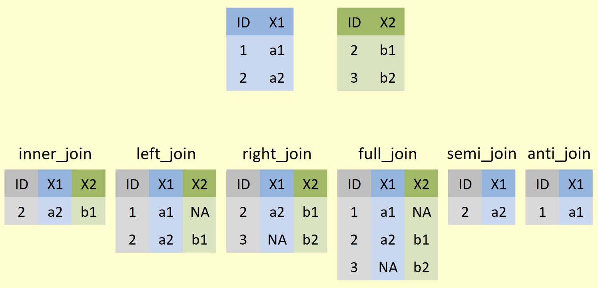

class: clear, title-slide, inverse, center, top, middle

```{r setup, include=FALSE}
knitr::opts_chunk$set(echo = FALSE)
```

```{r, echo=FALSE}
# then load all the relevant packages
pacman::p_load(pacman, knitr, tidyverse, readxl)
```

```{r xaringan-panelset, echo=FALSE}
xaringanExtra::use_panelset()
```

```{r xaringanExtra-clipboard, echo=FALSE}
# these allow any code snippets to be copied to the clipboard so they 
# can be pasted easily
htmltools::tagList(
  xaringanExtra::use_clipboard(
    button_text = "<i class=\"fa fa-clipboard\"></i>",
    success_text = "<i class=\"fa fa-check\" style=\"color: #90BE6D\"></i>",
  ),
  rmarkdown::html_dependency_font_awesome()
)
```
```{r xaringan-extras, echo=FALSE}
xaringanExtra::use_tile_view()

```

# `r rmarkdown::metadata$title`
----
### `r rmarkdown::metadata$author`
### `r format(Sys.time(), "%B %d, %Y")`

---
# Agenda

.pull-left[
## Part 1: Research Overview
- What is Sentiment Analysis?
- What research questions can sentiment analysis answer?

]

.pull-right[

## Part 2: R Code-Along
- Affin 
- Bing
- Loughran
- NRC
]

---
class: clear, inverse, middle, center

# Part 1: Research Overview

Applying Sentiment Analysis in STEM Education Research

---

# What is Sentiment Analysis?

### By summing the values related to each word in a document, we will be able to find out the tone or sentiment of the whole document. 

.center[

]

.footnote[
Figure source: Silge & Robinson, 2017
]

---
# Research questions

.panelset[

.panel[.panel-name[Walkthrough example]

.pull-left[
What is the public sentiment expressed toward the NGSS?
How does sentiment for NGSS compare to sentiment for CCSS?
]


.pull-right[

```{r edge-list, echo=FALSE, message=FALSE, warning=FALSE}
library(tidyverse)
library(knitr)

ts_forum_data <- read_csv("data/ngss_tweets.csv")

ts_forum_data %>%
  head() %>%
  select(text,screen_name) %>%
  kable()
```

]


]

.panel[.panel-name[Discuss]

Take a look at the dataset located [here](https://github.com/laser-institute/text-mining/tree/main/dataset) and consider the following:
- What format is this data set stored as? 
- What are some things you notice about this dataset? 
- What questions do you have about this dataset?
- What similar dataset do you have? 
- What research questions do you want to address with your dataset?

]

]

---
class: clear, inverse, middle, center

# part_2(R, code_along)

Lexicons!

[Text Mining_Sentiment Analysis]

---
# Inner_join

### inner_join() allows us to keep only the rows with words that match words in our sentiment lexicons, or dictionaries, along with the sentiment measure for that word from the sentiment lexicon.

.panelset[

.center[

]

]

---
# Affin, Bing, Loughran, NRC

### There is a difference in the intended use of the lexicon. The following figure shows the different lexicons, the number of words in the lexicon, resolution, calculation method and classification method.

.panelset[

.center[

]

[Source](https://bookdown.org/psonkin18/berkshire/sentiment.html)


]

---
# Affin, Bing, Loughran, NRC

.panelset[

.center[

]

[LIWC study](https://onlinelibrary.wiley.com/doi/full/10.1002/sce.21679)

]
---
class: clear, center

## .font130[.center[**Thank you!**]]
<br/>**Dr. Shiyan Jiang**<br/><mailto:sjiang24@ncsu.edu>
