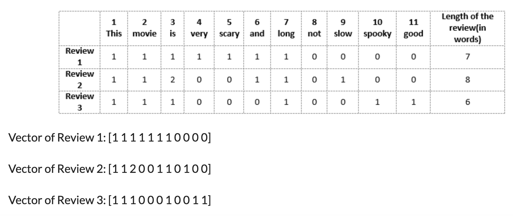
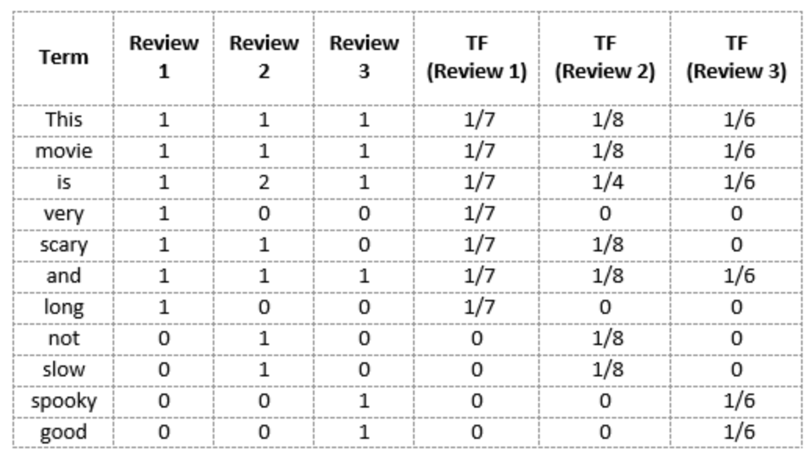
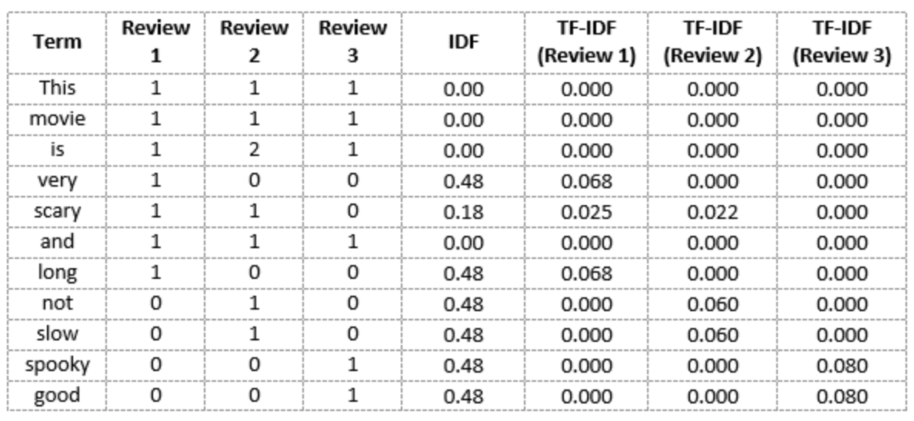

class: clear, title-slide, inverse, center, top, middle

```{r setup, include=FALSE}
knitr::opts_chunk$set(echo = FALSE)
```

```{r, echo=FALSE}
# then load all the relevant packages
pacman::p_load(pacman, knitr, tidyverse, readxl)
```

```{r xaringan-panelset, echo=FALSE}
xaringanExtra::use_panelset()
```

```{r xaringanExtra-clipboard, echo=FALSE}
# these allow any code snippets to be copied to the clipboard so they 
# can be pasted easily
htmltools::tagList(
  xaringanExtra::use_clipboard(
    button_text = "<i class=\"fa fa-clipboard\"></i>",
    success_text = "<i class=\"fa fa-check\" style=\"color: #90BE6D\"></i>",
  ),
  rmarkdown::html_dependency_font_awesome()
)
```
```{r xaringan-extras, echo=FALSE}
xaringanExtra::use_tile_view()

```

# `r rmarkdown::metadata$title`
----
### `r rmarkdown::metadata$author`
### `r format(Sys.time(), "%B %d, %Y")`

---
# Agenda

.pull-left[
## Part 1: Research Overview
- Research question
- Word count
- Term frequency
- Inverse document frequency
- TF-IDF
]

.pull-right[

## Part 2: R Code-Along
- Tokenization
- Stemming
- Stopword
- Filter
]

---
class: clear, inverse, middle, center

# Part 1: Overview

Turn texts into numbers
---
# Research questions

.panelset[

.panel[.panel-name[Walkthrough example]

.pull-left[
What aspects of online professional development offerings do teachers find most valuable?
]


.pull-right[

```{r edge-list, echo=FALSE, message=FALSE, warning=FALSE}
library(tidyverse)
library(knitr)

ts_forum_data <- read_csv("data/opd_survey.csv")

ts_forum_data <- slice(ts_forum_data, -1, -2)

ts_forum_data %>%
  tail() %>%
  select(Resource...6,Role) %>%
  kable()
```

]


]

.panel[.panel-name[Discuss]

Take a look at the dataset located [here](https://github.com/laser-institute/text-mining/tree/main/dataset) and consider the following:
- What format is this data set stored as? 
- What are some things you notice about this dataset? 
- What questions do you have about this dataset?
- What similar dataset do you have? 
- What research questions do you want to address with your dataset?

]

]

---

# Word count

- Review 1: This movie is very scary and long
- Review 2: This movie is not scary and is slow
- Review 3: This movie is spooky and good

.center[

]

.footnote[
Figure source: https://www.analyticsvidhya.com/blog/2020/02/quick-introduction-bag-of-words-bow-tf-idf/
]

---
# Term frequency

### The number we fill the matrix with are simply the raw count of the tokens in each document. This is called the term frequency (TF) approach.

.center[

]

.footnote[
Figure source: https://www.analyticsvidhya.com/blog/2020/02/quick-introduction-bag-of-words-bow-tf-idf/
]

---
# IDF, TF-IDF

### IDF is a measure of how important a term is. TF-IDF is intended to measure how important a word is to a document in a collection (or corpus) of documents.

.center[

]

.footnote[
Figure source: https://www.analyticsvidhya.com/blog/2020/02/quick-introduction-bag-of-words-bow-tf-idf/
]

---

class: clear, inverse, middle, center

# part_2(R, code_along)

Tokenization, Stemming, Stopword, and Filter

[Text Mining_Basics]

---
# Tokenization, Stemming, Stopword, and Filter

### These are some of the methods of processing the data in text mining:

- unnest_tokens()
- wordStem() (lab 3)
- anti_join(dataframe, stop_words)
- filter()
---
class: clear, center

## .font130[.center[**Thank you!**]]
<br/>**Dr. Shiyan Jiang**<br/><mailto:sjiang24@ncsu.edu>
