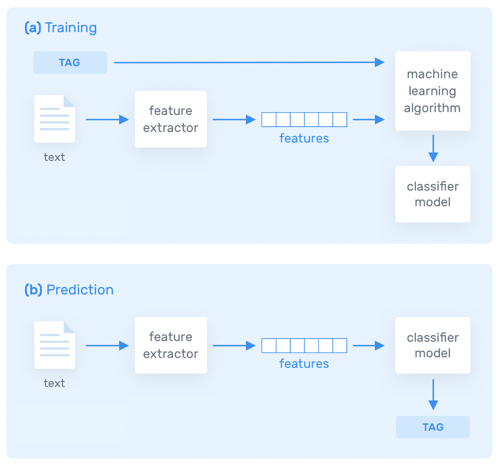
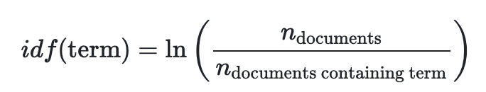
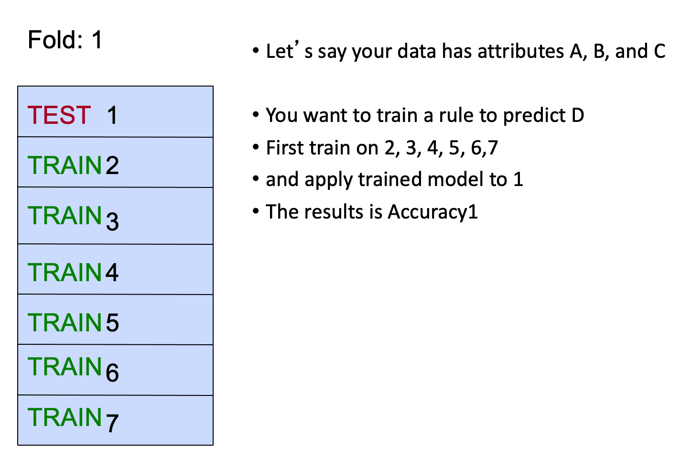
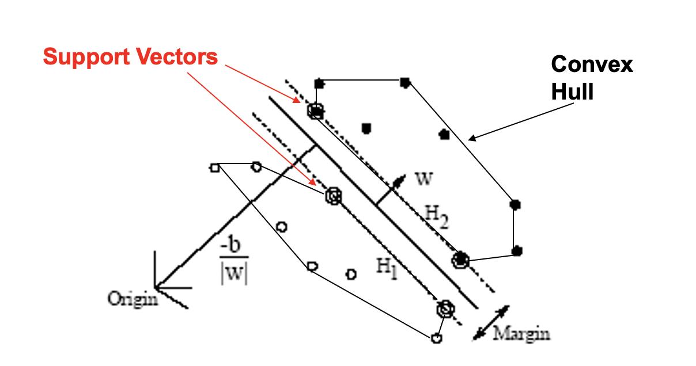

class: clear, title-slide, inverse, center, top, middle

```{r setup, include=FALSE}
knitr::opts_chunk$set(echo = FALSE)
```

```{r, echo=FALSE}
# then load all the relevant packages
pacman::p_load(pacman, knitr, tidyverse, readxl)
```

```{r xaringan-panelset, echo=FALSE}
xaringanExtra::use_panelset()
```

```{r xaringanExtra-clipboard, echo=FALSE}
# these allow any code snippets to be copied to the clipboard so they 
# can be pasted easily
htmltools::tagList(
  xaringanExtra::use_clipboard(
    button_text = "<i class=\"fa fa-clipboard\"></i>",
    success_text = "<i class=\"fa fa-check\" style=\"color: #90BE6D\"></i>",
  ),
  rmarkdown::html_dependency_font_awesome()
)
```
```{r xaringan-extras, echo=FALSE}
xaringanExtra::use_tile_view()

```

# `r rmarkdown::metadata$title`
----
### `r rmarkdown::metadata$author`
### `r format(Sys.time(), "%B %d, %Y")`

---
# Agenda

.pull-left[
## Part 1: Research Overview
- What is Text Classification?
- What research questions can text classification answer?

]

.pull-right[

## Part 2: R Code-Along
- tf-idf
- cross validation
- SVM
]

---
class: clear, inverse, middle, center

# Part 1: Research Overview

Applying Text Classification in STEM Education Research

---

# What is Text Classification?

### Text classification is a machine learning technique that assigns a set of predefined categories to open-ended text.

.center[

]

.footnote[
Figure source: https://monkeylearn.com/text-classification/
]

---
# Research questions

.panelset[


.panel[.panel-name[Literature]

Automatic coding (e.g., Xing et al., 2019): Text classification for automating the analysis of text data, such as forum posts.

Assessment (e.g., Sung et al., 2021): Text classification in assessing student’s multimodal representational thinking in the AR-assisted lab.
- What is the affordance of machine learning in promptly assessing a student’s multimodal representational thinking in an AR-assisted lab?

Prediction (e.g., Wang et al., 2022): Text classification for studying the effect of intelligent systems.
]

.panel[.panel-name[Walkthrough example]

.pull-left[

Assessment
- How can machine learning be used to assess learners’ critical data literacy in open online learning environments?
]


.pull-right[

```{r edge-list, echo=FALSE, message=FALSE, warning=FALSE}
library(tidyverse)
library(knitr)

ts_forum_data <- read_csv("data/comments.csv")

ts_forum_data |>
  head() |>
  select(comment,more_info) |>
  kable()
```

]


]

.panel[.panel-name[Discuss]

Take a look at the dataset located [here](https://github.com/yan2014/TM_LASER_textclassification2022/tree/main/text%20classification/data) and consider the following:
- What format is this data set stored as? 
- What are some things you notice about this dataset? 
- What questions do you have about this dataset?
- What similar dataset do you have? 
- What research questions do you want to address with your dataset?

]

]

---
class: clear, inverse, middle, center

# part_2(R, code_along)

tf-idf, cross validation, and SVM 

[Text Mining_Text Classification]

---
# tf-idf

### The statistic tf-idf is intended to measure how important a word is to a document in a collection (or corpus) of documents.


tf (term frequency): how frequently a word occurs in a document;

idf (inverse document frequency): 

.panelset[

.center[

]


]

idf can be combined with term frequency to calculate a term’s tf-idf (the two quantities multiplied together).

---
# cross validation

.panelset[

.center[

]


]

---
# SVM

.panelset[

.center[

]


]
---
class: clear, center

## .font130[.center[**Thank you!**]]
<br/>**Dr. Shiyan Jiang**<br/><mailto:sjiang24@ncsu.edu>
