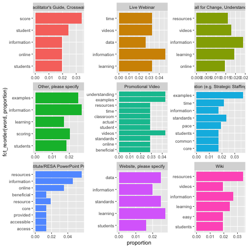

Tidy Text & Word Counts
========================================================
author: ECI 588: Text Mining in Education
date: Unit 1 Guided Walkthrough
autosize: false
transition: linear
font-family: 'Helvetica'

Adapted from:  
Text Mining with R: A Tidy Approach  
<https://www.tidytextmining.com>


What's a Walkthrough?
========================================================
Each unit, we'll **walk through** a basic research workflow, or process for analysis, modeled after Krumm et al. (2018): 


<small>Figure 2.2 Steps of Data-Intensive Research Workflow</small>


<!--
Notes... 
-->

In reality... 
========================================================

 

<small>Figure 2.3 Overlapping Activities Within the Data-Intensive Research Workflow</small>

<!--
Notes... 
--> 


Today's Walkthrough
========================================================

1. **Prepare**: Context, Data, & Questions  
  
2. **Wrangle**: Tidy & Tokenize!
3. **Explore**: Counts, Frequencies, & TF-IDF
4. **Model**: Not until Unit 3 
5. **Communicate**: Week 3: Data Products 

<!--
Notes... 
-->

1. PREPARE
========================================================
type: section

a) Context - Race to the Top (RttT) Online PD  
  
b) Data -  `read` and `view` at our Data

c) Questions - Formulate a Question(s)

<!--
Notes... 
-->


1a. Little Context
========================================================

**Race to the Top** 

NCDPI received $400M for activities and policy reforms to improve education in NC.


**Data Sources** 

Survey of over 15,000 educators participating in online PD. 

**Findings**

Teachers valued convenience, information, and resources. 

---


<!--
Notes... 
-->


1b. Guiding Questions
========================================================

**How do we to quantify what a document or collection of documents is about?**  
  

- What aspects of online professional development offerings do teachers find most valuable?

- How might resources differ in the value they afford teachers?


<!--
Notes... 
-->


1c. Project Setup
========================================================


<!--
Notes... 
-->

Load Libraries
========================================================


```r
library(tidyverse)
library(tidytext)
library(wordcloud2)
library(forcats)
```

2. WRANGLE
========================================================
type: section

a. Read, View, Write Data

b. Reduce Data

c. Tidy Text


2a. Read, View, Write Data
========================================================

**Reading Data into R**
- `dplyr::read_csv()`

**Viewing Data in RStudio**
- `utils::view()`
- `utils::head()`
- `tibble::glimpse()`

**Writing Data to Project Folder**
- `dplyr::write_csv()`


Reading Data into R (Part 1)
========================================================

1. Download the `opd_survey.csv` file we'll be using for this Unit from our NCSU Moodle course site.
2. Create a folder in directory on your computer where you stored your R Project and name it "data". 
3. Add the file to your data folder.
4. Check your Files tab in R Studio to verify that your file is indeed in your data folder.

Reading Data into R (Part 2)
========================================================


```r
opd_survey <- read_csv("data/opd_survey.csv")
```


```
Rows: 57,054
Columns: 19
$ RecordedDate       <chr> "Recorded Date", "{\"ImportId\":\"recordedDate\",\…
$ ResponseId         <chr> "Response ID", "{\"ImportId\":\"_recordId\"}", "R_…
$ Role               <chr> "What is your role within your school district or …
$ Q14                <chr> "Please select the school level(s) you work with. …
$ Q16                <chr> "Which content area(s) do you specialize in?  (SEL…
$ Resource           <chr> "Please indicate the online professional developme…
$ Resource_8_TEXT    <chr> "Please indicate the online professional developme…
$ Resource_9_TEXT    <chr> "Please indicate the online professional developme…
$ Resource_10_TEXT   <chr> "Please indicate the online professional developme…
$ Resource_1         <chr> "What was the primary focus of the webinar you att…
$ Resource_10_TEXT_1 <chr> "What was the primary focus of the webinar you att…
$ Q16_1              <chr> "Which primary content area(s) did the webinar add…
$ Q16_9_TEXT         <chr> "Which primary content area(s) did the webinar add…
$ Q19                <chr> "Please specify the online learning module you are…
$ Q20                <chr> "How are you using this resource?", "{\"ImportId\"…
$ Q21                <chr> "What was the most beneficial/valuable aspect of t…
$ Q26                <chr> "What recommendations do you have for improving th…
$ Q37                <chr> "What recommendations do you have for making this …
$ Q8                 <chr> "Which of the following best describe(s) how you c…
```

Notice that read_csv() dealt with the issues of duplicate column names for us!!

Reading Data into R (Part 3)
========================================================
The lazy way...


Viewing Data
========================================================


```r
#### read data into R #####

dplyr::read_csv()  # read csv files into R

#### view data in R #####

utils::view() # view an object

tibble::glimpse() # like view but transposed

utils::head() # view first 6 rows of your df

utils::tail() # view last 6 rows of your df
```

<!--
Notes... 
-->


Writing Data to Project Folders
========================================================

The **first argument** is the data frame we created earlier

The **second argument** is the file name you plan to give it, including (if necessary) the file path for where it should go. 


```r
write_csv(opd_survey, "data/opd_survey_copy.csv")
```


2b. Reduce Data
========================================================

**Rename Columns**
- `dplyr::rename()`

**Subset Columns and Rows**
- `dplyr::select()`
- `dplyr::slice()`
- `dplyr::filter()`

**Remove NAs**
- `stats::omit.na()`


Select Columns
========================================================


```r
opd_selected <- select(opd_survey, Role, Q21, Resource)

head(opd_selected)
```

```
# A tibble: 6 x 3
  Role                       Q21                     Resource                   
  <chr>                      <chr>                   <chr>                      
1 "What is your role within… "What was the most ben… "Please indicate the onlin…
2 "{\"ImportId\":\"QID2\"}"  "{\"ImportId\":\"QID5_… "{\"ImportId\":\"QID3\"}"  
3 "Central Office Staff (e.…  <NA>                   "Summer Institute/RESA Pow…
4 "Central Office Staff (e.… "Global view"           "Online Learning Module (e…
5 "School Support Staff (e.…  <NA>                   "Online Learning Module (e…
6 "School Support Staff (e.… "communication"         "Calendar"                 
```

Rename Q21
========================================================


```r
opd_renamed <- rename(opd_selected, text = Q21)

glimpse(opd_renamed)
```

```
Rows: 57,054
Columns: 3
$ Role     <chr> "What is your role within your school district or organizati…
$ text     <chr> "What was the most beneficial/valuable aspect of this online…
$ Resource <chr> "Please indicate the online professional development activit…
```

Slice Rows
========================================================

```r
opd_sliced <- slice(opd_renamed, -1, -2) # the - sign indicates to NOT keep rows 1 and 2

head(opd_sliced)
```

```
# A tibble: 6 x 3
  Role                          text              Resource                      
  <chr>                         <chr>             <chr>                         
1 Central Office Staff (e.g. S… <NA>              Summer Institute/RESA PowerPo…
2 Central Office Staff (e.g. S… Global view       Online Learning Module (e.g. …
3 School Support Staff (e.g. C… <NA>              Online Learning Module (e.g. …
4 School Support Staff (e.g. C… communication     Calendar                      
5 Teacher                       levels ofquestio… Live Webinar                  
6 Teacher                       None, really.     Online Learning Module (e.g. …
```

Remove NAs & Filter Teachers
========================================================

```r
opd_complete <- na.omit(opd_sliced)

opd_teacher <- filter(opd_complete, Role == "Teacher")

glimpse(opd_teacher)
```

```
Rows: 23,374
Columns: 3
$ Role     <chr> "Teacher", "Teacher", "Teacher", "Teacher", "Teacher", "Teac…
$ text     <chr> "levels ofquestioning and revised blooms", "None, really.", …
$ Resource <chr> "Live Webinar", "Online Learning Module (e.g. Call for Chang…
```

That's a lot of code!!
========================================================

```r
opd_selected <- select(opd_survey, Role, Resource, Q21)
opd_renamed <- rename(opd_selected, text = Q21)
opd_sliced <- slice(opd_renamed, -1, -2)
opd_complete <- na.omit(opd_sliced)
opd_teacher <- filter(opd_complete, Role == "Teacher")
```

Code Reduction
========================================================

```r
opd_teacher <- opd_survey %>%
  select(Role, Resource, Q21) %>%
  rename(text = Q21) %>%
  slice(-1, -2) %>%
  na.omit() %>%
  filter(Role == "Teacher")

glimpse(opd_teacher)
```

```
Rows: 23,374
Columns: 3
$ Role     <chr> "Teacher", "Teacher", "Teacher", "Teacher", "Teacher", "Teac…
$ Resource <chr> "Live Webinar", "Online Learning Module (e.g. Call for Chang…
$ text     <chr> "levels ofquestioning and revised blooms", "None, really.", …
```


2c. Tidy Text
========================================================

**Tokenize Text**
- `tidytext::unnest_tokens()`

**Remove Stop Words**
- `dplyr::anti_join()`


What tidy data is... 
========================================================

- Each variable is a column
- Each observation is a row
- Each type of observational unit is a table

What tidy data is not... 
========================================================


Nor this... 
========================================================


```
[1] "levels ofquestioning and revised blooms"                                                                                                                                                                                                                             
[2] "None, really."                                                                                                                                                                                                                                                       
[3] "In any of the modules when a teacher is shown in action in the classroom she or he is modeling what \"the topic should look like\" just like we do as teachers with children.  I think the video clips of interaction between student and teacher are most effective"
[4] "Understanding the change"                                                                                                                                                                                                                                            
[5] "overview of reasons for change"                                                                                                                                                                                                                                      
[6] "online--allowed me to do it on my own time and at my own pace"                                                                                                                                                                                                       
```


Tidy text is... 
========================================================

- a table with **one-token-per-row**. 
- A **token** is a meaningful unit of text, such as a word, that we are interested in using for analysis
- **tokenization** is the process of splitting text into tokens. 

Like this... 
========================================================


```
# A tibble: 6 x 1
  word         
  <chr>        
1 levels       
2 ofquestioning
3 and          
4 revised      
5 blooms       
6 none         
```

The unnest_tokens function
========================================================

```r
opd_tidy <- unnest_tokens(opd_teacher, word, text)

glimpse(opd_tidy)
```

```
Rows: 190,527
Columns: 3
$ Role     <chr> "Teacher", "Teacher", "Teacher", "Teacher", "Teacher", "Teac…
$ Resource <chr> "Live Webinar", "Live Webinar", "Live Webinar", "Live Webina…
$ word     <chr> "levels", "ofquestioning", "and", "revised", "blooms", "none…
```
 
Let's unpack this function!
========================================================

- expects a data frame as the first argument
- followed by an `output` column name
- followed by the `input` column 
- Other columns (i.e. `Role` and `Resource`) are retained.
- all punctuation has been removed
- tokens have been changed to lowercase


Remove Stop Words
========================================================


```r
opd_clean <- anti_join(opd_tidy, stop_words)

view(opd_clean)

stop_words
```

```
# A tibble: 1,149 x 2
   word        lexicon
   <chr>       <chr>  
 1 a           SMART  
 2 a's         SMART  
 3 able        SMART  
 4 about       SMART  
 5 above       SMART  
 6 according   SMART  
 7 accordingly SMART  
 8 across      SMART  
 9 actually    SMART  
10 after       SMART  
# … with 1,139 more rows
```

The anti_join function
========================================================


3. EXPLORE
========================================================
type: section

a. Word Counts

b. Word Frequencies 

c. TF-IDF


3a. Word Counts
========================================================

**Counts**
- `dplyr::count()`

**Word Search**
- `grep::grepl()`

**Data Viz**
- `wordcloud2::wordcloud2()`
- `ggplot2::ggplot()`
    - `ggplot2::aes()`
    - `ggplot2::geom_col()`


Word Counts
========================================================


```r
opd_counts <- count(opd_clean, word, sort = TRUE)

opd_counts
```

```
# A tibble: 5,352 x 2
   word              n
   <chr>         <int>
 1 information    1885
 2 learning       1520
 3 videos         1385
 4 resources      1286
 5 online         1139
 6 examples       1105
 7 understanding  1092
 8 time           1082
 9 students       1013
10 data            971
# … with 5,342 more rows
```

Word Clouds
========================================================


```r
wordcloud2(opd_counts)
```


Bar Chart
========================================================

Filter out rows 500 or less

```r
 opd_500 <- opd_counts %>% 
  filter(n > 500) %>% 
  mutate(word = reorder(word, n))
```

Make a default bar chart

```r
 ggplot(opd_500, aes(n, word)) + 
  geom_col()
```

Bar Chart
========================================================
title: 


Word Search
========================================================


```r
opd_quotes <- opd_teacher %>%
  select(text) %>% 
  filter(grepl('online', text))

view(opd_quotes)

sample_n(opd_quotes, 20)
```

```
# A tibble: 20 x 1
   text                                                                         
   <chr>                                                                        
 1 The most beneficial aspect of this online resource was that I was able to se…
 2 The additional online resources: lesson plans, digital literacy explanations…
 3 online                                                                       
 4 it was online and easy to access...handy to be reminded of great ways to use…
 5 Dr Anderson's presentation of the material was interesting, and logical.Out …
 6 The ability to do it online due to limited planning time.                    
 7 The fact that the course was online and easy to access.                      
 8 The section that discussed evaluation of online resources.                   
 9 It was available online                                                      
10 The most beneficail aspect to this online resource was to give insight to ho…
11 that it was online                                                           
12 It was nice to be able to do it online and at my own pace                    
13 online                                                                       
14 it was online                                                                
15 The visual online explanation of Blooms                                      
16 The information may be retrieved at any time online.                         
17 Since I am a ELA teacher, I especially loved the online literacy and researc…
18 understanding the legal and moral boundaries and ramifications of using onli…
19 The most important aspect of the online resource is availability to the reso…
20 The most beneficial aspect of this online resource is being able to save tim…
```


Findings
========================================================
>Educators frequently cited that **information** and **resources** improved their **understanding** of the new **standards** and the teacher eval process.   

__

>A common theme from focus groups and open-ended survey responses was the **convenience** of online professional development. 

Count by Resources
========================================================


```r
opd_resource_counts <- opd_clean %>%
  count(Resource, word, sort = TRUE)

view(opd_resource_counts)
```

Unfortunately, somewhat hard gauge how prominent the same word is across different groups based on just raw counts.


3b. Word Frequencies
========================================================
**Word Frequencies**
- `dplyr::group_by()`
- `dplyr::summarise()`
- `dplyr::mutate()`

**Data Viz**
- `dplyr::left_join()`
- `tidytext::bind_tf_idf()`


Word Frequencies
========================================================


```r
opd_frequencies <- opd_clean %>%
  count(Resource, word, sort = TRUE) %>%
  group_by(Resource) %>%
  mutate(proportion = n / sum(n))

view(opd_frequencies)
```

We see that **information**, for example, makes up about 2.3% of words in responses about the Online Modules, and about 1.7% for Recorded Webinars.

Small Multiples
========================================================




3c. TF-IDF
========================================================

**TF-IDF**
- `dplyr::left_join()`
- `tidytext::bind_tf_idf()`


What is TF-IDF?
========================================================
>The idea of the statistic tf-idf is to **find the important words**... by decreasing the weight for commonly used words and increasing the weight for words that are not used very much in a collection or corpus of document... 

>...while it has **proved useful in text mining**, search engines, etc., 

>...its **theoretical foundations are considered less than firm** by information theory experts.

1. Count Words by Grouping
========================================================


```r
opd_words <- opd_teacher %>%
  unnest_tokens(word, text) %>%
  count(Resource, word, sort = TRUE)

view(opd_words)
```


2. Calculate the total words per group
========================================================

```r
total_words <- opd_words %>%
  group_by(Resource) %>%
  summarise(total = sum(n))

view(total_words)
```

3. Join totals to word counts
========================================================

```r
opd_totals <- left_join(opd_words, total_words)

view(opd_totals)
```

4. Calculate TF-IDF & Interpret
========================================================

```r
opd_tf_idf <- opd_totals %>%
  bind_tf_idf(word, Resource, n)

view(opd_tf_idf)
```

`idf` and thus `tf-idf` are zero for these extremely common words often stop words and as we've discovered, uniquely misspelled words! 

