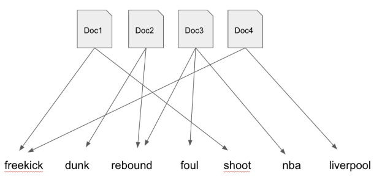
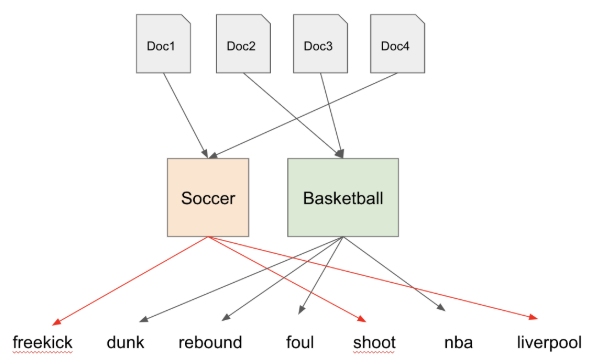

class: clear, title-slide, inverse, center, top, middle

```{r setup, include=FALSE}
knitr::opts_chunk$set(echo = FALSE)
```

```{r, echo=FALSE}
# then load all the relevant packages
pacman::p_load(pacman, knitr, tidyverse, readxl, tidytext, topicmodels)
```

```{r xaringan-panelset, echo=FALSE}
xaringanExtra::use_panelset()
```

```{r xaringanExtra-clipboard, echo=FALSE}
# these allow any code snippets to be copied to the clipboard so they 
# can be pasted easily
htmltools::tagList(
  xaringanExtra::use_clipboard(
    button_text = "<i class=\"fa fa-clipboard\"></i>",
    success_text = "<i class=\"fa fa-check\" style=\"color: #90BE6D\"></i>",
  ),
  rmarkdown::html_dependency_font_awesome()
)
```
```{r xaringan-extras, echo=FALSE}
xaringanExtra::use_tile_view()

```

# `r rmarkdown::metadata$title`
----
### `r rmarkdown::metadata$author`
### `r format(Sys.time(), "%B %d, %Y")`

---
# Agenda

.pull-left[
## Part 1: Research Overview
- What is topic modeling?
- What research questions can topic modeling answer?
- What are limitations & ethical considerations?

]

.pull-right[

## Part 2: R Code-Along
- Tidy Text
- Document Term Matrix
- Fit a Topic Model
]


---
class: clear, inverse, middle, center

# Part 1: Research Overview

Applying Topic Modeling in STEM Education Research


---
# What is Topic Modeling? 

.panelset[

.panel[.panel-name[Machine Learning]

Topic modeling is a form of unsupervised machine learning that uses various techniques to identify latent themes among a collection of documents.
.center[

]

]


.panel[.panel-name[Techniques]

With a bit of tongue-in-cheek, [Meeks and Weingart](http://journalofdigitalhumanities.org/2-1/dh-contribution-to-topic-modeling/) describe topic modeling as:

>leveraging occult statistical methods like 'dirichlet priors' and 'bayesian models'... to provide seductive but obscure results in the form of easily interpreted (and manipulated) 'topics.'

Occult methods include, but are not limited to:
- Latent Dirichlet Allocation (**LDA**)
- Structure Topic Modeling (STM)
- Latent Semantic Analysis (LSA)

]


.panel[.panel-name[Bag of Words]
.center[

]


]


.panel[.panel-name[Latent Themes]
.center[


]
]
]


---
# Research questions

.panelset[


.panel[.panel-name[Literature]

Literature review (e.g., Chen et al., 2020)
- In what research topics were the Computers & Education community interested ?
- How did such research topics evolve over time?

Assessment (e.g., Ming & Ming, 2015)
- Do the concepts discussed by students as inferred by pLSA (Probabilistic latent semantic analysis) predict their course outcomes?
- How does the accuracy of these predictions change over time as more student work is analyzed?

]

.panel[.panel-name[Walkthrough example]

.pull-left[

Course/project evaluation (e.g., Akoglu et al., 2019)
- What are the similarities and differences between how PLT (professional learning team) members and Non-PLT online participants engage and meet course goals in a MOOC-Ed designed for educators?

]


.pull-right[

```{r edge-list, echo=FALSE, message=FALSE, warning=FALSE}
library(tidyverse)
library(knitr)

ts_forum_data <- read_csv("data/ts_forum_data.csv")

ts_forum_data |>
  head() |>
  select(forum_name,post_content) |>
  kable()
```

]


]

.panel[.panel-name[Discuss]

Given your current understanding of Topic Modeling, how to you evision topic modeling might be useful in your research?

]

]


---
# What are limitations & ethical considerations?

.panelset[
- Nuances of language or context may be lost
- Limited to source material selected by researcher(s)
- Not good for small corpora
- Understanding of context needed
]


---
class: clear, inverse, middle, center

# part_2(R, code_along)

Tidy Text, Cast a DTM, Fit a Topic Model

---
# A Quick Refresher

## Sentiment analysis

.center[

]

.footnote[
Figure source: Silge & Robinson, 2017
]

---

# Wrangle Data

.panelset[

.panel[.panel-name[Import Data]

Let's import forum data collected from the Friday Institute's MOOC-Eds:

```{r import-data, echo=TRUE, message=FALSE}
ts_forum_data <- read_csv("data/ts_forum_data.csv", 
  col_types = cols(course_id = col_character(),
                   forum_id = col_character(), 
                   discussion_id = col_character(), 
                   post_id = col_character()
                   )
    )
```


]

.panel[.panel-name[Tidy Text]

Next, let's tokenize our forum text and by using the `unnest_tokens()` function and remove stop words per usual:

```{r wrangle-data, echo=TRUE, message=FALSE, warning=FALSE}

forums_tidy <- ts_forum_data %>%
  unnest_tokens(output = word, input = post_content) %>%
  anti_join(stop_words, by = "word")

```

]

.panel[.panel-name[Inspect Data]

In the corresponding line of your R script, take a look at the `forums_tidy` data file we just imported:

```{r inspect-data, echo=TRUE}
# ADD CODE BELOW
#
#

```


]

.panel[.panel-name[Discuss]

Think about the questions below and be prepared to share your response:              
1. What do you think the rows and columns represent in our tidy data? 
1. What else do you notice about our data?
1. What questions do you have about our tidy text? 

]

]


---
# Convert to Document Term Matrix

.panelset[

.panel[.panel-name[The DTM]

Before we can begin modeling our tidy forum data in R, we need to convert to our tidy text into a document term matrix.

.center[

]


]

.panel[.panel-name[Cast DTM]

Before we can begin analyzing our network data in R, we need to convert to a network class R object. Run the following code in your R script:

```{r convert-dtm, echo=TRUE, message=FALSE, warning=FALSE}

forums_dtm <- forums_tidy %>%
  count(post_id, word) %>%
  cast_dtm(post_id, word, n)

```


]

.panel[.panel-name[Inspect DTM]

In the corresponding line of your R script, type `forum_dtm` and run to inspect the properties of our document term matrix:

```{r view-netwok, echo=TRUE}
# ADD CODE BELOW
#
#

```


]

.panel[.panel-name[Discuss]

Think about the questions below:              

1. How many documents are in our DTM?
1. How many unique words are in our DTM?
1. What questions, if any, do have about our DTM?

Type your responses in the chat.

]


]

---

# Fit a Topic Model

.panelset[

.panel[.panel-name[topicmodels]

The {topicmodels} package provides functions for Latent Dirichlet Allocation (LDA) models and Correlated Topics Models (CTM). 

```{r topicmodels, echo=TRUE, eval=FALSE}
library(topicmodels)
```

]


.panel[.panel-name[LDA Function]
The `LDA()` function requires two basic arguments: a DTM and the number of topics. We'll 20 as our value for the `k =` argument and set a `seed =` value so we can reproduce our results:

```{r density, echo=TRUE, eval=TRUE}
forums_lda <- LDA(forums_dtm, 
                  k = 20, 
                  control = list(seed = 588)
                  )
```

]


.panel[.panel-name[Inspect Terms]

In the corresponding line of your R script, type `forum_dtm` and run to inspect the properties of our document term matrix:

```{r view-terms, echo=TRUE}
terms(forums_lda, 5)

```

]

.panel[.panel-name[Discuss]

What "latent themes" or "topics" might you apply to these word groups? 

]
]


---
class: clear, center

## .font130[.center[**Thank you!**]]
<br/>**The LASER Team**<br/><mailto:sjiang24@ncsu.edu>
