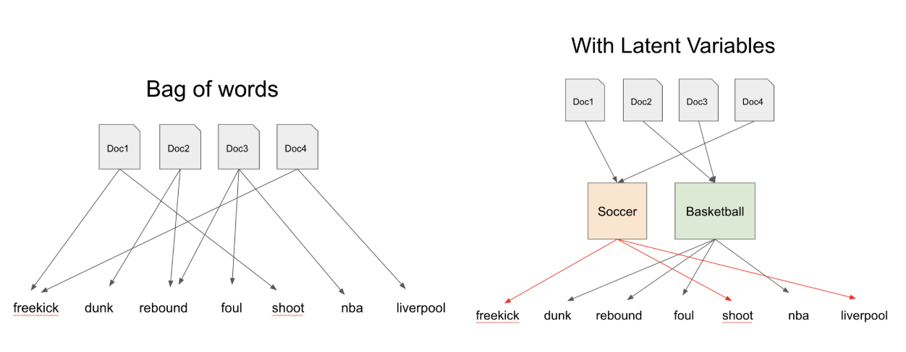
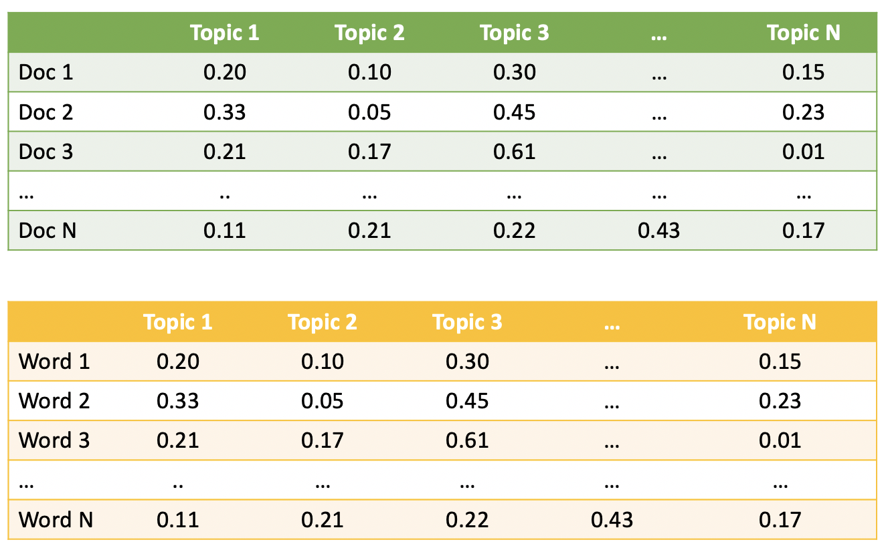

class: clear, title-slide, inverse, center, top, middle

```{r setup, include=FALSE}
knitr::opts_chunk$set(echo = FALSE)
```

```{r, echo=FALSE}
# then load all the relevant packages
pacman::p_load(pacman, knitr, tidyverse, readxl)
```

```{r xaringan-panelset, echo=FALSE}
xaringanExtra::use_panelset()
```

```{r xaringanExtra-clipboard, echo=FALSE}
# these allow any code snippets to be copied to the clipboard so they 
# can be pasted easily
htmltools::tagList(
  xaringanExtra::use_clipboard(
    button_text = "<i class=\"fa fa-clipboard\"></i>",
    success_text = "<i class=\"fa fa-check\" style=\"color: #90BE6D\"></i>",
  ),
  rmarkdown::html_dependency_font_awesome()
)
```
```{r xaringan-extras, echo=FALSE}
xaringanExtra::use_tile_view()

```

# `r rmarkdown::metadata$title`
----
### `r rmarkdown::metadata$author`
### `r format(Sys.time(), "%B %d, %Y")`

---
# Agenda

.pull-left[
## Part 1: Research Overview
- What is Topic Modeling?
- What research questions can topic modeling answer?
- What are limitations & ethical considerations?

]

.pull-right[

## Part 2: R Code-Along
- Document Term Matrix
- LDA (Latent Dirichlet allocation)
- Finding K
]

---
# A Quick Refresher

## Sentiment analysis

.center[

]

.footnote[
Figure source: Silge & Robinson, 2017
]

---
class: clear, inverse, middle, center

# Part 1: Research Overview

Applying Topic Modeling in STEM Education Research

---

# What is Topic Modeling?

### "Topic modeling is a field of natural language processing that aims to extract themes by text mining a set of documents." (Blei, 2012; Vijayan, 2021)

.center[

]

.footnote[
Figure source: Naskar, n.d.
]

---
# Research questions

.panelset[


.panel[.panel-name[Literature]

Literature review (e.g., Chen et al., 2020)
- In what research topics were the Computers & Education community interested ?
- How did such research topics evolve over time?

Assessment (e.g., Ming & Ming, 2015)
- Do the concepts discussed by students as inferred by pLSA (Probabilistic latent semantic analysis) predict their course outcomes?
- How does the accuracy of these predictions change over time as more student work is analyzed?

]

.panel[.panel-name[Walkthrough example]

.pull-left[

Course/project evaluation (e.g., Akoglu et al., 2019)
- What are the similarities and differences between how PLT (professional learning team) members and Non-PLT online participants engage and meet course goals in a MOOC-Ed designed for educators?

]


.pull-right[

```{r edge-list, echo=FALSE, message=FALSE, warning=FALSE}
library(tidyverse)
library(knitr)

ts_forum_data <- read_csv("data/ts_forum_data.csv")

ts_forum_data %>%
  head() %>%
  select(forum_name,post_content) %>%
  kable()
```

]


]

.panel[.panel-name[Discuss]

Take a look at the dataset located [here](https://github.com/yan2014/TM_LASER/tree/main/data-u) and consider the following:
- What format is this data set stored as? 
- What are some things you notice about this dataset? 
- What questions do you have about this dataset?
- What similar dataset do you have? 
- What research questions do you want to address with your dataset?

]

]


---
# What are limitations & ethical considerations?

.panelset[
- Nuances of language or context may be lost
- Limited to source material selected by researcher(s)
- Not good for small corpora
- “Computing probabilities allows a "generative" process by which a collection of new “synthetic documents” can be generated that would closely reflect the statistical characteristics of the original collection” (Wikipedia).
]


---
class: clear, inverse, middle, center

# part_2(R, code_along)

Document Term Matrix, LDA, and Finding K 

[Text Mining_Topic Modeling]

---
# Document Term Matrix

.panelset[

.center[

]


Figure source: SPE3DLab, n.d.


]

---
# LDA

.panelset[

.center[

]


Figure source: Ma, 2019


]

---
# LDA

.panelset[

.center[

]


]
---
class: clear, center

## .font130[.center[**Thank you!**]]
<br/>**Dr. Shiyan Jiang**<br/><mailto:sjiang24@ncsu.edu>
