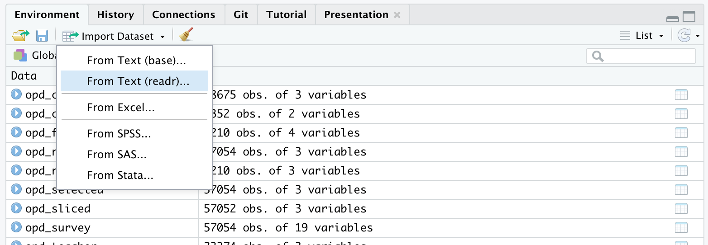
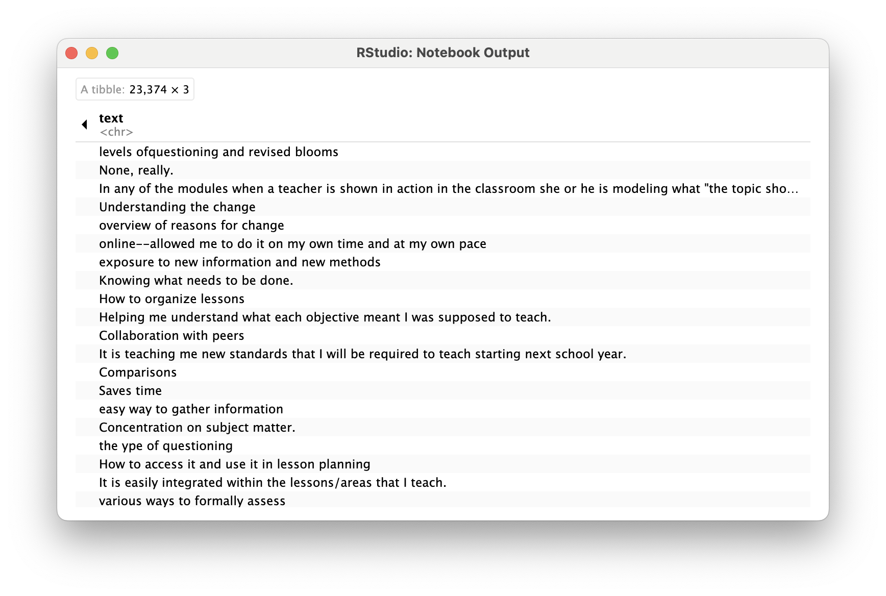
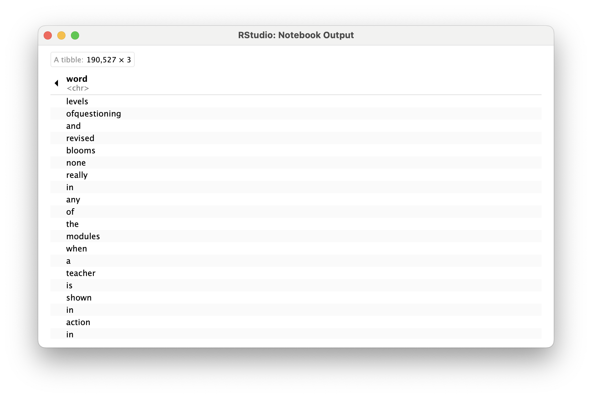
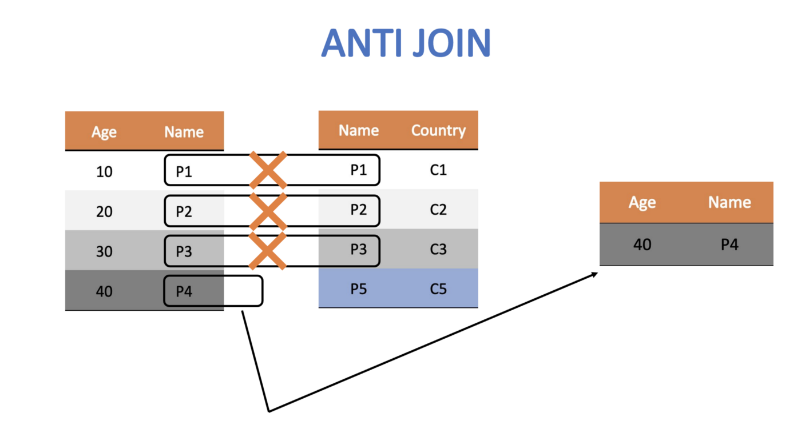

## Welcome to the Text Mining code along for Module 1

-   The Text Mining course is designed for those seeking an introductory
    understanding of quantifying the text in documents to better
    understand their properties

-   The following code along is a companion to the Module 1 case study's
    **Prepare** and **Wrangle** stages

{width="60%"}

[@krumm2018]

::: notes
:::

## Module Objectives

This code along is about getting our text "tidy." By the end of this
module we will:

-   Understand the context and data sources you're working with so you
    can formulate useful and answerable questions

. . .

-   Practice reading, manipulating, cleaning, transforming, and merging
    text data

. . .

::: notes
:::

## Context of the Problem

-   We are working with open-ended survey data from an evaluation of
    online professional development offered by the North Carolina
    Department of Public Instruction

-   This PD is part of the state's [Race to the
    Top](https://obamawhitehouse.archives.gov/issues/education/k-12/race-to-the-top)
    (RttT) efforts

-   [2012 Friday Institute Annual
    Report](https://fi.ncsu.edu/resource-library/race-to-the-top-online-professional-development-evaluation-year-1-report/)

::: {.fragment .fade-in-then-semi-out}
### Research Questions:

-   What aspects of online professional development offerings do
    teachers find most valuable?

-   How might resources differ in the value they afford teachers?
:::

::: notes
The dataset we'll be using for analysis in this case study is exported
as is from Qualtrics with personal identifiers, select demographics,
metadata, and closed-ended responses removed.
:::

## Load Libraries

:::::: panel-tabset
## Packages Needed

::::: columns
::: {.column width="50%"}
{width="30%"}
:::

::: {.column width="50%"}
{width="30%"}
:::
:::::

## Your Turn

-   Load the `tidyverse` and `tidytext` packages using `library()`

## Answer

```{r echo=TRUE}
library(tidyverse)
library(tidytext)
```
::::::

::: notes
The `tidytext` package helps to convert text into data frames with each
rows containing an individual word or sequence of words, making it easy
to to manipulate, summarize, and visualize text using using familiar
functions form the `tidyverse` collection of packages

Don't worry if you saw a number of messages: those probably mean that
the tidyverse loaded just fine. Any conflicts you may have seen mean
that functions in these packages you loaded have the same name as
functions in other packages and R will default to function from the last
loaded package unless you specify otherwise.
:::

## Wrangling Text Data

-   Data wrangling is essential because it involves the initial steps of
    going from raw data to a dataset that can be explored and modeled
    [@krumm2018]. Text mining is no exception. Today we will:

a.  **Read raw data**. Before working with data, we need to "read" it
    into R. It also helps to inspect your data and we'll review
    different functions for doing so
b.  **Reduce the data**. We focus on tools from the `dplyr` package to
    `view`, `rename`, `select`, `slice`, and `filter` our data in
    preparation for analysis
c.  **Tidy text**. We'll learn how to use the `tidytext` package to both
    "tidy" and tokenize our text in order to create a data frame to use
    for analysis

## Reading Data

This section introduces the following functions for reading data into R
and inspecting the contents of a data frame:

-   `dplyr::read_csv()` Reading .csv files into R.
-   `base::print()` View your data frame in the Console Pane
-   `utils::view()` View your data frame in the Source Pane
-   `tibble::glimpse()` Like print, but transposed so you can see all
    columns
-   `utils::head()` View the first 6 rows of your data.
-   `utils::tail()` View last 6 rows of your data.
-   `dplyr::write_csv()` writing .csv files to directory.

::: notes
The name before the double colon indicates the package the function
comes from. For example, read_csv comes from the readr package. In
practice, we do not typically need to name the package when we call a
function. If there are packages that use a function with the same name,
it will default to the package that last loaded.
:::

## Reading Data, Cont.

::: panel-tabset
## Raw Data

-   To get started, we need to import, or "read", our data into R

-   The RttT Online PD survey data is stored in a CSV file named
    opd_survey.csv which is located in the data folder of this project

## Your Turn

-   Use `read_csv()` to save `opd_survey.csv` as a new object
    `opd_survey`

-   This file can be found in the local data folder

-   If you have questions about the above function, don't be afraid to
    look it up in console using `?read_csv()`

## Answer

```{r echo=TRUE}
opd_survey <- read_csv("data/opd_survey.csv")
```

## Alternative

-   There is also an Import Dataset feature under the Environment tab in
    the upper right pane of RStudio

{width="100%"}
:::

## Viewing Data

-   Once your data is in R, there are many different ways you can view
    it. Use the below code chunk to try each way out:

```{r echo=FALSE}
# enter the name of your data frame and view directly in console 
opd_survey 

# view your data frame transposed so your can see every column and the first few entries
glimpse(opd_survey) 

# look at just the first six entries
head(opd_survey) 

# or the last six entries
tail(opd_survey) 

# view the names of your variables or columns
names(opd_survey) 

# or view in source pane
view(opd_survey) 

```

::: notes
The view() function is a very useful function for displaying a data
frame in an interactive spreadsheet-like interface within RStudio.
However, it causes issues when rendering Quarto or knitting R Markdown
documents because it does not produce an output or modify the
environment as expected when rendering documents.

Notice that in the code chunk above that the eval=FALSE option as been
included in the header. This will prevent Quarto from evaluating this
code chunk and including it in the rendered HTML file. If you use the
view() function in later code chunks, be sure to include this option.
Alternatively, you can use the view function directly in the console.

To learn more about Quarto code chunk options, visit:
<https://quarto.org/docs/computations/execution-options.html>
:::

## Reducing Data

### [**`dplyr`**](https://dplyr.tidyverse.org) **functions**

-   `select()` picks variables based on their names.
-   `slice()` lets you select, remove, and duplicate rows.
-   `rename()` changes the names of individual variables using new_name
    = old_name syntax
-   `filter()` picks cases, or rows, based on their values in a
    specified column

### [**`tidyr`**](https://tidyr.tidyverse.org) **functions**

-   `drop_na()` removes rows with missing values ("na", "N/A", etc.)

::: notes
As you've probably already noticed from viewing our dataset, we clearly
have more data than we need to answer our rather basic research
question. For this part of our workflow we focus on the following
functions from the tidyverse dplyr and tidyr packages for wrangling our
data.
:::

## Subset Columns

::: panel-tabset
## select()

-   To help address our research question, let's first reduce our
    dataset to only the columns needed
-   `select()` is a `dplyr` function that can choose specific variables,
    or columns, of data

## Your Turn

-   `select()` the columns `Role`, `Resource`, and `Q21`

-   Assign these selected columns to a new data frame named
    `opd_selected` by using the `<-` assignment operator

## Answer

```{r echo=TRUE}
#select relevant columns
opd_selected <- select(opd_survey, Role, Resource, Q21)
#check data
head(opd_selected)
```
:::

::: notes
To begin, we'll `select()` the columns `Role`, `Resource`, and `Q21`
since those respectively pertain to educator role, OPD resource they are
evaluating, and, as illustrated by the second row of column Q21, their
response to the survey question, "What was the most beneficial/ aspect
of the professional development resource?"

We'll also assign these selected columns to a new data frame named
`opd_selected` by using the assignment operator
:::

## Rename Columns

::: panel-tabset
## rename()

-   `rename()` allows us to change the names of existing columns, which
    can make them more useful or informative in our data workflow

## Your Turn

-   Take our `opd_selected` data frame and use `rename()`, along with
    the `=` assignment operator, to change the column name from `Q21` to
    `text` and save it as `opd_renamed`.

## Answer

```{r echo=TRUE}
#rename columns
opd_renamed <- rename(opd_selected, text = Q21)
#check data
opd_renamed
```
:::

::: notes
Notice that Q21 is not a terribly informative variable name. Let's now
take our `opd_selected` data frame and use the `rename()` function along
with the `=` assignment operator to change the name from Q21 to `text`
and save it as `opd_renamed`.
:::

## Additional Wrangling

-   The following code shows how to make some slight adjustments to
    account for Qualtrics artifacts and missing data

-   These are shown in greater detail in the [Module 1 Case
    Study](https://laser-institute.github.io//text-mining/module-1/tm-1-case-study.html)

```{r echo=FALSE}
#use slice() to remove the top two rows of data
#these are extra headers created by Qualtrics that we don't need
opd_sliced <- slice(opd_renamed, -1, -2) # the - operator tells the slice function to NOT keep rows 1 and 2

opd_sliced

#use drop_na() to remove missing data indicated by "NA"

opd_complete <- drop_na(opd_sliced)

opd_complete

#use filter() to identify only responses from participants who indicated their role as teacher

opd_teacher <- filter(opd_complete, Role == "Teacher")

opd_teacher
```

::: notes
When we used two `==` signs to filter for rows when Role is equal to
Teacher. This was different than when we used just on = sign to rename
our column.

In R, the single `=` sign is used for creating new variables, object or
value, while the double == sign is used to test if two values are equal.

The single `=` can also be used used for assigning the output of a
function to a new objects, like so:

`opd_complete = drop_na(opd_sliced)`

However, using and == for comparisons and the `<-` operator for
assignment avoids ambiguity and makes the code easier to read and
maintain.
:::

## Tidying Text

For this part of our workflow we focus on the following functions from
the [`tidytext`](https://cran.r-project.org/web/packages/tidytext/) and
`dplyr` packages respectively:

-   `unnest_tokens()` splits a column into tokens
-   `anti_join()` returns all rows from x with**out** a match in y.

Tidy data has a specific structure:

-   Each variable is a column
-   Each observation is a row
-   Each type of observational unit is a table

## Tidy Text, Cont.

In this section, our goal is to transform our `opd_teacher` text data
from this:



## Tidy Text, Cont.

to this:



::: notes
This one-token-per-row structure differs from how text is often stored,
perhaps as strings or in a [document-term
matrix](https://en.wikipedia.org/wiki/Document-term_matrix#:~:text=A%20document%2Dterm%20matrix%20is,and%20columns%20correspond%20to%20terms.).
The **token** that is stored in each row is most often a single word,
but can also be an n-gram (e.g., a sequence of 2 or 3 words), a
sentence, or even a whole paragraph. Conveniently, the tidytext package,
provides functionality for tokenizing text by common units like these
into a one-term-per-row format.
:::

## Tokenizing Text

::: panel-tabset
## unnest_tokens()

-   In order to tidy our text, we need to break the text into individual
    tokens (a process called tokenization) and transform it to a tidy
    data structure

-   To do this, we use tidytext's incredibly powerful `unnest_tokens()`
    function

-   Arguments

## Your Turn

-   Use `unnest_tokens()` to tokenize `opd_teacher` into new object
    `opd_tidy`

-   Within the function, follow the table `opd_teacher` with the
    `output` and `input` arguments as `word` and `text`, respectively

## Answer

```{r}
#
opd_tidy <- unnest_tokens(opd_teacher, word, text)
```
:::

In order to tidy our text, we need to break the text into individual
tokens (a process called tokenization) and transform it to a tidy data
structure. To do this, we use tidytext's incredibly powerful
`unnest_tokens()` function.

Run the following code to tidy our text and save it as a new data frame
named `opd_tidy`:

```{r}
opd_tidy <- unnest_tokens(opd_teacher, word, text)

opd_tidy
```

Note that we also could have just added `unnest_tokens(word, text)` to
our previous piped chain of functions like so:

```{r}
opd_tidy <- opd_survey |>
  select(Role, Resource, Q21) |>
  rename(text = Q21) |>
  slice(-1, -2) |>
  drop_na() |>
  filter(Role == "Teacher") |>
  unnest_tokens(word, text)

opd_tidy
```

::: notes
In order to tidy our text, we need to break the text into individual
tokens (a process called tokenization) and transform it to a tidy data
structure. To do this, we use tidytext's incredibly powerful
`unnest_tokens()` function.

After all the work we did prepping our data, this is going to feel a
little anticlimactic.

There is A LOT to unpack with this function. First notice that
`unnest_tokens` expects a data frame as the first argument, followed by
two column names. The first is an output column name that doesn't
currently exist (`word`, in this case) but will be created as the text
is unnested into the new column. This if followed by the input column
that the text comes from which we uncreatively named `text`. Also
notice:

-   Other columns, such as `Role` and `Resource`, are retained.
-   All punctuation has been removed.
-   Tokens have been changed to lowercase, which makes them easier to
    compare or combine with other datasets. However, we can use the
    `to_lower = FALSE` argument to turn off this behavior if desired.
:::

## Removing Stop Words

::: panel-tabset
## `stop_words()`

One final step in tidying our text is to remove words that don't add
much value to our analysis (at least when using this approach) such as
"and", "the", "of", "to" etc. The `tidytext` package contains a
`stop_words` dataset derived from three different lexicons that we'll
use to remove rows that match words in this dataset.

Run `view(stop_words)` to view all stop words in each lexicon:

## `anti_join()`

In order to remove these stop words, we will use function called
`anti_join()` that looks for matching values in a specific column from
two datasets and returns rows from the original dataset that have no
matches.

For a good overview of the different `dplyr` joins see here:
<https://medium.com/the-codehub/beginners-guide-to-using-joins-in-r-682fc9b1f119>

## Visual

{width="80%"}

## Example

Let's remove rows from our `opd_tidy` data frame that contain matches in
the `word` column with those in the `stop_words` dataset and save it as
`opd_clean` since we were done cleaning our data at this point.

```{r, echo=TRUE}
opd_clean <- anti_join(opd_tidy, stop_words)
view(opd_clean)
```

## **👉 Your Turn ⤵**

Finally, let's wrangle a data set that includes tokens not just for
teachers, but for all educators who particiated in the online
professional development offerings.

Complete and run the following code to wrangle and tidy your
`opd_survey` data for all survey respondents.

```{r}
wrangled_teacher <- opd_survey |>
  select(Role, Resource, Q21) |> # Select only columns Role, Resource, and Q21
  rename(text = Q21) |> 
  slice(-1, -2) |>
  drop_na() |>
  filter(Role == "Teacher") |>
  unnest_tokens(word, text) |>
  anti_join(stop_words)

wrangled_teacher
```

If you did this correctly, you should now see a `wrangled_teacher` data
frame in the Environment pane that has 78,675 observations and 3
variables.

## Questions

1.  How many observations are in the data frame with all educators?
2.  Why do you think the console provided the message "Joining, by =
    'word'"?

Congratulations, we're now ready to begin exploring our wrangled data!
:::

# What's Next? {background="#143156"}

::: {style="text-align: left; font-size: 50px"}
-   Explore the *R Basics* column of [Posit Cloud's
    Recipes](https://posit.cloud/learn/recipes)
-   Complete the *Prepare and Wrangle* part of the [case
    study](https://laser-institute.github.io//text-mining/module-2/tm-2-case-study.html)
-   Complete the [Text Mining Basics
    badge](https://laser-institute.github.io//text-mining/module-1/tm-1-badge.html)
-   Do [essential readings for the next
    module](https://laser-institute.github.io//text-mining/module-2/tm-2-readings.html)
:::
