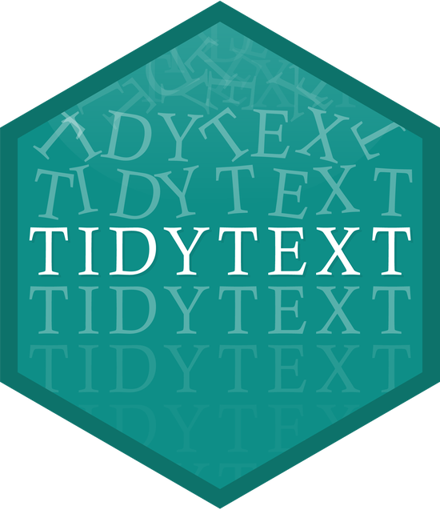
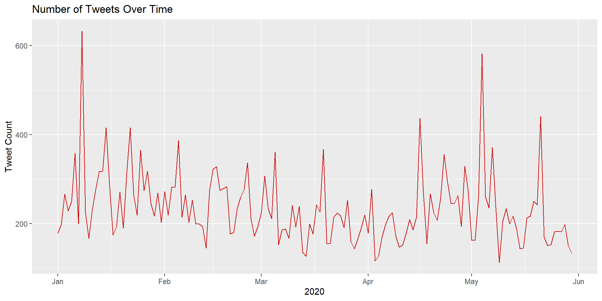
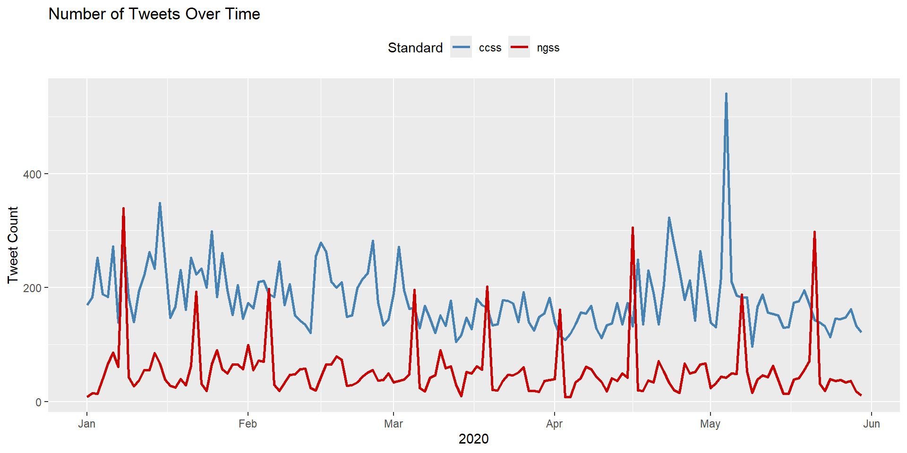
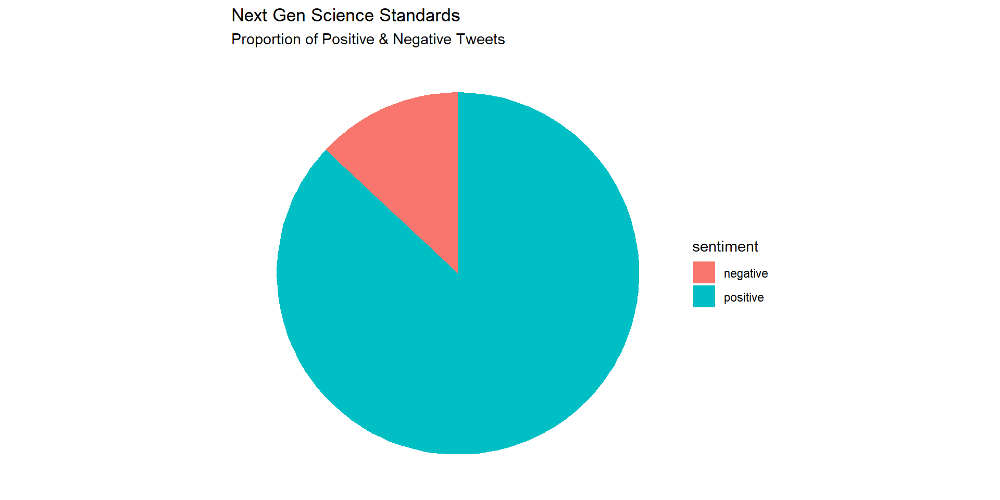
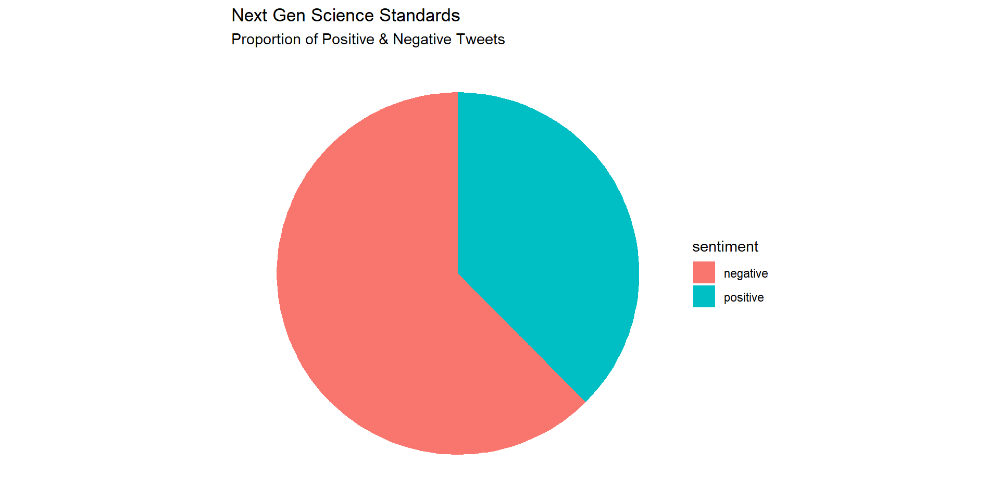

## Welcome to the Text Mining Code Along for Module 2


::: {.cell}

:::


-   The Text Mining course is designed for those seeking an introductory
    understanding of quantifying the text in documents to better
    understand their properties

-   The following Code Along is a companion to the Module 2 case study's
    **Explore** stages

{width="60%"}

[@krumm2018]

::: notes
:::

## Module Objectives

This code along assumes that our text is tidied, and is now ready for
some exploration.

-   The **explore** phase of the learning analytics workflow is to gain
    a good intuition about the underlying data through summary
    statistics, visualizations, and, if need be, additional wrangling

-   Exploration uncovers possible relationships between variables and
    gives an opportunity to refine your research questions or hypotheses

. . .

By the end of this module, we will:

-   Visualize the date range of our `ccss-tweets` dataset

-   Summarize and compare public sentiment using summary statistics

-   Visualize sentiment through a pie chart

::: notes
:::

## Context of the Problem

### **Twitter and the Next Generation Science Standards**

{fig-alt="Full Paper (AERA Open)"
width="50%"}

::: {.fragment .fade-in-then-semi-out}
### Research Questions:

-   What is the public sentiment expressed toward the NGSS?

-   How does sentiment for NGSS compare to sentiment for CCSS?
:::

::: notes
:::

## Load Libraries

:::::: panel-tabset
## Packages Needed

::::: columns
::: {.column width="50%"}
{width="275"}

{width="270"}
:::

::: {.column width="50%"}
{width="275"}
:::
:::::

## Your Turn

-   Load the `tidyverse`, `tidytext`, and `textdata` packages using
    `library()`

## Answer


::: {.cell}

```{.r .cell-code}
library(tidyverse)
library(tidytext)
library(textdata)
```
:::

::::::

::: notes
The `tidytext` package helps to convert text into data frames with each
rows containing an individual word or sequence of words, making it easy
to to manipulate, summarize, and visualize text using using familiar
functions form the `tidyverse` collection of packages.

`textdata` integrates nicely with the {tidytext} package and provides
streamlined access to various text-based datasets, which are commonly
used for text mining, natural language processing, and sentiment
analysis. Some examples of datasets accessible via textdata include
sentiment lexicons (e.g., sentiment lexicons like AFINN, NRC, or Bing),
specialized word lists, and linguistic resources.
:::

## Time Series

::: panel-tabset
## Quick Viz

Let's take a very quick look at the number of daily tweets over the
first 5 months of 2020:


::: {.cell}

```{.r .cell-code}
daily_tweets <- ss_tweets |>
  mutate(tweet_date = as.Date(created_at)) |>
  group_by(tweet_date) |>
  summarise(count = n())

# Plot a line chart of the number of tweets over time
ggplot(daily_tweets, aes(x = tweet_date, y = count)) +
  geom_line(color = "#CC0000") +
  labs(
    title = "Number of Tweets Over Time",
    x = "2020",
    y = "Tweet Count")
```

::: {.cell-output-display}
{width=960}
:::
:::


## **👉 Your Turn ⤵**

Now recycle and modify the previous code to plot each standard
separately so we can compare the number of tweets over time by Next
Generation Science and Common Core `standard`:

## Answer


::: {.cell}

```{.r .cell-code}
daily_tweets <- ss_tweets |>
  mutate(tweet_date = as.Date(created_at)) |>
  group_by(standards, tweet_date) |> 
  summarise(count = n()) |>
  ungroup()

ggplot(daily_tweets, aes(x = tweet_date, y = count, color = standards, group = standards)) +
  geom_line(size = 1) +
  # Manually define colors for each standard
  scale_color_manual(values = c("steelblue", "#CC0000")) +
  labs(
    title = "Number of Tweets Over Time",
    x = "2020",
    y = "Tweet Count",
    color = "Standard"
  ) + 
  theme(legend.position = "top")
```

::: {.cell-output-display}
{width=960}
:::
:::

:::

::: notes
\[Tab 1\] Let's unpack what our code just did:

1.  **Convert to date**: the `mutate(tweet_date = as.Date(created_at))`
    created a new column, `tweet_date`, by extracting just the date
    portion from the `created_at` column.

2.  **Group by date**: The `group_by(tweet_date)` groups all tweets by
    their date.

3.  **Count tweets**: The `summarise(count = n())` counts the number of
    tweets per date, returning a daily summary in daily_tweets.

4.  **Plot the results**: The `ggplot(...) + geom_line(...)` code
    creates a line chart with the `tweet_date` on the x-axis and the
    tweet `count` on the y-axis, coloring the line in red `#CC0000` and
    adding axis labels and a title.
:::

## Sentiment Summaries

Since our primary goals is to compare public sentiment around the NGSS
and CCSS state standards, in this section we put together some basic
numerical summaries using our different lexicons to see whether tweets
are generally more positive or negative for each standard as well as
differences between the two. To do this, we revisit the following
`dplyr` functions:

-   [`count()`](https://dplyr.tidyverse.org/reference/count.html?q=count)
    lets you quickly count the unique values of one or more variables

-   [`group_by()`](https://dplyr.tidyverse.org/articles/grouping.html?q=group)
    takes a data frame and one or more variables to group by

-   [`summarise()`](https://dplyr.tidyverse.org/reference/summarise.html)
    creates a numerical summary of data using arguments like
    [`mean()`](https://rdrr.io/r/base/mean.html)
    and [`median()`](https://rdrr.io/r/stats/median.html)

-   [`mutate()`](https://dplyr.tidyverse.org/reference/mutate.html) adds
    new variables and preserves existing ones

And introduce one new function:

-   `pivot_wider()` "widens" data, increasing the number of columns and
    decreasing the number of rows. The inverse transformation is
    [`pivot_longer()`](https://r4ds.hadley.nz/data-tidy.html#sec-pivoting).

## Sentiment Counts

::: panel-tabset
## bing

Let's start with `bing`, our simplest sentiment lexicon, and use the
`count` function to count how many times in our `sentiment_bing` data
frame "positive" and "negative" occur in `sentiment` column :


::: {.cell}

```{.r .cell-code}
summary_bing <- count(sentiment_bing, sentiment, sort = TRUE)
summary_bing
```

::: {.cell-output .cell-output-stdout}

```
# A tibble: 2 × 2
  sentiment     n
  <chr>     <int>
1 negative  20186
2 positive  16042
```


:::
:::


## **👉 Your Turn ⤵**

Since our main goal is to compare positive and negative sentiment
between CCSS and NGSS, let's use the `group_by` function again to get
`sentiment` summaries for NGSS and CCSS separately:

## Answer


::: {.cell}

```{.r .cell-code}
summary_bing <- sentiment_bing |> 
  group_by(standards) |> 
  count(sentiment) 

summary_bing
```

::: {.cell-output .cell-output-stdout}

```
# A tibble: 4 × 3
# Groups:   standards [2]
  standards sentiment     n
  <chr>     <chr>     <int>
1 ccss      negative  18391
2 ccss      positive  10290
3 ngss      negative   1795
4 ngss      positive   5752
```


:::
:::

:::

::: notes
\[Tab 1 \] Collectively, it looks like our combined dataset has more
negative words than positive words.

\[Tab 3\] Looks like CCSS have far more negative words than positive,
while NGSS skews much more positive. So far, pretty consistent with
Rosenberg et al.'s findings!
:::

## Compare Sentiment Counts

Our last step will be calculate a single sentiment "score" for our
tweets that we can use for quick comparison and create a new variable
indicating which lexicon we used.

First, let's untidy our data a little by using the `pivot_wider`
function from the `tidyr` package to transform our `sentiment` column
into separate columns for `negative` and `positive` that contains the
`n` counts for each:


::: {.cell}
::: {.cell-output .cell-output-stdout}

```
# A tibble: 2 × 3
# Groups:   standards [2]
  standards negative positive
  <chr>        <int>    <int>
1 ccss         18391    10290
2 ngss          1795     5752
```


:::
:::


Finally, we'll use the `mutate` function to create two new variables:
`sentiment` and `lexicon` so we have a single sentiment score and the
lexicon from which it was derived:


::: {.cell}
::: {.cell-output .cell-output-stdout}

```
# A tibble: 2 × 5
# Groups:   standards [2]
  lexicon standards negative positive sentiment
  <chr>   <chr>        <int>    <int>     <int>
1 bing    ccss         18391    10290     -8101
2 bing    ngss          1795     5752      3957
```


:::
:::


There we go, now we can see that CCSS scores negative, while NGSS is
overall positive.

## Compute Sentiment Scores

::: panel-tabset
## Score

Now let's calculate a quick score for using the `afinn` lexicon. Recall
that AFINN provides a value from -5 to 5 for each.

To calculate a summary score, we will need to first group our data by
`standards` again and then use the `summarise` function to create a new
`sentiment` variable by adding all the positive and negative scores in
the `value` column:


::: {.cell}

```{.r .cell-code}
summary_afinn <- sentiment_afinn |> 
  group_by(standards) |> 
  summarise(sentiment = sum(value)) |> 
  mutate(lexicon = "AFINN") |>
  relocate(lexicon)

summary_afinn
```

::: {.cell-output .cell-output-stdout}

```
# A tibble: 2 × 3
  lexicon standards sentiment
  <chr>   <chr>         <dbl>
1 AFINN   ccss         -14998
2 AFINN   ngss          11709
```


:::
:::


Again, CCSS is overall negative while NGSS is overall positive!

## 👉 Your Turn ⤵

Calculate a single sentiment score for NGSS and CCSS using either the
remaining `nrc` or `AFINN` lexicons.

## Answer


::: {.cell}

```{.r .cell-code}
summary_nrc <- sentiment_nrc |> 
  filter(sentiment %in% c("positive", "negative")) |>
  group_by(standards) |> 
  count(sentiment, sort = TRUE) |> 
  mutate(method = "nrc")  |>
  spread(sentiment, n) |>
  mutate(sentiment = positive/negative)

summary_nrc
```

::: {.cell-output .cell-output-stdout}

```
# A tibble: 2 × 5
# Groups:   standards [2]
  standards method negative positive sentiment
  <chr>     <chr>     <int>    <int>     <dbl>
1 ccss      nrc       16715    52867      3.16
2 ngss      nrc        2161    13847      6.41
```


:::

```{.r .cell-code}
summary_afinn <- sentiment_afinn |> 
  group_by(standards) |> 
  summarise(sentiment = sum(value)) |>
  mutate(lexicon = "AFINN") |>
  relocate(lexicon)

summary_afinn
```

::: {.cell-output .cell-output-stdout}

```
# A tibble: 2 × 3
  lexicon standards sentiment
  <chr>   <chr>         <dbl>
1 AFINN   ccss         -14998
2 AFINN   ngss          11709
```


:::
:::

:::

::: notes
The `nrc` lexicon contains "positive" and "negative" values just like
bing, but also includes values like "trust" and "sadness" as shown
below. If you use nrc, you will need to use the filter() function to
select rows that only contain "positive" and "negative."
:::

## Visualizing Sentiment


::: {.cell}

:::


::: panel-tabset
## AFINN

Let's create a simple pie chart that we can use to visually communicate
the proportion of positive and negative tweets:


::: {.cell}
::: {.cell-output-display}
{width=960}
:::
:::


## 👉 Your Turn ⤵

Replicate this process to create a similar pie chart for the CCSS
tweets.

## Answer


::: {.cell}

```{.r .cell-code}
afinn_counts <- afinn_sentiment |>
  group_by(standards) |> 
  count(sentiment) |>
  filter(standards == "ccss")

afinn_counts |>
ggplot(aes(x="", y=n, fill=sentiment)) +
  geom_bar(width = .6, stat = "identity") +
  labs(title = "Next Gen Science Standards",
       subtitle = "Proportion of Positive & Negative Tweets") +
  coord_polar(theta = "y") +
  theme_void()
```

::: {.cell-output-display}
{width=960}
:::
:::

:::

# What's Next? {background="#143156"}

::: {style="text-align: left; font-size: 50px"}
-   Explore the *R Basics* column of [Posit Cloud's
    Recipes](https://posit.cloud/learn/recipes)
-   Complete the *Prepare and Wrangle* part of the [case
    study](https://posit.cloud/spaces/493094/join?access_code=qjsumVzA0HZYgrxOSizVbVPmDs7iHYS32yUQaqDe)
-   Complete the [Foundations of Learning Analytics
    badge](https://laser-institute.github.io/la-workflow/Foundation_R/module_1/module-1-badge-key.html)
-   Do [essential readings for the next
    module](https://laser-institute.github.io/la-workflow/Foundation_R/module_2/module-2-conceptual-slides-R.html#/module-2-objectives)
:::

