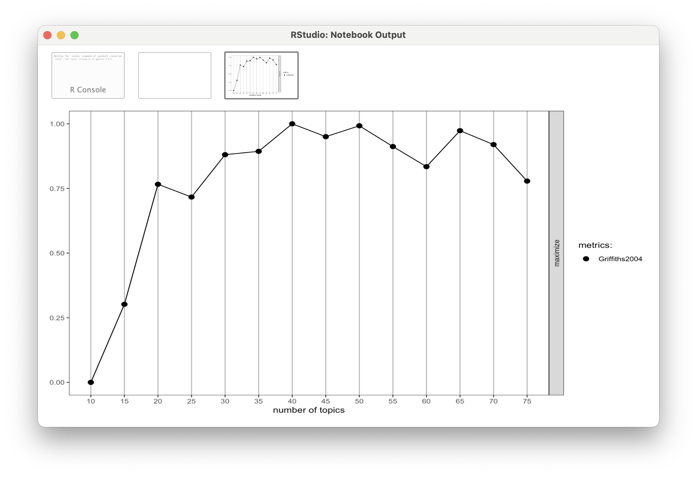

## Welcome to the Text Mining Code Along for Module 3

-   The Text Mining course is designed for those seeking an introductory
    understanding of quantifying the text in documents to better
    understand their properties.

-   The following Code Along is a companion to the Module 3 case study's
    **Model** stage.

::: notes
:::

## Module Objectives

This Code Along dips our toes into **modeling** text as data. In very
simple terms, modeling involves developing a mathematical summary of a
dataset, which can help us further explore trends and patterns in our
data. By the end of this module we will learn how to:

-   **Fit a Topic Modeling with LDA**.We will learn to use the
    `topicmodels` package and associated `LDA()` function for
    unsupervised classification of our forum discussions to find natural
    groupings of words, or topics.
-   **Choose K.** We will take an introductory look at fitting our LDA
    to K, the number of topics within the text.

::: notes
:::

## Context of the Problem

{width="50%"}

::: notes
From Abstract: Massive Open Online Courses for Educators (MOOC-Eds)
provide opportunities for using research-based learning and teaching
practices, along with new technological tools and facilitation
approaches for delivering quality online professional development. The
Teaching Statistics Through Data Investigations MOOC-Ed was built for
preparing teachers in pedagogy for teaching statistics, and it has been
offered to participants from around the world. During 2016-2017,
professional learning teams (PLTs) were formed from a subset of MOOC-Ed
participants. These teams met several times to share and discuss their
learning and experiences. This study focused on examining the ways that
a blended approach to professional development may result in similar or
different patterns of engagement to those who only participate in a
large-scale online course. Results show the benefits of a blended
learning environment for retention, engagement with course materials,
and connectedness within the online community of learners in an online
professional development on teaching statistics. The findings suggest
the use of self-forming autonomous PLTs for supporting a deeper and more
comprehensive experience with self-directed online professional
developments such as MOOCs. Other online professional development
courses, such as MOOCs, may benefit from purposely suggesting and
advertising, and perhaps facilitating, the formation of small
face-to-face or virtual PLTs who commit to engage in learning together.
:::

## Load Libraries

::: panel-tabset
## Packages Needed

-   `tidytext`: Tidies text data by tokenizing and allows us to cast our
    document term matrix, an essential input for LDA.

-   `topicmodels`: Implements Latent Dirichlet Allocation (LDA) and
    Correlated Topic Models (CTM) for extracting topics from text data.

-   `ldatuning`: Helps determine the optimal number of topics for LDA
    models using various evaluation metrics.

-   `LDAvis`: Provides an interactive visualization tool for exploring
    LDA topic distributions and word associations.

## 👉 Your Turn ⤵

-   Load those packages into your IDE.
-   You may have trouble loading in one or more of these packages. Why
    might that be? What would you need to do first?

## Answer

```{r}
#| echo: true
#| eval: false
library(tidytext)
library(topicmodels)
install.packages("ldatuning") #this one is not typically pre-installed
library(ldatuning)
library(LDAvis)
```

```{r}
#| eval: true
#| echo: false
library(tidyverse)
library(tidytext)
library(topicmodels)
library(LDAvis)
```
:::

::: notes
The text we are working with for this Code Along has already been
cleaned and tokenized.

It has not been stemmed, which is the reduction of words to their root
forms as a part of tokenizing. This improves consistency in topic
modeling, but they also can produce funny "words" in the output.
Stemming is explored in the case study.
:::

## Read in Your Data

::: panel-tabset
## 👉 Your Turn ⤵

-   Read in "code_along.csv" located in your Data folder as object
    `forums_tidy.`

## Answer

```{r}
#| echo: true
forums_tidy <- read.csv("data/forums_tidy.csv", header = TRUE)
```
:::

::: notes
As a refresher, let's read in the pre-wrangled dataset from your Data
folder.
:::

## Create a Document Term Matrix

::: panel-tabset
## DTMs

-   [Latent Dirichlet allocation
    (LDA)](https://www.tidytextmining.com/topicmodeling.html#latent-dirichlet-allocation)
    algorithms (via `LDA()` in R) expects a document-term matrix (DTM)
    as the data input.

-   To create our DTM, we'll need to first `count()` how many times each
    `word` occurs in each document, or `post_id` in our case, like so:

```{r}
#| echo: true
#| eval: false
forums_tidy |>
  count(post_id, word) |>
  arrange(desc(n))
```

## 👉 Your Turn ⤵

-   Use `cast_dtm()` to create a DTM of `forums_tidy`, saving it as new
    object `forums_dtm`

## Answer

```{r}
#| echo: true
forums_dtm <- forums_tidy |>
  cast_dtm(post_id, word, n)
```
:::

::: notes
Once we have created a count of each word contained in a document, we
next create a "tidy" matrix that contains one row per post as our
original data frame did, but now contains a column for each `word` in
the entire corpus and a value of `n` for how many times that word occurs
in each post.
:::

## LDA Recap

LDA Assumes:

1.  **Every [document]{.underline} contains a mixture of topics.**
2.  **Every [topic]{.underline} contains a mixture of words.**

Now we must choose a number of topics that might exist across these
discussion forums. Remember: *We have to identify this number
ourselves!*

::: notes
Before running our first topic model using the `LDA()` function, let's
quick recap from our readings some basic principles behind Latent
Dirichlet Allocation and why LDA is of preferred over other automatic
classification or clustering approaches.

Unlike simple forms of cluster analysis such as k-means clustering, LDA
is a **"mixture" model**, which in our context means that:

1.  **Every [document]{.underline} contains a mixture of topics.**
    Unlike algorithms like k-means, LDA treats each document as a
    mixture of topics, which allows documents to "overlap" each other in
    terms of content, rather than being separated into discrete groups.
    So in practice, this means that a discussion forum post could have
    an estimated topic proportion of 70% for Topic 1 (e.g. be mostly
    about a Topic 1), but also be partly about Topic 2.
2.  **Every [topic]{.underline} contains a mixture of words.** For
    example, if we specified in our LDA model just 2 topics for our
    discussion posts, we might find that one topic seems to be about
    pedagogy while another is about learning. The most common words in
    the pedagogy topic might be "teacher", "strategies", and
    "instruction", while the learning topic may be made up of words like
    "understanding" and "students". However, words can be shared between
    topics and words like "statistics" or "assessment" might appear in
    both equally.
:::

## Fitting a Topic Modeling

Since it looks like there are about 20 distinct discussion forums, we'll
use that as our value for the `k =` argument of `LDA()`. This is a
number that we can adjust as we go, if it seems like it's not capturing
a full range of themes or provides redundant themes.

## Creating the LDA

-   Now it's time to create the LDA from the DTM using our (somewhat)
    arbitrated k of 20.

-   NOTE: This is computationally intensive, so don't panic if R seems
    to take a long time to create the new `forums_lda` object (or even
    freeze!).

```{r}
#| echo: true
forums_lda <- LDA(forums_dtm, 
                  k = 20,
                  method = "VEM",
                  control = list(seed = 588),
                  )
```

::: notes
Note that we used the `control =` argument to pass a random number
(`588`) to seed the assignment of topics to each word in our corpus.
Since LDA is a [stochastic
algorithm](https://machinelearningmastery.com/stochastic-in-machine-learning/)
that could have different results depending on where the algorithm
starts, specified a `seed` for reproducibility and so we're all seeing
the same results every time we specify the same number of topics.

By default, the `LDA()` function uses the `method =` "VEM" (Variational
Expectation Maximization) estimation method, which is generally faster
and more scalable. However, there is "Gibbs" (Gibbs Sampling) method,
which is more accurate but computationally intensive, as well as the
"CTM" (Correlated Topic Model) method, a variation of LDA with
correlated topics.
:::

## Viewing LDA Output

::: panel-tabset
## terms()

You can view any number of words within a topic by using the `terms()`
function. We'll also send this to the `as_tibble()` function to make the
output a little easier to read:

```{r}
#| echo: true
terms(forums_lda, 5) |>
  as_tibble()
```

## 👉 Your Turn ⤵

-   Adjust the word number argument in `terms()` to make the word list
    10 per topic instead.

-   Note the differences in the output. How does adjusting this "window"
    change your interpretation of the themes?

## Answer

```{r}
#| echo: true
terms(forums_lda, 10) |>
  as_tibble()
```
:::

::: notes
As you can see form the output, each "topic" is essentially a
"bag-of-words" that typically occur together across documents.
:::

## Finding K

::: panel-tabset
## k_metrics()

```{r}
#| echo: true
#| eval: false
k_metrics <- FindTopicsNumber(
  forums_dtm,
  topics = seq(10, 75, by = 5),
  metrics = "Griffiths2004",
  method = "Gibbs",
  control = list(),
  mc.cores = NA,
  return_models = FALSE,
  verbose = FALSE,
  libpath = NULL
)
```

## View Output

```{r}
#| echo: true
#| eval: false
FindTopicsNumber_plot(k_metrics)
```


:::

::: notes
The {ldatuning} package has functions for both calculating and plotting
different metrics that can be used to estimate the most preferable
number of topics for LDA model. Let's use the defaults specified in the
`?FindTopicNumber` documentation.

Note that the `FindTopicNumbers()` function contains three additional
metrics that can be used to estimate the most preferable number of
topics for LDA model. We used the Griffiths2004 metrics.

As a general rule of thumb, we're looking for an inflection point in our
plot which indicates an optimal number of topics to select for a value
of K. After running this with another function in the `stm` package (in
the Case Study), we've identified 14 as a new optimal number.
:::

## Refitting the LDA

::: panel-tabset
## 👉 Your Turn ⤵

-   Rerun `LDA()` with our new K of 14, saving as a `forums_lda_new`
    object.

-   Use terms() to compare the outputs.

## Answer

```{r}
#| echo: true
#| eval: false
#Create the refitted LDA
forums_lda_new <- LDA(forums_dtm, 
                  k = 14,
                  method = "VEM",
                  control = list(seed = 588),
                  )
#Look at your new LDA results
terms(forums_lda_new, 5) |> #this example assumes 5 words per topic
  as_tibble()
```
:::

## ❓Discussion

-   What did you notice between the LDA outputs?

-   What do you think would happen if you asked for a K much lower than
    14?

# What's Next? {background="#143156"}

::: {style="text-align: left; font-size: 50px"}
-   Complete the Module 3 [case study](#0)
-   Complete the [Topic Modeling
    badge](https://laser-institute.github.io//text-mining/module-3/tm-3-badge.html)
-   Do [essential readings for the next
    module](https://laser-institute.github.io//text-mining/module-4/tm-4-readings.html)
:::
