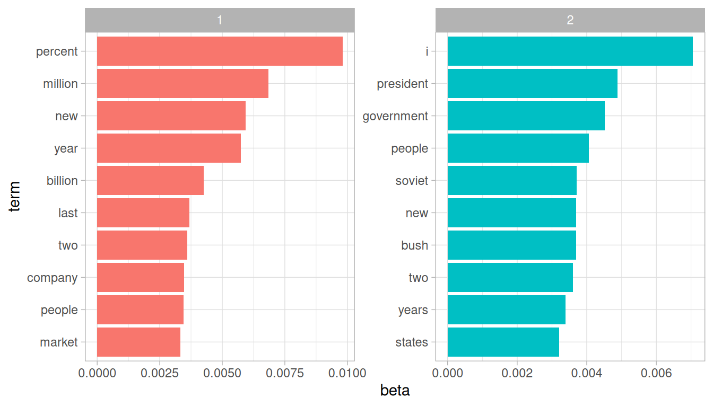

## Unsupervised Machine Learning in Text Mining

In learning analytics often deals with "unlabeled" data, where the outcome of a model isn't pre-defined. Unsupervised machine learning is:

- **Unlabeled.** You give the model the data and let it find its own logic.

- **About discovery.** Finding hidden patterns or clusters you didn't know existed.

- Low effort upfront; high effort during interpretation.

- Common Tools: Topic Modeling & K-Means Clustering.

::: notes
The goal of unsupervised machine learning is to find structure in text data without telling an algorithm what to "look" for or whether or not the connections and conclusions that it draws are necessarily correct or incorrect.

This module will focus on Latent Dirichlet Allocation (LDA), the most common form of topic modeling.
:::

## What is Topic Modeling?

Megan R. Brett's [Topic Modeling, a Basic Introduction](https://journalofdigitalhumanities.org/2-1/topic-modeling-a-basic-introduction-by-megan-r-brett/) describes topic modeling as a method for finding and tracing clusters of words (topics) in large bodies of text.

- Instead of searching for one word within a body of text or index, the algorithm finds groups of words that frequently appear together.

- **Why use it?** It allows us to process thousands of student responses that would be impossible to read manually.

::: notes
Think of topic modeling as a "term search on steroids," and LDA is a the most common means. Structural Topic Modeling is another approach that compares structural topic modeling to other variables.
:::

## Understanding LDA

**Latent Dirichlet Allocation (LDA)** is the most common technique for topic modeling.

- **Latent:** The topics are "hidden" (we can't see them directly, only the words).
- **Dirichlet:** A mathematical distribution that assumes documents cover a few topics and topics use a few words frequently.
- **Allocation:** The process of assigning words to topics and topics to documents.

## The Core Assumptions of LDA

LDA operates on two key assumptions:

1.  **Every document is a mixture of topics.** For example, a student reflection might be 60% "Course Logistics" and 40% "Conceptual Confusion."
2.  **Every topic is a mixture of words.** The "Course Logistics" topic might contain words like *deadline, portal, upload,* and *syllabus*.

## LDA in the Learning Analytics Context

How can educational professionals use this?

- **Course Feedback:** Identifying common themes in open response student feedback. From these themes, researchers may be able to identify pain points, highlights, or other themes of interest.
- **Curricular Mapping:** Ensuring that course readings actually cover the intended thematic areas.
- **Forum Snapshots:** By processing large and numerous text-based forums in a MOOC course, instructors can get a quick understanding of salient topics and compare them to learning objectives.

::: notes
What are some examples that you can think of in your own work?
:::

## Packages

**1. Text Preprocessing:** `tidytext`: Tidies and tokenizes text so it is ready to be made into a document-term matrix.

**2. Topic Modeling Algorithms:** `topicmodels` implements Latent Dirichlet Allocation (LDA) and Correlated Topic Models (CTM) for extracting topics from text data.

**3. Model Selection & Optimization:** `ldatuning` helps determine the optimal number of topics for LDA models using various evaluation metrics.

## The Document-Term Matrix

To perform LDA in R, we must move from raw text to a **Document-Term Matrix (DTM).** This involves:

- **Cleaning:** Removing "stop words" (the, is, at) and punctuation.
- **Tokenization:** Breaking sentences into individual words.
- **Weighting:** Focusing on meaningful word frequencies.

::: notes
This might look familiar to the process of getting data ready for dictionary-based methods. It should! The initial steps are very similar, even down to measuring term frequencies. However, you preserve the identities of the documents from which you tokenized the text, which is carried over to the DTM and considered in the frequency analysis used in an LDA.
:::

## Interpreting Results

The computer does not "understand" the topics; it only sees mathematical correlations.

- It is the researcher's responsibility to interpret the groups of terms into their own themes. What would you call the above groups "1" and "2"?

- The researcher also must define the number of groups to be sorted (K). Too few leads to broad generalizations; too many leads to redundant clusters. Picking an optimal K can be assisted with `ldatuning.`

::: notes
This is an example of an LDA output. Don't worry too much about the specific beta scores on the x axis here, just focus on the ranked order of terms by highest to lowest beta.

Do these two collections of terms seem like they represent distinct concepts to you? What do you notice about them? Do you see any terms that maybe should be excluded from analysis?
:::

## Benefits and Limitations

**Benefits:**

- **Offers an ostentibly neutral approach** to theming texts.

- **Scalable** to massive datasets.

**Limitations:**

- **Context can be lost** due to the "bag of words" approach to analysis. Text is tokenized into a list of single words, and the LDA process ignores word order in favor of frequency.

- **Garbage In, Garbage Out:** Poorly cleaned data (like encoding errors or human-made typos) can result in nonsensical topics.

::: notes
In short, LDA is theoretically neutral and can help offer an outside perspective to theming from your own work as a researcher. It may corroborate your own themes or tease out ideas you wouldn't have noticed on your own. However, you still lose context by breaking down the text into individual tokens, even if those tokens are considered within their original documents.
:::

## Discussion

1.  Think of a dataset in your current role (e.g., student evaluations). What "latent" topics might you expect?

2.  Where do you see limitations in this approach? What could you pair LDA with to create a more thorough analysis?

## Acknowledgements

::::: columns
::: {.column width="20%"}
{fig-align="center" width="80%"}
:::

::: {.column width="80%"}
This work was supported by the National Science Foundation grants DRL-2025090 and DRL-2321128 (ECR:BCSER). Any opinions, findings, and conclusions expressed in this material are those of the authors and do not necessarily reflect the views of the National Science Foundation.
:::
:::::
