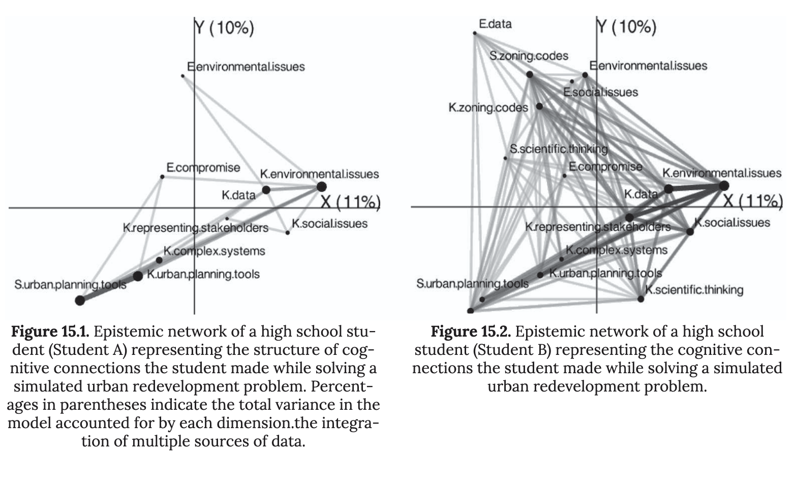
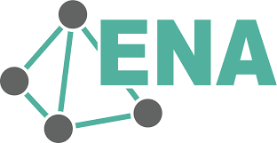

## Introduction

- Having access to massive educational text data via chats, forums, reflections, etc. presents a dilemma:
  - Qualitative methods are deep but don't scale.
  - Natural language processing such as topic modeling (e.g., LDA) scales well, but loses "context"
- Quantitative Ethnography (QE) is a research method that seeks to combine qualitative depth & richness with large texts.

::: notes
NLP loses context due to its focus on individual terms and their frequencies in documents. It is effective at identifying "what" but less about "how" those ideas interact.
:::

## Quantitative Ethnography

- QE is a research paradigm integrating statistical power with "thick description," the combination of behaviors and the context for those behaviors.
- QE validates big-data findings with human-coded insights, combining structure with meaning.

::: notes
Qualitative Ethnography maps out how students connect ideas, not just how often they are mentioned. It quantifies the qualitative observations, or "thick description," of a learning event, discussion, etc.

Thick description, popularized by Clifford Geertz in The Interpretation of Cultures (1973), is a description of human social action that describes not just physical behaviors, but their context as interpreted by the actors as well, so that it can be better understood by an outsider.
:::

## Epistemic Network Analysis (ENA)

- ENA is an analysis technique that maps relationships between concepts, which is effective for QE and works well for text mining.

- It focuses on *co-occurrence* within a specific "window," or stanza, of text, rather than total frequencies of a given term.

- For example: If "pedagogy" and "technology" appear in the same stanza of a predefined length, ENA maps that link. If it continues to find that link over many stanzas, the strength of the link increases between those ideas.

- Other parameters can be set to account for dialogues, events, or other structures within an observation: (e.g., "units," "conversations," etc.)

- At a glance, it looks similar to a social network, where concepts are points (nodes) on the graph and their relationships are represented as lines (ties).

::: notes
ENA is a common analysis to support QE because it carries out the principle of mapping relationships of ideas. You can stretch this algorithm to account for all sorts of learning events. If it's a conversation between two students, you can acknowledge their dialogue. If there are groups of students working concurrently, you can account for that structure. This gives this analysis more nuance than simply tidying all text into a bag of words, or even LDA which acknowledges distinct documents.

The visualizations look similar to social networks, which are a better-known data visualization, except the nodes on the graphs are ideas rather than actors/individuals. There are some other key distinctions which we'll get into later.
:::

## Scenario: Middle School Earth Sciences Class

- 3 groups of 4-5 students apiece, tasked with discussing a sustainable urban redevelopment problem.
- **Research Question:** How do high-performing groups connect scientific evidence to policy decisions compared to lower-performing groups?

::: notes
Let's apply this to something more concrete. Imagine a middle school classroom working on a sustainability unit. In this case, group performance is defined by overall participation among members.
:::

## Wrangle

- First, record & transcribe group discussions.

- Retain identities of each student and which group so individual and group ENAs can be compared.

::: notes
The extra data here can be used to set some of the parameters mentioned before.
:::

## Exploring

- Develop a coding scheme based on your observations. For example:

  - **\[environmental.issues\]** (e.g., "This would contribute to runoff and erosion.")

  - **\[zoning.codes\]** (e.g., "Could we build that next to the train station?")

  - **\[social.issues\]** (e.g., "That looks like hostile architecture in the plaza.")

  - **\[scientific.thinking\]** (e.g., "The chart shows a 2-degree increase.")

::: notes
Coding can be done inductively or *a priori*. However you achieve this coding, you flag sentences, utterances, etc. for any of these codes as a binary. So if there were only four different codes in your analysis, like above, the first utterance here ("This would contribute...") would read as (1, 0, 0, 0) to indicate that it only had the \[environmental.issues\] code.
:::

## Model

- ENA looks for your coded data within the stanza, an arbitrated "window" of text made of n lines.
- "The key idea behind a stanza is that (a) codes in lines *anywhere within the same stanza are related* to one another in the model, and (b) codes in lines that are *not in the same stanza* are *not related* to one another in the model" [@epistemi2017]
- This window "moves" up and down the transcript to find co-occurrences and build the model.

::: notes
The ENA algorithm uses a moving window (e.g., n lines of text) to identify conceptual associations. If a student mentions \[EVI\] and \[POL\] within the same window, ENA records a connection between those two nodes. It assumes that if two ideas are discussed close together, they are linked in the student’s mind.

The beauty is that you can apply this approach to an individual, group, or even "groups" of groups using parameters.

To answer our research question, you filter the transcripts to compare our three working groups to see how closely those ideas associate.
:::

## Communicate

[{width="1400"}](https://www.solaresearch.org/wp-content/uploads/2017/05/chapter15.pdf)

::: notes
This is an example output comparing two individual students' conceptual models for a similar activity in [@epistemi2017]. This analysis only considered the association of ideas within a single student's mind or experience, rather than in dialogue.

Comparing epistemic networks relies on having, nodes–which represent the ideas–in the same location on the graph. The ties, or lines which represent the strength of the association between ideas, are what differ. This makes it easier to compare the strength of the ties between them.
:::

## Discussion

- What are some similarities between the two students' epistemic networks? What are some differences?

- What happens when you have to compare 10 epistemic networks? 20? 100?

::: notes
One neat aspect of ENA, which is better explored in our readings and in the Case Study, is that epistemic networks can be combined and averaged into new projections. This means we can visualize epistemic nets for individual students, like the previous image, or combine multiple students (like in our hypothetical scenario) into a single net. This gives us flexibility for comparing ideas among a range of educational events & contexts, rather than having to eyeball the differences between a huge array of different nets.
:::

## Using ENA with R

- R is able to conduct ENA through the `rENA` package!

{width="200"}

```{r}
#| echo: true
#| eval: false
install.packages("rENA")
library(rENA)
```

::: notes
You're in luck! `rENA` allows ENA to be conducted and communicated in R's a transparent, reproducible, and open format. We'll explore some of `rENA`'s functions in this module's Code Along.
:::

# Acknowledgements

::::: columns
::: {.column width="20%"}
{fig-align="center" width="80%"}
:::

::: {.column width="80%"}
This work was supported by the National Science Foundation grants DRL-2025090 and DRL-2321128 (ECR:BCSER). Any opinions, findings, and conclusions expressed in this material are those of the authors and do not necessarily reflect the views of the National Science Foundation.
:::
:::::
