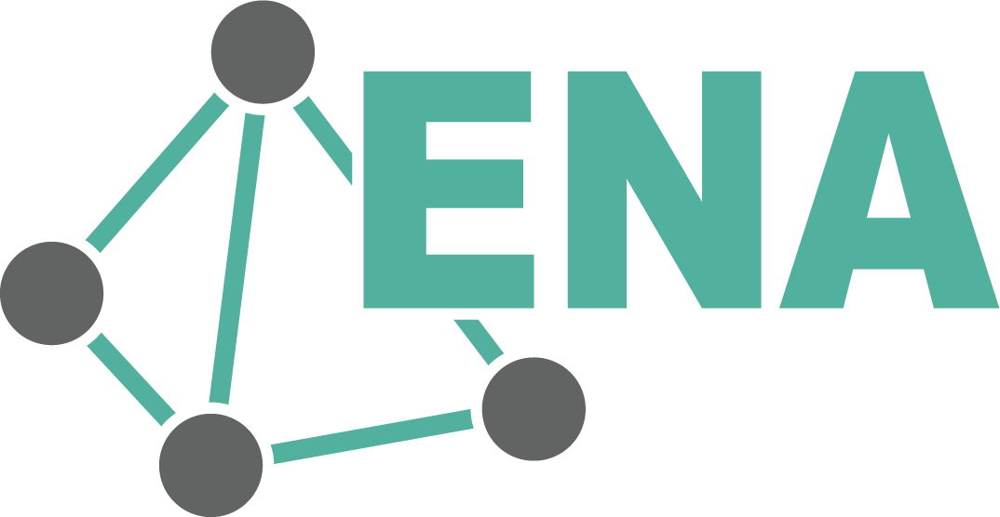

## Overview of Quantitative Ethnography (QE)

Guiding questions:

-   **What is** QE?

-   **Why should we use** QE? When is it most appropriate to use?

-   What are **common techniques** for QE?

## The Challenge of Text Mining at Scale

-   Again, we have access to massive educational text data via chats, forums, reflections, etc.
-   **The Dilemma:**
    -   Qualitative methods are deep but don't scale.
    -   Natural language processing such as topic modeling (e.g., LDA) scales well, but loses "context"

::: notes
NLP loses context due to its focus on individual terms and their frequencies in documents. It is effective at identifying "what" but less about "how" those ideas interact.
:::

## What is Quantitative Ethnography (QE)?

-   **Definition:** A research paradigm integrating statistical power with "thick description," the combination of behaviors and the context for those behaviors.
-   **Core Philosophy:** Structure + Meaning.
-   **Why it matters:** QE validates big-data findings with human-coded insights.

::: notes
Qualitative ethnography maps out how students connect ideas, not just how often they are mentioned.

Thick description, popularized by Clifford Geertz in The Interpretation of Cultures (1973), is a description of human social action that describes not just physical behaviors, but their context as interpreted by the actors as well, so that it can be better understood by an outsider.
:::

## Introduction to Epistemic Network Analysis (ENA)

-   **Beyond Frequency:** ENA is an analysis technique that maps relationships between concepts.

-   **ENA** focuses on *co-occurrence* within a specific "stanza" of text, rather than total frequencies of a given term.

-   **Visualizing Knowledge:** If "pedagogy" and "technology" appear in the same thought, ENA maps that link. If it continues to find that link over many stanzas, the strength of the link increases between those ideas.

    {width="300"}

::: notes
:::

## Scenario: Middle School Climate Science
-   3 groups of 4-5 students apiece, tasked with designing a sustainable city.
-   Group performance graded by how many students participate and depth of discussion when sharing out to class.
-   Research Question: How do high-performing groups connect scientific evidence to policy decisions compared to lower-performing groups?

::: notes
:::

## Data Collection
-   Record & transcribe group discussions
-   Retain identities of each student and which group so individual and group ENAs can be compared

::: notes
:::

## Coding
You develop a coding scheme based on your observations. For example:
-   [ENV]: Environmental Impact (e.g., "The sea levels will rise.")
-   [POL]: Policy/Regulation (e.g., "We should ban plastic bags.")
-   [ECO]: Economic Cost (e.g., "That will be too expensive.")
-   [EVI]: Scientific Evidence (e.g., "The chart shows a 2-degree increase.")

::: notes
Coding can be done inductively or a priori. However you achieve this coding, you flag utterances or sections of the transcript for any of these codes as a binary.
:::

## Segmentation & Stanza Window

-   **Unit of Analysis:** The "Who" (e.g., Student ID).
-   **Stanza Window:** The "moving window" of context.
-   **Logic:** Ideas appearing within \~4 lines are likely cognitively linked.

::: notes
The ENA algorithm uses a moving window (e.g., n lines of text) to identify conceptual associations. If a student mentions [EVI] and [POL] within the same window, ENA records a connection between those two nodes. It assumes that if two ideas are discussed close together, they are linked in the student’s mind.

The beauty is that you can apply this algorithm to an individual or a group. To answer our research question, you filter the transcripts to compare our three working groups to see how closely those ideas associate.
:::

## Why Use R for ENA?

-   **The `rENA` Package:** The gold standard for this research.
-   **Reproducibility:** Scripts allow others to see your exact data pipeline.
-   **Integration:** Move from `tidyverse` (cleaning) to modeling seamlessly.

```{r}
#| echo: true
#| eval: false
install.packages("rENA")
library(rENA)
```

# Acknowledgements

::::: columns
::: {.column width="20%"}
{fig-align="center" width="80%"}
:::

::: {.column width="80%"}
This work was supported by the National Science Foundation grants DRL-2025090 and DRL-2321128 (ECR:BCSER). Any opinions, findings, and conclusions expressed in this material are those of the authors and do not necessarily reflect the views of the National Science Foundation.
:::
:::::
