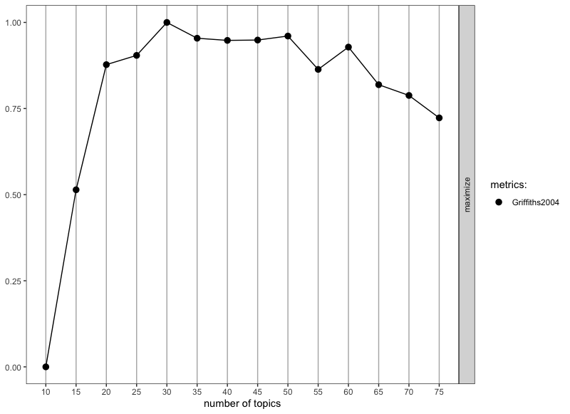
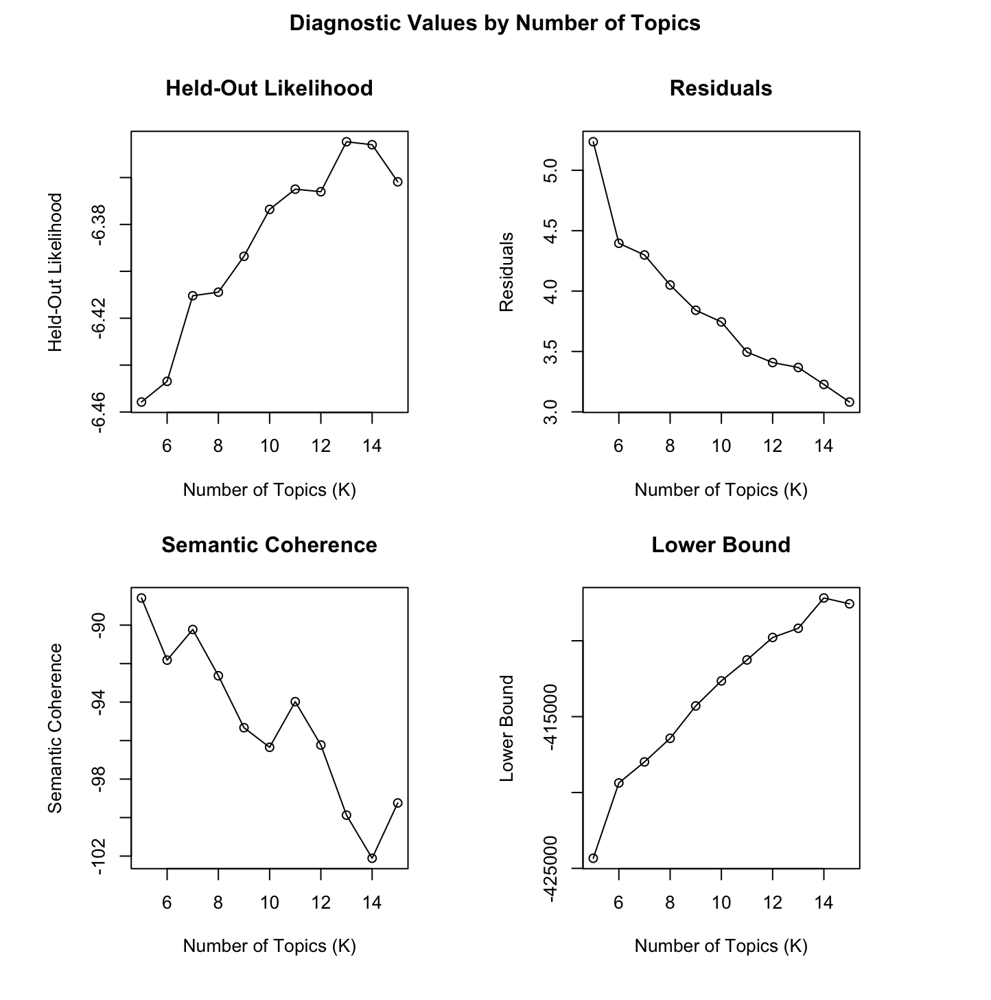

```{r setup, include=FALSE}
knitr::opts_chunk$set(echo = TRUE)
```

## 0. INTRODUCTION

The LASER Institute Text Mining Workshop extends our Summer Institute
learning labs by introducing Topic Modeling, an unsupervised machine
learning technique for clustering word groups to help identify "topics".
This workshop will also take an extended look at some research and
evaluation work by the Friday Institute for Educational Innovation at
North Carolina State University. In addition to many other areas of
inquiry, this work was aimed at understanding and improving peer
interaction and discussion in the Friday Institute's Massively Open
Online Courses for Educators (MOOC-Ed) and Online Professional Learning
programs. To learn more about these courses and programs, visit:
<https://place.fi.ncsu.edu>

### What is Topic Modeling?

Topic modeling is a text mining approach for identifying "topics" by
examining how words cohere into different latent, or hidden, themes
based on patterns of co-occurrence of words within documents. With a bit
of tongue-in-cheek, [Meeks and Weingart
(2012)](http://journalofdigitalhumanities.org/2-1/dh-contribution-to-topic-modeling/) describe
topic modeling as: 

> *...focused on corpora and not individual texts, treating the works
> themselves as unceremonious 'buckets of words,' and providing
> seductive but obscure results in the forms of easily interpreted (and
> manipulated) 'topics'.... To achieve its results, it leverages occult
> statistical methods like 'dirichlet priors' and 'bayesian models.'*

That being said,
[Weingart](http://journalofdigitalhumanities.org/2-1/dh-contribution-to-topic-modeling/)
also noted that "a topic model is a "clever and exceptionally versatile
little algorithm that can be customized to all sorts of applications"
and [Bail
(2020)](https://sicss.io/2020/materials/day3-text-analysis/topic-modeling/rmarkdown/Topic_Modeling.html#running-your-first-topic-model)
add that topic modeling can be "a powerful tool for identifying general
trends in a corpus that can then be analyzed in a more granular manner
using other techniques."

With respect to the actual R workflow of applying topic models to
documents and text of interests, Silge & Robinson and a new bottom row
their flowchart consisting new data structures (i.e., a corpus object
and document-term matrix) and and the LDA model:  

[{width="90%"}](https://www.tidytextmining.com/topicmodeling.html)

Previously, we've looked at sentiment analysis and the VADER package as
part of the "Model" process of the data-intensive workflow described in
our course text, [*Learning Analytics Goes to
School*](https://catalog.lib.ncsu.edu/catalog/NCSU4862134)*.* As noted
by Krumm and Means (2018), ***learning analytics workflows are not
always a linear process*** and there is often a great deal of iteration
that occurs within and between wrangling, exploring, modeling. As
illustrated by our workflow below, this week we will primarily explore
our data after the modeling process in order to gain some additional
insight into the topics generated by our model. Specifically, this
workshop will introduce the following concepts and skills:

1.  **Prepare**: Prior to analysis, we'll take a quick look at some of
    the related MOOC-Ed research and evaluation work to gain some
    context for our analysis. This should aid in the interpretation of
    our results and help guide some decisions as we tidy, model, and
    visualize our data.
2.  **Wrangle**: In section 2 we again revisit tidying and tokenizing
    text using the `tidytext` package but are also introduced to the
    document term matrix data format as well as the `stm` package. This
    package makes use of `tm` text mining package to preprocess text and
    will also be our first introduction to word stemming.
3.  **Model**: We take a look at two different approaches to topic
    modeling: Latent Dirichlet Allocation (LDA) and Structural Topic
    Modeling (STM), which is very similar to LDA but can use metadata
    about documents to improve the assignment of words to "topics" in a
    corpus and examine relationships between topics and covariates. 
4.  **Explore**: To further explore the results of our topic model, we
    use several handy functions from the `topicmodels` and `stm`
    packages, including the `findThoughts` function for viewing
    documents assigned to a given topic and the `toLDAvis` function for
    exploring topic and word distributions.

------------------------------------------------------------------------

## 1. PREPARE

To help us better understand the context, questions, and data sources
we'll be using in Unit 3, this section will focus on the following
topics:

a.  **Context**. As context for our analysis this week, we'll review
    several related papers by me and some of my current and former
    colleagues relevant to our analysis of MOOC-Ed discussion forums.
b.  **Questions.** We'll also examine what insight topic modeling can
    provide to a question that we asked participants answer in their
    professional learning teams (PLTs).
c.  **Project Setup.** This should be very familiar by now, but we'll
    review our R Project setup and install and load the required
    packages for the topic modeling walkthrough.

### 1a. Review the Literature

[{width="60%"}](https://place.fi.ncsu.edu/local/catalog/course.php?id=4&ref=1)

Full text: <https://www.learntechlib.org/p/195234/>

**Abstract**

Massive Open Online Courses for Educators (MOOC-Eds) provide
opportunities for using research-based learning and teaching practices,
along with new technological tools and facilitation approaches for
delivering quality online professional development. The [Teaching
Statistics Through Data Investigations
MOOC-Ed](https://place.fi.ncsu.edu/local/catalog/course.php?id=4&ref=1)
was built for preparing teachers in pedagogy for teaching statistics,
and it has been offered to participants from around the world. During
2016-2017, professional learning teams (PLTs) were formed from a subset
of MOOC-Ed participants. These teams met several times to share and
discuss their learning and experiences.

This study focused on examining the ways that a blended approach to
professional development may result in similar or different patterns of
engagement to those who only participate in a large-scale online course.
Results show the benefits of a blended learning environment for
retention, engagement with course materials, and connectedness within
the online community of learners in an online professional development
on teaching statistics. The findings suggest the use of self-forming
autonomous PLTs for supporting a deeper and more comprehensive
experience with self-directed online professional developments such as
MOOCs. Other online professional development courses, such as MOOCs, may
benefit from purposely suggesting and advertising, and perhaps
facilitating, the formation of small face-to-face or virtual PLTs who
commit to engage in learning together.

**Data Source & Analysis**

All peer interaction, including peer discussion, take place within
discussion forums of MOOC-Eds, which are hosted using the Moodle
Learning Management System. To build the dataset you'll be using for
this walkthrough, I wrote a query for Moodle's MySQL database, which
records participants' user-logs of activity in the online forums. This
sql query combines separate database tables containing postings and
comments including participant IDs, timestamps, discussion text and
other attributes or "metadata."

For further description of the forums and data retrieval process, see
also the following papers:

-   Kellogg, S., & Edelmann, A. (2015). [Massively Open Online Course
    for Educators (MOOC‐Ed) network
    dataset](https://bera-journals.onlinelibrary.wiley.com/doi/pdfdirect/10.1111/bjet.12312). *British
    journal of educational technology*, *46*(5), 977-983.

-   Ezen-Can, A., Boyer, K. E., Kellogg, S., & Booth, S. (2015, March).
    [Unsupervised modeling for understanding MOOC discussion forums: a
    learning analytics
    approach](https://dl.acm.org/doi/pdf/10.1145/2723576.2723589).
    In *Proceedings of the fifth international conference on learning
    analytics and knowledge* (pp. 146-150).

-   Kellogg, S., Booth, S., & Oliver, K. (2014). [A social network
    perspective on peer supported learning in MOOCs for
    educators.](https://www.erudit.org/en/journals/irrodl/1900-v1-n1-irrodl04945/1065545ar.pdf) *International
    Review of Research in Open and Distributed Learning*, *15*(5),
    263-289.

**Summary of Key Findings**

The following highlight some key findings related to the discussion
forums in the papers cited above:

1.  MOOCs designed specifically for K-12 teachers can provide positive
    self-directed learning experiences and rich engagement in discussion
    forums that help form online communities for educators.
2.  Analysis of discussion forum data in TSDI provided a very clear
    picture of how enthusiastic many PLT members and leaders were to
    talk to others in the online community. They posed their questions
    and shared ideas with others about teaching statistics throughout
    the units, even though they were also meeting synchronously several
    times with their colleagues in small group PLTs.
3.  Findings on knowledge construction demonstrated that over half of
    the discussions in both courses moved beyond sharing information and
    statements of agreement and entered a process of dissonance,
    negotiation and co-construction of knowledge, but seldom moved
    beyond this phase in which new knowledge was tested or applied.
    These findings echo similar research on difficulties in promoting
    knowledge construction in online settings.
4.  Topic modeling provides more interpretable and cohesive models for
    discussion forums than other popular unsupervised modeling
    techniques such as k-means and k-medoids clustering algorithms.

### 1b. Refine Research Questions

For the paper, [*Participating in a MOOC and Professional Learning Team:
How a Blended Approach to Professional Development Makes a
Difference*](https://www.learntechlib.org/p/195234/), we were interested
in unpacking how participants who enrolled in the Teaching Statistics
through Data Investigations MOOC-Ed might benefit from also being in a
smaller group of professionals committed to engaging in the same
professional development. Our specific research question for this paper
was:

> What are the similarities and differences between how PLT members and
> Non-PLT online participants engage and meet course goals in a MOOC-Ed
> designed for educators in secondary and collegiate settings?

Dr. Hollylynne Lee and the TSDI team also developed a facilitation guide
designed specifically for PLT teams to help groups synthesize the ideas
in the course and make plans for how to implement new strategies in
their classroom in order to impact students' learning of statistics. One
question PLT members were asked to address was:

> What ideas or issues emerged in the discussion forums this past week?

For this walkthrough, we will further examine that question through the
use of topic modeling.

And just to reiterate yet again from Unit 1, one overarching question
we'll explore throughout this course, and that Silge and Robinson (2018)
identify as a central question to text mining and natural language
processing, is:

> How do we to **quantify** what a document or collection of documents
> is about?

### 1c. Set Up you(R) Project

As highlighted in [Chapter 6 of Data Science in Education Using
R](https://datascienceineducation.com/c06.html) (DSIEUR), one of the
first steps of every workflow should be to set up a "Project" within
RStudio. This will be your "home" for any files and code used or created
in Unit 2.

You are welcome to continue using the project set up on our LASER Labs &
Workshops RStudio Cloud workspace, or export the project from our
workspace and use with RStudio Desktop. Regardless of where you're
working, you will need to load (and install first if using Desktop) the
following packages needed for this walkthrough:

```{r load-packages, message=FALSE}
library(tidyverse)
library(tidytext)
library(SnowballC)
library(topicmodels)
library(stm)
library(ldatuning)
library(knitr)
library(LDAvis)
```

Finally, I recommend create a new R script file that you may want to use
to test out and tweak code prior to running in the code chunks for the
[**Your Turn**]{style="color: green;"} **⤵** activities.

------------------------------------------------------------------------

## 2. WRANGLE

As noted during the Summer Institute, data wrangling involves some
combination of cleaning, reshaping, transforming, and merging data
(Wickham & Grolemund, 2017). For this workshop, we'll revisit tidying
and tokenizing text using the `tidytext` package, and also use the `stm`
package as an alternative to preprocess text (e.g., removing
punctuation, stop words, etc.) and to introduce the concept of word
stemming.

a.  **Import Data**. We'll be working with .csv files this week and the
    `read_csv()` function but will introduce a new argument for changing
    column types.
b.  **Cast a DTM**. We revisit the `tidytext` package to "tidy" and
    tokenize our forum data and introduce the `cast_dtm()` function to
    create the document term matrix (dtm) need for topic modeling.
c.  **To Stem or not to STEM?** We conclude our data wrangling by also
    introducing the `textProcessor()` function for preprocessing and
    discuss the pros and cons of word stemming.

### 2a. Import and Inspect Data

To get started, we need to import, or "read", our data into R. The
function used to import your data will depend on the file format of the
data you are trying to import. First, however, you'll need to do the
following:

1.  Download the `ts_forum_data.csv` file we'll be using for this Unit
    from our NCSU Moodle course site.
2.  Create a folder in the directory on your computer where you stored
    your R Project and name it "data".
3.  Add the file to your data folder.
4.  Check your Files tab in RStudio to verify that your file is indeed
    in your data folder.

Now let's read our data into our Environment using the `read_csv()`
function and assign it to a variable name so we can work with it like
any other object in R.

```{r read-csv}
ts_forum_data <- read_csv("data/ts_forum_data.csv", 
                  col_types = cols(course_id = col_character(),
                                   forum_id = col_character(), 
                                   discussion_id = col_character(), 
                                   post_id = col_character()
           )
    )
```

By default, many of the columns like `course_id` and `forum_id` are read
in as numeric data. For our purposes, we plan to treat them as unique
identifiers or names for our courses, forums, discussions, and posts.
The `read_csv()` function has a handy `col_types =` argument changing
the column types from numeric to characters.

#### [**Your Turn**]{style="color: green;"} **⤵**

In the code chunk below, use one of your prefered methods for inspecting
your data (e.g. typing the object name, `View()`, `glimpse()`, `head()`,
etc.) and answer the questions that follow. Yes, the "V" is capitalized
for the \`---very unusual for an R function (the tidyverse does have
it's own lowercase `view()` function if that bothers you though).
Because this function is a bit atypical in more ways than one, I have
two recommendations concerning its use:

-   Use it strictly in the console. Because it opens a new viewing
    window, **including it in an R Markdown script can cause issues when
    "knitting"** or rendering an HTML (or PDF) report. Hence I have
    included the `eval = FALSE` argument in the code chunk so it it not
    run when you knit your document.

-   Close the viewer window that opens once you have viewed the data.
    Keeping it open can clutter your work space a bit and can lead to
    confusion about what data frame it was you viewed.

```{r}


```

1.  What notice about the data? What do you think the observations,
    variables, and values in our data represent?

    -   

2.  What questions do you have about the data? What do you think you'd
    still need to know to conduct a proper analysis?

    -   

### 2b. Cast a Document Term Matrix

In this section we'll revisit some familiar `tidytext` functions used in
Units 1 & 2 for tidying and tokenizing text and introduce some new
functions from the `stm` package for processing text and transforming
our data frames into new data structures required for topic modeling.

#### Functions Used

**`tidytext` functions**

-   `unnest_tokens()` splits a column into tokens
-   `anti_join()` returns all rows from x without a match in y and used
    to remove `stop words` from out data.
-   `cast_dtm()` takes a tidied data frame take and "casts" it into a
    document-term matrix (dtm)

**`dplyr`** **functions**

-   `count()` lets you quickly count the unique values of one or more
    variables
-   `group_by()` takes a data frame and one or more variables to group
    by
-   `summarise()` creates a summary of data using arguments like sum and
    mean

**`stm` functions**

-   `textProcessor()` takes in a vector or column of raw texts and
    performs text processing like removing punctuation and word
    stemming.
-   `prepDocuments()` performs several corpus manipulations including
    removing words and renumbering word indices

#### Tidying Text

Prior to topic modeling, we have a few remaining steps to tidy our text
that we introduced during the Summer Institute. [Chapter 1 of Text
Mining With R](https://www.tidytextmining.com/tidytext.html) does a nice
job of outlining these preprocessing steps:

1.  Transforming our text into "tokens"
2.  Removing unnecessary characters, punctuation, and whitespace
3.  Converting all text to lowercase
4.  Removing stop words such as "the", "of", and "to"

Let's tokenize our forum text and by using the familiar
`unnest_tokens()` and remove stop words per usual:

```{r tokenize-forums}
forums_tidy <- ts_forum_data %>%
  unnest_tokens(input = post_content,
                output = word,
                token = "ngrams",
                n = 1) %>%
  anti_join(stop_words, by = "word")

forums_tidy
```

Now let's do a quick word count to see some of the most common words
used throughout the forums. This should get a sense of what we're
working with and later we'll need these word counts for creating our
document term matrix for topic modeling:

```{r count-words}
forums_tidy %>%
  count(word, sort = TRUE)
```

Terms like "students," "data," and "class" are about what we would have
expected from a course teaching statistics. The term "agree" and "time"
however, are not so intuitive and worth a quick look as well.

##### ✅ Comprehension Check

Use the `filter()` and `grepl()` functions introduced in [Unit 1.
Section
3b](https://sbkellogg.github.io/eci-588/unit-1/unit-1-walkthrough.html#b.-word-search)
to filter for rows in our `ts_forum_data` data frame that contain the
terms "agree" and "time" and another term or terms of your choosing.
Select a random sample of 10 posts using the `sample_n()` function for
your terms and answer the following questions:

1.  What, if anything, do these posts have in common?

2.  What topics or themes might be apparent, or do you anticipate
    emerging, from our topic modeling?

Your output should look something like this:

```{r find-quotes, echo=FALSE}
forum_quotes <- ts_forum_data %>%
  select(post_content) %>% 
  filter(grepl('time', post_content))

sample_n(forum_quotes,10)
```

#### Creating a Document Term Matrix

As highlighted in [Chapter 5 of Text Mining with
R](https://www.tidytextmining.com/dtm.html#cast-dtm), the `topicmodels`
package and the [Latent Dirichlet allocation
(LDA)](https://www.tidytextmining.com/topicmodeling.html#latent-dirichlet-allocation)
algorithm and `LDA()` function it uses expects document-term matrix as
the data input.

Before we create a our document-term matrix, however, we have an
important decision to make:

> **What do we consider to be a "document" in a MOOC-Ed discussion
> forum?**

For example, we could consider each individual discussion post, or
`post_id` in our data frame, as a document. It might also make sense to
combine texts from all posts within each discussion, or
`disccussion_id`, and consider that as a document since these posts are
often interconnected an build off one another.

For now, however, let treat each individual post as a unique "document."
noted above, to create our document term matrix, we'll need to first
`count()` how many times each `word` occurs in each document, or
`post_id` in our case, and create a matrix that contains one row per
post as our original data frame did, but now contains a column for each
`word` in the entire corpus and a value of `n` for how many times that
word occurs in each post.

To create this document term matrix from our post counts, we'll use the
`cast_dtm()` function like so and assign it to the variable
`forums_dtm`:

```{r cast-dtm}
forums_dtm <- forums_tidy %>%
  count(post_id, word) %>%
  cast_dtm(post_id, word, n)
```

##### ✅ Comprehension Check

Take a look at our `forums_dtm` object in the console and answer the
following question:

1.  What "class" of object is `forums_dtm`?
2.  How many unique documents and terms are included our matrix?
3.  Why might there be fewer documents/posts than were in our original
    data frame?
4.  What exactly is meant by "sparsity"?

```{r class-dtm, echo=FALSE}
class(forums_dtm)

forums_dtm
```

### 2c. To Stem or not to Stem?

Next we'll need to prepare our original data set for structural topic
modeling using the `textProcessor()` function. The `stm` package has a
number of features that extend the functionality of the `topicmodels`
package, including an argument for "stemming" words, which [Schofield
and Mimno
(2016)](https://direct.mit.edu/tacl/article/doi/10.1162/tacl_a_00099/43370/Comparing-Apples-to-Apple-The-Effects-of-Stemmers)
describe as follows:

> Stemming is a popular way to reduce the size of a vocabulary in
> natural language tasks by conflating words with related meanings.
> Specifically, stemming aims to convert words with the same "stem" or
> root (e.g "creative" and "creator") to a single word type ("create").
> Though originally developed in the context of information retrieval
> (IR) systems, stemmers are now commonly used as a preprocessing step
> in unsupervised machine learning tasks.

The rationale behind stemming is that it can dramatically reduce the
number of words or terms to be modeled, which in theory should help
simplify and improve the performance of your model. We'll explore this
assumption a little later in this section.

#### Processing and Stemming for STM

Like `unnest_tokens()`, the `textProcessor()` function includes several
useful arguments for processing text like converting text to lowercase
and removing punctuation and numbers. I've included several of these in
the script below along with their defaults used if you do not explicitly
specify in your function. Most of these are pretty intuitive and you can
learn more by viewing the `?textProcessor` documentation.

Let's go ahead and process our discussion forum `post_content` in
preparation for structural topic modeling:

```{r textProcessor}
temp <- textProcessor(ts_forum_data$post_content, 
                    metadata = ts_forum_data,  
                    lowercase=TRUE, 
                    removestopwords=TRUE, 
                    removenumbers=TRUE,  
                    removepunctuation=TRUE, 
                    wordLengths=c(3,Inf),
                    stem=TRUE,
                    onlycharacter= FALSE, 
                    striphtml=TRUE, 
                    customstopwords=NULL)
```

Note that the first argument the `textProcessor` function expects is the
column in our data frame that contains the text to be processed, the
second argument `metadata =` expects the data frame that contains the
text of interest and uses the column names to label the metadata such as
course ids and forum names. This meatdata can be used to to improve the
assignment of words to topics in a corpus and examine the relationship
between topics and various covariates of interest.

Unlike the `unnest_tokens()` function, the output is not a nice tidy
data frame. Topic modeling using the `stm` package requires a very
unique set of inputs that are specific to the package. The following
code will pull elements from the `temp` list that was created that will
be required for the `stm()` function we'll use in Section 4:

```{r stm-inputs}
meta <- temp$meta
vocab <- temp$vocab
docs <- temp$documents
```

#### Stemming Tidy Text

Notice that the `textProcessor` stem argument we used above is set to
`TRUE` by default. We haven't introduced word stemming at this point
because there is some debate about the actual value of this process.
While words like "students" and "student" might make sense to collapse
into their base word and actually make analyses and visualizations more
concise and easier to interpret. [Hvitfeldt and Silge
(2021)](https://smltar.com/stemming.html) note, however, that words like
the following have dramatic differences in meaning, semantics, and use
and could result in poor models or misinterpreted results:

-   meaning and mean
-   likely, like, liking
-   university and universe

The first word pair is particularly relevant to discussion posts from
our Teaching Statistics course data. In addition, collapsing words like
"teachers" and "teaching" could dramatically alter the results from a
topic model.

[Schofield and Mimno
(2016)](https://direct.mit.edu/tacl/article/doi/10.1162/tacl_a_00099/43370/Comparing-Apples-to-Apple-The-Effects-of-Stemmers)
specifically,

> *Despite their frequent use in topic modeling, we find that stemmers
> produce no meaningful improvement in likelihood and coherence and in
> fact can degrade topic stability.*

For now, we will leave as is the `forums_dtm` we created earlier with
words unstemmed, but what if we wanted to stem words in a "tidy" way?

Since the `unnest_tokens()` function does not (intentionally I believe)
include a stemming function, one approach would be to use the
`wordStem()` function from the `snowballC` package to either replace our
`words` column with a word stems or create a new variable called `stem`
with our stemmed words. Let's do the latter and take a look at the
original words and the stem that was produced:

```{r wordStem}
stemmed_forums <- ts_forum_data %>%
  unnest_tokens(output = word, input = post_content) %>%
  anti_join(stop_words, by = "word") %>%
  mutate(stem = wordStem(word))

stemmed_forums
```

You can see that words like "activity" and "activities" that occur
frequently in our discussions have been reduced to the word stem
"activ". If you are interested in learning other approaches for word
stemming in R, as well as reading a more in depth description of the
stemming process, I highly recommend the [Chapter 4
Stemming](https://smltar.com/stemming.html) from Hvitfeldt and Silge
(2021) book, *Supervised Machine Learning for Text Analysis in R*.

##### ✅ Comprehension Check

Complete the following code using what we learned in the section on
[Creating a Document Term Matrix] and answer the following questions:

1.  How many fewer terms are in our stemmed document term matrix?
2.  Did stemming words significantly reduce the sparsity of the network?

**Hint:** Make sure your code includes stem counts rather than word
counts.

```{r stem-practice, eval=FALSE}
stemmed_dtm <- ts_forum_data %>%
  unnest_tokens(output = word, input = post_content) %>%
  anti_join(stop_words, by = "word") %>%
  mutate(stem = wordStem(word)) %>%
  ______() %>%
  ______() %>%
  
stemmed_dtm
```

```{r stem-counts, echo=FALSE, message=FALSE}
stemmed_dtm <- ts_forum_data %>%
  unnest_tokens(output = word, input = post_content) %>%
  anti_join(stop_words, by = "word") %>%
  mutate(stem = wordStem(word)) %>%
  count(post_id, stem, sort = TRUE) %>%
  cast_dtm(post_id, stem, n)

stemmed_dtm
forums_dtm

stem_counts <- ts_forum_data %>%
  unnest_tokens(output = word, input = post_content) %>%
  anti_join(stop_words, by = "word") %>%
  mutate(stem = wordStem(word)) %>%
  count(stem, sort = TRUE)

stem_counts
```

## 3. MODEL

This unit provides our first opportunity for modeling a text as data. In
very simple terms, modeling involves developing a mathematical summary
of a dataset. These summaries can help us further explore trends and
patterns in our data.

In their book, *Learning Analytics Goes to School,* Krumm and Means
(2018) describe two general types of modeling approaches used in the
Data-Intensive Research workflow: unsupervised and supervised machine
learning. In distinguishing between the two, they note:

> *Unsupervised learning algorithms can be used to understand the
> structure of one's dataset. Supervised models, on the other hand, help
> to quantify relationships between features and a known outcome. Known
> outcomes are also commonly referred to as labels or dependent
> variables.*

In Section 3 we focus on Topic Modeling, an unsupervised learning
approach to automatically identify topics in a collection of documents.
In fact, we'll explore two different approaches to topic modeling, as
well as strategies for identifying the "right" number of topics:

a.  **Fitting a Topic Modeling with LDA**. In this section we learn to
    use the `topicmodels` package and associated `LDA()` function for
    unsupervised classification of our forum discussions to find natural
    groupings of words, or topics.
b.  **Fitting a Structural Topic Model**. We then explore the use of the
    `stm` package and `stm()` function to fit our model and uses
    metadata about documents to improve the assignment of words to
    "topics" in a corpus.
c.  **Choosing K.** Finally, we wrap up Section 3 by learning about
    diagnostic properties like exclusivity, semantic coherence, and
    heldout likelihood for helping to select an appropriate number of
    topics.

### 3a. Fitting a Topic Modeling with LDA

Before running our first topic model using the `LDA()` function, let's
quick recap from our readings some basic principles behind Latent
Dirichlet allocation and why LDA is of preferred over other automatic
classification or clustering approaches.

Unlike simple forms of cluster analysis such as k-means clustering, LDA
is a **"mixture" model**, which in our context means that:

1.  **Every [document]{.ul} contains a mixture of topics.** Unlike
    algorithms like k-means, LDA treats each document as a mixture of
    topics, which allows documents to "overlap" each other in terms of
    content, rather than being separated into discrete groups. So in
    practice, this means that a discussion forum post could have an
    estimated topic proportion of 70% for Topic 1 (e.g. be mostly about
    a Topic 1), but also be partly about Topic 2.
2.  **Every [topic]{.ul} contains a mixture of words.** For example, if
    we specified in our LDA model just 2 topics for our discussion
    posts, we might find that one topic seems to be about pedagogy while
    another is about learning. The most common words in the pedagogy
    topic might be "teacher", "strategies", and "instruction", while the
    learning topic may be made up of words like "understanding" and
    "students". However, words can be shared between topics and words
    like "statistics" or "assessment" might appear in both equally.

Similar to k-means other other simple clustering approaches, however,
LDA does require us to specify a value of *k* for the number of topics
in our corpus. Selecting *k* is no trivial matter and can greatly impact
your results.

Since we don't have a have strong rationale about the number of topics
that might exist in discussion forums, let's use the `n_distinct()`
function from the `dplyr` package to find the number of unique forum
names in our course data and run with that:

```{r n-distinct}
n_distinct(ts_forum_data$forum_name)
```

Since it looks like there are 20 distinct discussion forums, we'll use
that as our value for the `k =` argument of the `LDA()`. Be patient
while this runs, since the default setting of is to perform a large
number of iterations.

```{r LDA}
n_distinct(ts_forum_data$forum_name)

forums_lda <- LDA(forums_dtm, 
                  k = 20, 
                  control = list(seed = 588)
                  )

forums_lda
```

Note that we used the `control =` argument to pass a random number
(`588`) to seed the assignment of topics to each word in our corpus.
Since LDA is a [stochastic
algorithm](https://machinelearningmastery.com/stochastic-in-machine-learning/)
that could have different results depending on where the algorithm
starts, specified a `seed` for reproducibility and so we're all seeing
the same results every time we specify the same number of topics.

And tying back to our work in Unit 1, Bail (2020) notes that topic
assignments for each word are updated in an iterative fashion and that
LDA employs the Term Frequency-Inverse Document Frequency (TF-IDF)
metric to assign probabilities.

### 3b. Fitting a Structural Topic Model

Bail notes that LDA, while perhaps the most common approach to topic
modeling, is just one of many different types, including Dynamic Topic
Models, Correlated Topic Models, Hierarchical Topic Models, and more
recently, Structural Topic Modeling (STM). He argues that one reason STM
has rising in popularity and use is that it employs meta data about
documents to improve the assignment of words to topics in a corpus and
that can be used to examine relationships between covariates and
documents. 

Also, since Julia Silge has indicated that STM is, "my current favorite
implementation of topic modeling in R" and has built supports in the
`tidytext` package for building structural topic models, this package
definitely is worth discussing in this walkthrough. I also highly
recommend her own walkthrough of the `stm` package: [The game is afoot!
Topic modeling of Sherlock Holmes
stories](https://juliasilge.com/blog/sherlock-holmes-stm/) as well as
her follow up post, [Training, evaluating, and interpreting topic
models](https://juliasilge.com/blog/evaluating-stm/).

#### The `stm` Package

As we've seen above, STM produced an unusual `temp` textProcessor output
that is unique to the `stm` package. And as you've probably already
guessed, the `stm()` function for fitting a structural topic model does
not take a fairly standard document term matrix like the `LDA()`
function.

Before we fit our model, we'll have to extract the elements from the
`temp` object created after we processed our text. Specifically, the
`stm()` function expects the following arguments:

-   `documents =` the document term matrix to be modeled in the native
    stm format
-   `data =` an optional data frame containing meta data for the
    prevalence and/or content covariates to include in the model
-   `vocab =` a character vector specifying the words in the corpus in
    the order of the vocab indices in documents.

Let's go ahead and extract these elements:

```{r stm-docs}
docs <- temp$documents 
meta <- temp$meta 
vocab <- temp$vocab 
```

And now use these elements to fit the model using the same number of
topics for *K* that we specified for our LDA topic model. Let's also
take advantage of the fact that we can include the `course_id` and
`forum_id` covariates in the `prevealence =` argument to help improve,
in theory, our model fit:

```{r stm}
forums_stm <- stm(documents=docs, 
         data=meta,
         vocab=vocab, 
         prevalence =~ course_id + forum_id,
         K=20,
         max.em.its=25,
         verbose = FALSE)

forums_stm
```

As noted earlier, the `stm` package has a number of handy features. One
of these is the `plot.STM()` function for viewing the most probable
words assigned to each topic.

By default, it only shows the first 3 terms so let's change that to 5 to
help with interpretation:

```{r plot-stm}
plot.STM(forums_stm, n = 5)
```

Note that you can also just use `plot()` as well:

```{r plot}
plot(forums_stm, n = 5)
```

##### ✅ Comprehension Check

Fit a model for both LDA and STM using different values for K and answer
the following questions:

1.  What topics appear to be similar to those using 20 topics for K?
2.  Knowing that you don't have as much context as I do, how might you
    interpret one of these latent topics or themes using the key terms
    assigned?
3.  What topic emerged that seem dramatically different and how might
    you interpret this topic?

### 3c. Finding *K*

As alluded to earlier, selecting the number of topics for your model is
a non-trivial decision and can dramatically impact your results. Bail
(2018) notes that

> *The results of topic models should not be over-interpreted unless the
> researcher has strong theoretical apriori about the number of topics
> in a given corpus, or if the researcher has carefully validated the
> results of a topic model using both the quantitative and qualitative
> techniques described above.*

There are several approaches to estimating a value for K and we'll take
a quick look at one from the `ldatuning` package and one from our `stm`
package.

#### The FindTopicsNumber Function

The `ldatuning` package has functions for both calculating and plotting
different metrics that can be used to estimate the most preferable
number of topics for LDA model. It also conveniently takes the standard
document term matrix object that we created from out tidy text and has
the added benefit of running fairly quickly, especially compared to the
function for finding K from the `stm` package.

Let's use the defaults specified in the `?FindTopicNumber` documentation
and modify slightly get metrics for a sequence of topics from 10-75
counting by 5 and plot the output we saved using the
`FindTopicsNumber_plot()` function:

```{r find-topic, eval=FALSE}
k_metrics <- FindTopicsNumber(
  forums_dtm,
  topics = seq(10, 75, by = 5),
  metrics = "Griffiths2004",
  method = "Gibbs",
  control = list(),
  mc.cores = NA,
  return_models = FALSE,
  verbose = FALSE,
  libpath = NULL
)

FindTopicsNumber_plot(k_metrics)
```

Note that the `FindTopicNumbers()` function contains three additional
metrics for calculating metrics that can be used to estimate the most
preferable number of topics for LDA model. We used the Griffiths2004
metrics included in the default example and I've also found this to
produce the most interpretable results as show in the figure below:

{width="90%"}

As a general rule of thumb and overly simplistic heuristic, we're
looking for an inflection point in our plot which indicates an optimal
number of topics to select for a value of K.

#### The findingK() Function

Finally, Bail (2018) notes that the`stm` package has a useful function
called `searchK` which allows us to specify a range of values for `k`
and outputs multiple goodness-of-fit measures that are "very useful in
identifying a range of values for `k` that provide the best fit for the
data."

The syntax of this function is very similar to the `stm()` function we
used above, except that we specify a range for `k` as one of the
arguments. In the code below, we search all values of `k` between 10 and
30.

```{r searck-k, eval=FALSE}
findingk <- searchK(docs, 
                    vocab, 
                    K = c(5:15),
                    data = meta, 
                    verbose=FALSE)

plot(findingk)
```

Note that Running `searchK()` function on this corpus took all night on
a pretty powerful MacBook Pro and crashed once as well, so I do not
expect you to run this for the walkthrough. I ran a couple iterations
and landed on between 5 and 15 with an optimal number of topics
somewhere around 14:

{width="90%"}

Given the somewhat conflicting results, also somewhat selfishly and for
the same of simplicity for this walkthrough, I'm just going to stick
with the rather arbitrary selection of 20 topics for the remainder of
this Unit.

#### The LDAvis Explorer

One final tool that I want to introduce from the `stm` package is the
`toLDAvis()` function which provides a great visualizations for
exploring topic and word distributions using `LDAvis` topic browser:

```{r LDAvis}
toLDAvis(mod = forums_stm, docs = docs)
```

As you can see from the browser screen shot below, our current stm model
of 20 topics is resulting in a lot of overlap among topics and suggest
that 20 may not be an optimal number of topics, as other approaches for
finding k also suggests:


## 4. EXPLORE

Silge and Robinson (2018) note that fitting at topic model is the "easy
part." The hard part is making sense of the model results and that the
rest of the analysis involves exploring and interpreting the model using
a variety of approaches which we'll walkthrough in in this section.

Bail (2018) cautions, however, that:

> *...post-hoc interpretation of topic models is rather dangerous... and
> can quickly come to resemble the process of "reading tea leaves," or
> finding meaning in patterns that are in fact quite arbitrary or even
> random.*

### 4a. Exploring Beta Values

Hidden within this `forums_lda` topic model object we created are
per-topic-per-word probabilities, called β ("beta"). It is the
probability of a term (word) belonging to a topic. 

Let's take a look at the 5 most likely terms assigned to each topic,
i.e. those with the largest β values using the `terms()` function from
the `topicmodels` package:

```{r terms}
terms(forums_lda, 5)
```

Even though we've somewhat arbitrarily selected the number of topics for
our corpus, some these topics or themes are fairly intuitive to
interpret. For example:

-   Topic 11 (technology, students, software, program, excel) seems to
    be about students use of technology including software programs like
    excel;

-   Topic 9 (questions, kids, love, gapminder, sharing) seems to be
    about the gapminder activity from the MOOC-Ed and kids enjoyment of
    it; and

-   Topic 18 (data, students, collect, real, sets) seems to be about
    student collection and use of real world data sets.

Not surprisingly, the `tidytext` package has a handy function
conveniently name `tidy()` to convert our lda model to a tidy data frame
containing these beta values for each term:

```{r tidy_lda}

tidy_lda <- tidy(forums_lda)

tidy_lda
```

Obviously, it's not very easy to interpret what the topics are about
from a data frame like this so let's borrow code again from [Chapter
8.4.3 Interpreting the topic
model](https://www.tidytextmining.com/nasa.html?q=beta#interpreting-the-topic-model)
in Text Mining with R to examine the top 5 terms for each topic and then
look at this information visually:

```{r top_terms}

top_terms <- tidy_lda %>%
  group_by(topic) %>%
  slice_max(beta, n = 5, with_ties = FALSE) %>%
  ungroup() %>%
  arrange(topic, -beta)

top_terms %>%
  mutate(term = reorder_within(term, beta, topic)) %>%
  group_by(topic, term) %>%    
  arrange(desc(beta)) %>%  
  ungroup() %>%
  ggplot(aes(beta, term, fill = as.factor(topic))) +
  geom_col(show.legend = FALSE) +
  scale_y_reordered() +
  labs(title = "Top 5 terms in each LDA topic",
       x = expression(beta), y = NULL) +
  facet_wrap(~ topic, ncol = 4, scales = "free")
```

### 4b. Exploring Gamma Values

Now that we have a sense of the most common words associated with each
topic, let's take a look at the topic prevalence in our MOOC-Ed
discussion forum corpus, including the words that contribute to each
topic we examined above.

Also, hidden within our `forums_lda` topic model object we created are
per-document-per-topic probabilities, called γ ("gamma"). This provides
the probabilities that each document is generated from each topic, that
gamma matrix. We can combine our beta and gamma values to understand the
topic prevalence in our corpus, and which words contribute to each
topic.

To do this, we're going to borrow some code from the Silge (2018) post,
[Training, evaluating, and interpreting topic
models](https://juliasilge.com/blog/evaluating-stm/).

First, let's create two tidy data frames for our beta and gamma values

```{r beta_gamma}
td_beta <- tidy(forums_lda)

td_gamma <- tidy(forums_lda, matrix = "gamma")

td_beta
td_gamma

```

Next, we'll adopt Julia's code wholesale to create a filtered data frame
of our `top_terms`, join this to a new data frame for `gamma-terms` and
create a nice clean table using the `kabel()` function `knitr` package:

```{r prevalence_table}
top_terms <- td_beta %>%
  arrange(beta) %>%
  group_by(topic) %>%
  top_n(7, beta) %>%
  arrange(-beta) %>%
  select(topic, term) %>%
  summarise(terms = list(term)) %>%
  mutate(terms = map(terms, paste, collapse = ", ")) %>% 
  unnest()

gamma_terms <- td_gamma %>%
  group_by(topic) %>%
  summarise(gamma = mean(gamma)) %>%
  arrange(desc(gamma)) %>%
  left_join(top_terms, by = "topic") %>%
  mutate(topic = paste0("Topic ", topic),
         topic = reorder(topic, gamma))

gamma_terms %>%
  select(topic, gamma, terms) %>%
  kable(digits = 3, 
        col.names = c("Topic", "Expected topic proportion", "Top 7 terms"))
```

And let's also compare this to the most prevalent topics and terms from
our `forums_stm` model that we created using the `plot()` function:

```{r plot_stm}
plot(forums_stm, n = 7)
```

### 4c. Reading the Tea Leaves

Recognizing that topic modeling is best used as a "tool for reading" and
provides only an incomplete answer to our overarching, **"How do we
quantify what a corpus is about?"**, the results do suggest some
potential topics that have emerges as well as some areas worth following
up on.

Specifically, looking at some of the common clusters of words for the
more prevalent topics suggest that some key topics or "latent themes"
(renamed in bold) might include:

-   **Teaching Statistics:** Unsurprising, given the course title, the
    topics most prevalent in both the `forums_stm` and `forums_lda`
    models contains the terms "teach", "students", "statistics". This
    could be an "overarching theme" but more likely may simply be just
    the residue of the course title though being sprinkled throughout
    the forums and deserves some follow up. Topics 8 from the LDA model
    may overlap with this topic as well.
-   **Course Utility:** The second most prevalent Topics (13 and 2) in
    the `lda` and `stm` models respectively, seem to potentially be
    about the usefulness of course "resources" like lessons, tools,
    videos, and activities. I'm wagering this might be a forum dedicated
    to course feedback. Topic 15 from the STM model also suggest this
    may be a broader theme.
-   **Using Real-World Data:** Topics 18 & 12 from the LDA model
    particularly intrigue me and I'm wagering this is pretty positive
    sentiment among participants about the value and benefit of having
    students collect and analyze real data sets (e.g. Census data in
    Topic 1) and work on projects relevant to their real life. Will
    definitely follow up on this one.
-   **Technology Use:** Several topics (6 & 11 from LDA and 8 & 19 from
    STM) appear to be about student use of technology and software like
    calculators and Excel for teaching statistics and using simulations.
    Topic 16 from LDA also suggest the use of the Common Online Data
    Analysis Platform
    ([CODAP](Common%20Online%20Data%20Analysis%20Platform%20(CODAP)%20Open-source%20software%20for%20dynamic%20data%20exploration)).
-   **Student Struggle & Engagement:** Topic 15 from LDA and Topic 16
    from STM also intrigue me and appear to be two opposite sides of
    perhaps the same coin. The former includes "struggle" and "reading"
    which suggests perhaps a barrier to teaching statistics while Topic
    16 contains top stems like "engage", "activ", and "think" and may
    suggest participants anticipate activities may engage students.

To serve as a check on my tea leaf reading, I'm going to follow Bail's
recommendation to examine some of these topics qualitatively. The `stm`
package has another useful function though exceptionally fussy function
called `findThoughts` which extracts passages from documents within the
corpus associate with topics that you specify.

The first line of code may not be necessary for your independent
analysis, but because the `textProcessor()` function removed several
documents during processing, the `findthoughts()` function can't
properly index the processed docs. This [line of code found on
stackoverflow](https://stackoverflow.com/questions/43492667/r-stm-number-of-provided-texts-and-number-of-documents-modeled-do-not-match)
removes documents from original `ts_forum_data` source that were removed
during processing so there is a one-to-one correspondence with
`forums_stm` and so you can use the function to find posts associated
with a given topic.

Let's slightly reduce our original data set to match our STM model, pass
both to the `findThoughts()` function, and set our arguments to return
`n =10` posts from `topics = 2` (i.e. Topic 2) that have at least 50% or
`thresh = 0.5` as a minimum threshold for the estimated topic
proportion.

```{r findThoughts_2}

ts_forum_data_reduced <-ts_forum_data$post_content[-temp$docs.removed]

findThoughts(forums_stm,
             texts = ts_forum_data_reduced,
             topics = 2, 
             n = 10,
             thresh = 0.5)
```

Duplicate posts aside, this **Course Utility** topic returns posts there
were expected based on my interpretation of the key terms for Topic 2.
It looks like I may have read those tea leaves correctly.

Now let's take a look at Topic 16 that we thought might be related to
student engagement:

```{r findThoughts_16}

findThoughts(forums_stm,
             texts = ts_forum_data_reduced,
             topics = 16, 
             n = 10,
             thresh = 0.5)
```

It looks like my tea reading was a partially correct for Topic 16,
though the results seem to be about a specific "Pepsi challenge"
activity to conduct with students.

Finally, let's look at posts from Topic 3 which we though might be an
overarching theme about teaching statistics:

```{r findThoughts_3}

ts_forum_data_reduced <-ts_forum_data$post_content[-temp$docs.removed]

findThoughts(forums_stm,
             texts = ts_forum_data_reduced,
             topics = 3, 
             n = 10,
             thresh = 0.5)
```

Looking at just the 10 posts returned, perhaps a better name for this
topic would be **Course Reflections on Teaching Statistics**.

#### Unit Takeaway

In addition to some useful R packages and functions for the actual
process of topic modeling, hopefully there are two main lessons I'm
hoping you take away from this walkthrough:

1.  **Topic modeling requires a lot of decisions.** Beyond deciding on a
    value for K, there are a number of key decisions that you have to
    make that can dramatically affect your results. For example, to stem
    or not to stem? What qualifies as a document? What flavor or topic
    modeling is best suited to your data and research questions? How
    many iterations to run?
2.  **Topic modeling is as much art as (data) science.** As Bail (2018)
    noted, the term "topic" is somewhat ambitious, and topic models do
    not produce highly nuanced classification of texts. Once you've fit
    your model, interpreting your model requires some mental gymnastics
    and ideally some knowledge of the context from which the data came
    to help with interpretation of your topics. Moreover, the
    quantitative approaches for making the decisions highlighted above
    are imperfect and a good deal of human judgment required.

##### ✅ Comprehension Check

Using the STM model you fit from the Section 3 [Comprehension Check]
with a different value for K, use the approaches demonstrated in Section
4 to explore and interpret your topics and terms and revisit the
following question:

1.  Now that you have a little more context, how might you revise your
    initial interpretation of some of the latent topics or latent themes
    from your model?
